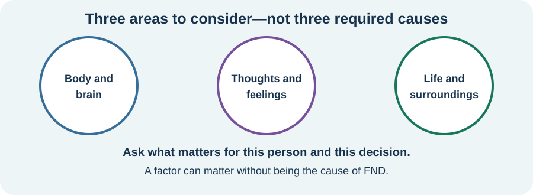

<!-- NAV-BREADCRUMB:START -->
[Home](../../../README.md) › [Course](../../README.md) › Part One: Understanding FND › [Module 1: What FND Is](README.md) › **The Biopsychosocial Model and Misconceptions**
<!-- NAV-BREADCRUMB:END -->

# The Biopsychosocial Model and Misconceptions

> **Working draft:** This page human authored and is looking for [reviewers](https://fnd-education-project.github.io/FND-Education/).

This page explains the biopsychosocial model in simple terms, what it does and does not mean for FND, and how biological, psychological, and social factors can guide individual care and support.

---
[For the Person With FND](#for-the-person-with-fnd) 
[For Family, Friends, and Other Supporters](#for-family-friends-and-other-supporters) 
[For Clinicians and the Care Team](#for-clinicians-and-the-care-team) 
[Research and Sources](#research-and-sources)
---

## For the Person With FND
{: #for-the-person-with-fnd .shareable }
FND is a neurological disease that can be understood through a **biopsychosocial model**. *What does this mean?* (*citations* [1](#citation-1), [2](#citation-2), [3](#citation-3)) 

When we talk about the *biopsychosocial model*, it is in relation to how your **symptoms** are affected by, well, all aspects of your life and health, really. (*citations* [1](#citation-1), [3](#citation-3)) 
- **The *'bio'* part refers to your biology;** your current health issues and how your nervous system responds to things. It also includes what we talked about in module 1, that the way your brain talks to the rest of your body and nervous system is disrupted.
- **The *'psycho'* or *'psychological'* part includes thoughts, emotions, coping, and stresses past or present.** These may affect symptoms for some people, but they are not present or important in the same way for everyone. They are not required to explain or diagnose FND.
- **Finally, the *'social'* aspect of this not only includes your culture but also your access to health care and the family and social support you have.**

*Illustration: the three areas help organize an individual picture. They are not three required causes.*

Let's talk about this in a way that is more familiar: the common headache. A headache can change with many influences, such as muscle tension, illness, sleep, stress, or injury. FND symptoms can also change with different physical, psychological, or social influences, but the pattern is individual and sometimes no clear influence is found. Something that happens before a flare may be relevant without proving that it caused the FND. (*citations* [1](#citation-1), [3](#citation-3)) 

Some people notice that stress, illness, pain, poor sleep, sensory overload, activity, or another demand is followed by worse symptoms; others do not. Relaxation or meditation may help some people when they fit that person's pattern, but they are optional tools rather than evidence that stress caused the symptoms. (*citations* [1](#citation-1), [4](#citation-4))

However, FND is not a headache. In fact, quality of life can be very poor. But, both your symptoms and that quality of life can improve. (*citations* [1](#citation-1), [6](#citation-6))

### Questions
#### • How do you think building a good support group around you can improve the way you cope with your symptoms?
#### • Have you noticed any repeatable influences around symptom changes—physical, psychological, social, or none that you can identify?

### What can the person safely try at home?
If you are able and find it useful, you might write down what was happening around a symptom change. This is optional. It may help you or your clinician notice a pattern, but some changes have no identifiable trigger, and keeping records does not determine whether symptoms improve. You could use three headings—*"body and brain"*, *"thoughts and feelings"*, and *"life and surroundings"*—but leave any column blank when nothing relevant is known rather than trying to find an explanation.

Don't worry if you can't journal! Personally, my functional symptoms prevent me from remembering and I found journaling nearly impossible. Over time I have still been able to notice some patterns in my own symptoms. Your experience may be different, and not finding a pattern is useful information too.

> ## Crosswords
> - **Biopsychosocial What?** ([normal](crosswords/Biopsychosocial-What-crossword-09-2026.pdf)) ([easy](crosswords/Biopsychosocial-What-crossword-easy-09-2026.pdf)) ([answer key](crosswords/Biopsychosocial-What-crossword-answer-key-09-2026.pdf))

***
[For the Person With FND](#for-the-person-with-fnd) 
[For Family, Friends, and Other Supporters](#for-family-friends-and-other-supporters) 
[For Clinicians and the Care Team](#for-clinicians-and-the-care-team) 
[Research and Sources](#research-and-sources)
***

## For Family, Friends, and Other Supporters
{: #for-family-friends-and-other-supporters .shareable }

As described earlier on this page, the biopsychosocial model is a way to organize possible influences on health and daily life; it is not a map of three required causes. As a support person, you cannot control the person's symptoms, but you can help across all three areas: access to medical care, rehabilitation and equipment; psychological care when the person wants it for an agreed reason; and practical support with safety, personal care, transport, relationships, housing, work, or other daily needs. Good support can make life safer and more manageable without guaranteeing a change in symptoms.

If the person has trauma, anxiety, depression, or another psychological difficulty that they want help with, appropriate therapy may be valuable for that reason. It should not be presented as a requirement for FND care or as proof of what caused the neurological symptoms. I also want to express caution: many therapists have limited FND training, and some still use older explanations. In some parts of the world there are specialist FND clinics. It is probably not a good idea to push anyone with FND into therapy or a particular therapist. 

> For the first few years, it was too triggering for me to attempt therapy but later, when I was ready, it proved helpful to work with some of my past traumas. The biggest thing I got from therapy was a better attitude towards my symptoms.
— *(Lived experience)*

You are one of the sufferer's social group. You can help the person to try the various exercises that are described online and in this course and you can encourage them especially as they grieve their new disability. And, symptoms come and go and new ones appear. Helping the person to not be too anxious about their health is very helpful, but because new symptoms often look like other medical or mental problems, it's best to encourage the person to have these investigated. (*citations* [5](#citation-5))

> I also found it unhelpful when my support person's optimism was misplaced; all the many positive things they were doing for me made my life more comfortable, easier to adapt to, and made me feel safe. But, no matter what they did, FND was not going to go away. Our life had permanently changed.
— *(Lived experience)*

***
[For the Person With FND](#for-the-person-with-fnd) 
[For Family, Friends, and Other Supporters](#for-family-friends-and-other-supporters) 
[For Clinicians and the Care Team](#for-clinicians-and-the-care-team) 
[Research and Sources](#research-and-sources)
***

## For Clinicians and the Care Team
{: #for-clinicians-and-the-care-team .shareable }

In the previous article, it was shown that researchers have established that Functional Neurological Disorder sits *"at the interface between neurology and psychiatry"*. (*citations* [1](#citation-1)) 
**What is the biopsychosocial model?**
- **What it is:** The biopsychosocial model is a way of looking at how the body and brain, thoughts and emotions, and a person’s life and surroundings may affect their health and recovery.
- **What it isn’t**: It does not mean that FND is caused by thoughts, stress, trauma or mental illness. It does not replace a positive neurological diagnosis, and all three areas do not have to affect every person. (*citations* [1](#citation-1), [2](#citation-2), [3](#citation-3))

> People with functional seizures have an increased risk of premature death. In one study, among patients who died before age 50, 20% of those deaths were attributed to suicide.

*Figure 1*

The biopsychosocial model is a way of guiding individual support by looking at all the factors that influence the person's symptoms: psychological support when appropriate and assistance with education and employment are two examples. Here are some of the common comorbidities in relation to the 'biological' and 'psychological' aspects and many of the common problems facing sufferers of FND. (*citations* [1](#citation-1), [3](#citation-3), [9](#citation-9))

| Area                    | Common accompanying problems                                                                                                                                                                                                                       |
| ----------------------- | -------------------------------------------------------------------------------------------------------------------------------------------------------------------------------------------------------------------------------------------------- |
| **Biological/physical** | Fatigue; memory and concentration problems; chronic pain; migraine or headache; poor sleep; irritable bowel syndrome; fibromyalgia; complex regional pain syndrome; and sometimes another neurological condition such as epilepsy. (*citations* [6](#citation-6), [7](#citation-7)) |
| **Psychological** | Anxiety, panic disorder, depression, post-traumatic stress disorder and dissociative symptoms or disorders. These should be treated when present, but they are **not required for FND** and should not be assumed to have caused it. (*citations* [2](#citation-2), [6](#citation-6)) |
| **Social** | Loss of employment or education; financial pressure; reduced independence; isolation; strained relationships; caregiver burden; stigma; unsuitable housing or transportation; and difficulty accessing knowledgeable healthcare or rehabilitation. (*citations* [6](#citation-6), [9](#citation-9)) |

One of the key complaints on reddit among sufferers of FND is how after diagnosis they are given a link to a website and little further care is afforded them. Good communication and follow-up matter. [NeuroSymptoms.org](https://neurosymptoms.org/en/symptoms/) explains symptoms that clinicians may diagnose as functional, symptoms that often occur alongside FND, and diagnostic principles. It cannot decide whether a particular new symptom in one person is FND; that still requires appropriate medical assessment.

Symptoms not associated with FND need to be investigated both at diagnosis and during the course of the disease. (*citations* [5](#citation-5), [8](#citation-8)) 

> “When I developed bowel and urinary problems, an MRI appeared to show spinal-cord compression at T10–11, and surgery was being considered. However, the neurosurgeon examined me first and found that the examination did not match the MRI. A second MRI confirmed there was no herniation—the first image was misleading.
>
> I had previously experienced genuine bowel and bladder problems from a T6–7 disc herniation, so the new symptoms could not simply be dismissed as FND. My experience shows why new symptoms must be investigated, but also why imaging should be interpreted alongside the clinical examination before deciding on treatment.”
— *(Lived experience)*

Investigating symptoms and referring your patient to other resources including social workers is good health care. (*citations* [1](#citation-1), [9](#citation-9))

***
[For the Person With FND](#for-the-person-with-fnd) 
[For Family, Friends, and Other Supporters](#for-family-friends-and-other-supporters) 
[For Clinicians and the Care Team](#for-clinicians-and-the-care-team) 
[Research and Sources](#research-and-sources)
***

## Further reading in the Reference Library

- **[Biopsychosocial Experiences Associated with FND](../../../reference/biopsychosocial-experiences/README.md)** — cross-cutting experiences that may matter in daily life without being diagnostic signs or proof of cause.
- **[Mental Health, Stigma, and Being Believed](../../../reference/biopsychosocial-experiences/02-mental-health-stigma-and-being-believed.md)** — how FND and mental-health conditions can coexist without one automatically explaining the other.

***

<!-- NAV-CONTEXT:START -->
**Continue:** [Next page: Remission, Recovery, and What Improvement Can Mean](03-remission-recovery-and-what-improvement-can-mean.md)

**Navigate:** [Home](../../../README.md) · [Course](../../README.md) · [Reference Library](../../../reference/README.md) · [Site Map](../../../SITEMAP.md)
<!-- NAV-CONTEXT:END -->

***

## Research and Sources

### Three focused quotations

- “Psychological stressors are common risk factors for functional neurological disorder, but are often absent.” (*citations* [1](#citation-1))
- “Most respondents reported that FND had multiple causes, including physical and psychological.” (*citations* [6](#citation-6))
- “A change in seizure frequency may not translate to participation in life roles.” (*citations* [9](#citation-9))

### Citation table

| Citation | Figure | Full citation |
|---|---|---|
| **[1]** | — | Hallett M, Aybek S, Dworetzky BA, McWhirter L, Staab JP, Stone J. Functional neurological disorder: new subtypes and shared mechanisms. *The Lancet Neurology*. 2022;21(6):537–550. [FND-CIT-0003](../../../research/citation-index.md#fnd-cit-0003). [https://doi.org/10.1016/S1474-4422(21)00422-1](https://doi.org/10.1016/S1474-4422(21)00422-1) |
| **[2]** | — | Espay AJ, Aybek S, Carson A, et al. Current concepts in diagnosis and treatment of functional neurological disorders. *JAMA Neurology*. 2018;75(9):1132–1141. [FND-CIT-0002](../../../research/citation-index.md#fnd-cit-0002). [https://doi.org/10.1001/jamaneurol.2018.1264](https://doi.org/10.1001/jamaneurol.2018.1264) |
| **[3]** | — | Pick S, Goldstein LH, Perez DL, Nicholson TR. Emotional processing in functional neurological disorder: a review, biopsychosocial model and research agenda. *Journal of Neurology, Neurosurgery & Psychiatry*. 2019;90(6):704–711. [FND-CIT-0005](../../../research/citation-index.md#fnd-cit-0005). [https://doi.org/10.1136/jnnp-2018-319201](https://doi.org/10.1136/jnnp-2018-319201) |
| **[4]** | — | Dworetzky BA, Baslet G. Functional neurological disorder: Practical management. *Neurotherapeutics*. 2025;22(4):e00612. [FND-CIT-0013](../../../research/citation-index.md#fnd-cit-0013). [https://doi.org/10.1016/j.neurot.2025.e00612](https://doi.org/10.1016/j.neurot.2025.e00612) |
| **[5]** | — | Bennett K, Diamond C, Hoeritzauer I, Gardiner P, McWhirter L, Carson A, Stone J. A practical review of functional neurological disorder (FND) for the general physician. *Clinical Medicine*. 2021;21(1):28–36. [FND-CIT-0001](../../../research/citation-index.md#fnd-cit-0001). [https://doi.org/10.7861/clinmed.2020-0987](https://doi.org/10.7861/clinmed.2020-0987) |
| **[6]** | — | Butler M, Shipston-Sharman O, Seynaeve M, et al. International online survey of 1048 individuals with functional neurological disorder. *European Journal of Neurology*. 2021;28(11):3591–3602. [FND-CIT-0014](../../../research/citation-index.md#fnd-cit-0014). [https://doi.org/10.1111/ene.15018](https://doi.org/10.1111/ene.15018) |
| **[7]** | — | Steinruecke M, Mason I, Keen M, McWhirter L, Carson AJ, Stone J, Hoeritzauer I. Pain and functional neurological disorder: a systematic review and meta-analysis. *Journal of Neurology, Neurosurgery & Psychiatry*. 2024;95(9):874–885. [FND-CIT-0015](../../../research/citation-index.md#fnd-cit-0015). [https://doi.org/10.1136/jnnp-2023-332810](https://doi.org/10.1136/jnnp-2023-332810) |
| **[8]** | — | Hoeritzauer I, Pronin S, Carson A, Statham P, Demetriades AK, Stone J. The clinical features and outcome of scan-negative and scan-positive cases in suspected cauda equina syndrome: a retrospective study of 276 patients. *Journal of Neurology*. 2018;265(12):2916–2926. [FND-CIT-0016](../../../research/citation-index.md#fnd-cit-0016). [https://doi.org/10.1007/s00415-018-9078-2](https://doi.org/10.1007/s00415-018-9078-2) |
| **[9]** | — | Sekine ER, Kanaan RA, McMillan J, Oxford S, Iles RA. Biopsychosocial prognostic indicators in Functional Neurological Disorder: a systematic review. *Journal of Psychosomatic Research*. 2025;195:112201. [FND-CIT-0017](../../../research/citation-index.md#fnd-cit-0017). [https://doi.org/10.1016/j.jpsychores.2025.112201](https://doi.org/10.1016/j.jpsychores.2025.112201) |
| **[10]** | *Figure 1* | Nightscales R, McCartney L, Auvrez C, et al. Mortality in patients with psychogenic nonepileptic seizures. *Neurology*. 2020;95(6):e643–e652. [FND-CIT-0050](../../../research/citation-index.md#fnd-cit-0050). [https://doi.org/10.1212/WNL.0000000000009855](https://doi.org/10.1212/WNL.0000000000009855) |

*Last reviewed: August 26, 2026*

<strong>Author accuracy review — suggested wording not yet applied</strong>

These notes are for the author and reviewers. They identify wording that may overstate the evidence, blur an important distinction, or be misunderstood. The suggested replacements are written in the course's direct, plain-language tone. They have not been inserted into the lesson.

### Applied accuracy review — September 29, 2026

The stress, journaling, supporter-role, and NeuroSymptoms wording identified in this review has now been corrected in the reader-facing lesson. The remaining note is retained only to record that these statements were deliberately changed to avoid treating psychological factors as universal causes or requiring a trigger to be found.

