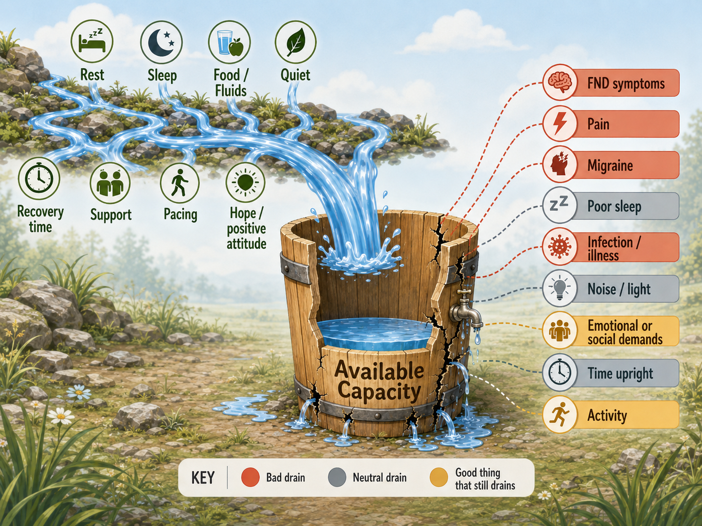

<!-- NAV-BREADCRUMB:START -->
[Home](../../../README.md) › [Course](../../README.md) › Part One: Understanding FND › [Module 1: What FND Is](README.md) › **Available Capacity, Spoons, and Early Action**
<!-- NAV-BREADCRUMB:END -->

# Available Capacity, Spoons, and Early Action

> **Working draft:** This page is human-authored and is now looking for [reviewers](https://fnd-education-project.github.io/FND-Education/).

FND can affect movement, sensation, episodes, speech, thinking and many other functions. Whatever a person's symptom pattern, daily life still places demands on the body and mind. Learning to notice changing capacity can help a person adjust those demands. 

## For the Person With FND

### What does “available capacity” mean?

**Available capacity** is the usable physical, thinking, sensory, emotional, social and upright-activity capacity you have at a particular time. It includes what you can do now and the recovery cost that may follow.

> **Available capacity is what you can use right now—not what you should be able to do, and not a measure of effort or worth.**

A lot of people might think of capacity as 'available energy' but it's more than that. A tired brain feels different than a tired body and available capacity describes both together, in a way. Not everyone experiences FND quite the same way, and your available capacity is one of those ways. For those who notice drastic changes in their available capacity, or as some call it, changes in your available 'spoons', it is often related to the onset of symptoms or a worsening of symptoms. 

> ### What are “spoons”?
>
> Christine Miserandino introduced **Spoon Theory** in 2003 to describe living with lupus. She used a limited number of spoons to represent the usable capacity needed for ordinary tasks. The metaphor spread through chronic-illness and disability communities because it gives people short phrases such as “I am low on spoons” or “it'll take more spoons than I have.” (*citations* [1](#citation-1))
>
> This course uses **available capacity** when a term needs to include more than fatigue alone.

Available capacity changes everyday and throughout the day and is affected by your entire 'biopsychosocial' life such as social demands, pain, sleep, what you eat and drink, or that moment's sensory input (like a bright light or sharp sound).

> "I can usually talk to someone for fifteen or twenty minutes before I become too tired. And, if two people are talking over each other or there's more than one conversation happening I might not last thirty seconds!"

Functional Seizures often take a lot of available capacity; recovery may take days. And that tells us something else about our available capacity: it can be 're-fuelled', so to speak. 

A task can be possible but still cost too much. For example, you may be able to attend an appointment but have little capacity left to travel home, prepare food or manage symptoms afterwards. 

> "I learned that I only had enough capacity to do a certain amount of tasks in a day and those tasks had to include getting dressed, showering and even eating. All of these things lowered how much available capacity I had left"

### What can low capacity look like?

It is unique to each individual, but a person's familiar pattern may include:

- an ordinary task takes more concentration, effort, time, equipment or help;
- reduced ability to stand, walk, converse, make decisions;
- less tolerance for light, sound or busy surroundings;
- familiar warning symptoms appearing earlier or becoming harder to settle;
- less reserve for an unexpected delay, interruption or more tasks;
- a need for longer recovery after an activity; or
- symptoms becoming more frequent, intense or widespread.

Because available capacity can be affected by so many things, don't beat yourself up thinking you failed to do something to prevent it. Adapting to your new capacity is challenging and is ongoing with your changing disease. Something that would have been fine a week ago might not be today. And the reverse is true: Something you couldn't do a few months ago may be something you can try now. And sometimes it feels like low capcity equals a flare of symptoms or a functional seizure for those who have that symptom, but it isn't, every time. As you'll learn, there are things that might help!

More details can be found in [Module 15: Pacing, Activity, and the Boom-and-Bust Cycle](../../part-4-treatment-and-rehabilitation/module-15-pacing-activity-and-the-boom-and-bust-cycle/README.md).

### What can you safely try at home?

If you haven't already, begin to notice when your available capacity goes lower.

- **What changes did you notice?** Try to write just one down.
- **What part of the activity or time of day did I notice?** 

As you learn to adapt to your available capacity, see if you can also 'recover' from lower capacity throughout the day. 

### Questions

#### When your available capacity begins to narrow, what changes do you usually notice first?

#### What afre some of the things you do when that happens?

***
[For the Person With FND](#for-the-person-with-fnd) 
[For Family, Friends, and Other Supporters](#for-family-friends-and-other-supporters) 
[For Clinicians and the Care Team](#for-clinicians-and-the-care-team) 
[Research and Sources](#research-and-sources)
***

## For Family, Friends, and Other Supporters

What available capacity looks like to those around the FND sufferer can sometimes seem contrived. "Today they seem to be managing that walk without difficulty; yesterday they couldn't even go out. What was different?" Or, "they walk all day inside, but as soon as they are outside and around people, it's like their anxiety takes over and they can't walk anymore." 

But as you begin to understand the factors that affect the available capacity and that tasks have costs - even delayed costs to that available capacity you begin to also understand that the person's quality of life and independence is far more important than our managing their activities. So, what is it good for a caregiver to do?

Since we're talking about helping to ensure some form of independence, then the best first step might be to talk to the person you are helping to support.

***Useful questions might be:***

- **“What kinds of things cost their available capacity the most right now?”** The phrase, *'right now'* because that can change day to day or even hour by hour.
- **“Would it help if I changed the setting, took one step of the task or moved something around?”** Adapting is a good way to allow for freedom within the limitations they face.
- **“Do you want quiet, practical help, company or space?”** These are key questions! And, to re-emphasize a point already made, the answer to this question changes hourly sometimes. Unfortunately, answering, 'space' and 'quiet' also has the undesired effect of the sufferer being left in a lonely state where friends and family begin to distance themselves.

As an FND sufferer, myself, I'm conflicted on this next point. The advice is to not 'police the person's spoons', 'require them to justify the cost of every activity' nor say that 'a flare proves they spent capacity badly.' On the other hand, my caregiver let me know when she noticed something about me like that I was losing my speech or walking less automatically and these observations have been very helpful in learning the cues of when symptoms were getting more severe.

It was also helpful, mainly because one of my FND symptoms is a loss of a particular kind of memory, that she reminded me before I began a project I had in mind that I might want to reserve spoons for company that was coming later or that I had a functional seizure the day before. However, she reminded me and didn't tell me I couldn't. I felt like I was given choice and I definitely chose incorrectly at times and it cost me - and unfortunately, my caregiver as well in their energy and time. I think as long as the principles here are kept in mind, then a balance can be found between you and the person you are caring for.

Learn the person's safety plan before a severe event or use the reference section to come up with one. During worsening of their symptoms, help reduce immediate risks like falls or other hazards and follow their safety plan rather than debating the cause or urging the person to push through.

***
[For the Person With FND](#for-the-person-with-fnd) 
[For Family, Friends, and Other Supporters](#for-family-friends-and-other-supporters) 
[For Clinicians and the Care Team](#for-clinicians-and-the-care-team) 
[Research and Sources](#research-and-sources)
***

## For Clinicians and the Care Team

Use **available capacity** as patient-centred descriptive language, not as a physiological conclusion. Ask what the person can do, what it costs during and afterwards, which domains add load, what changes first and which adjustments are useful. A clinic performance, step count, heart-rate-variability value or “spoon number” is not a complete measure of sustainable capacity.

Assessment may need to distinguish:

- FND symptoms and the effort involved in managing them;
- fatigue, fatigability and deconditioning;
- immediate symptom provocation from delayed or prolonged post-exertional worsening;
- pain, migraine, sleep disorder, medication effects, orthostatic intolerance and systemic illness; and
- a familiar flare from a new neurological or medical change.

The occupational-therapy consensus for FND includes activity-based rehabilitation, fatigue and pain management, pacing, use of activity diaries and relapse planning. This is professional consensus, not proof that one pacing formula prevents FND flares. Plans should be individualized and should not automatically import a fixed-increment exercise program. (*citations* [2](#citation-2))

Co-produce a brief plan that names the person's early signs, the first change in demands, safety-critical stop points, supporter roles and when reassessment is needed. Where post-exertional malaise or a coexisting condition is suspected, assess it on its own terms before recommending progression. Continue to support access and participation when capacity remains low; successful care is not limited to increasing activity.

***
[For the Person With FND](#for-the-person-with-fnd) 
[For Family, Friends, and Other Supporters](#for-family-friends-and-other-supporters) 
[For Clinicians and the Care Team](#for-clinicians-and-the-care-team) 
[Research and Sources](#research-and-sources)
***

<!-- NAV-CONTEXT:START -->
**Continue:** [Next module: How Is FND Diagnosed?](../module-02-how-fnd-is-diagnosed/README.md)

**Navigate:** [Home](../../../README.md) · [Course](../../README.md) · [Reference Library](../../../reference/README.md) · [Site Map](../../../SITEMAP.md)
<!-- NAV-CONTEXT:END -->

***

## Research and Sources

### What the evidence can and cannot support

- **Community language:** Spoon Theory is a lived-experience metaphor that began with lupus. Its value is communicative; it is not a clinical scale or FND mechanism. (*citation* [1](#citation-1))
- **FND practice:** Occupational-therapy consensus supports individualized activity planning, pacing and relapse management within broader FND care. Consensus cannot show that low capacity causes every flare or that early action will always prevent one. (*citation* [2](#citation-2))
- **Evidence borrowed from ME/CFS:** Energy Envelope Theory proposes matching expended energy to perceived available energy. A 2008 study reported associations with functioning in people with ME/CFS, but the design did not validate the model for FND. A later scoping review found heterogeneous and methodologically limited pacing evidence in ME/CFS. (*citations* [3](#citation-3), [4](#citation-4))
- **Autonomic physiology:** Sympathetic and parasympathetic influences may oppose each other, change independently or be active together. A systematic review found heterogeneous group-level autonomic findings in FND. Neither source supplies an individual capacity meter. (*citations* [5](#citation-5), [6](#citation-6))

The research does not currently establish one biological quantity called available capacity, a validated spoon count, an FND-specific energy envelope or a reliable way to predict every flare. The practical plan on this page is therefore a low-burden way to notice patterns and change modifiable demands, not a diagnostic or treatment claim.

### Citation table

| Citation | Full citation |
|---|---|
| **[1]** | Miserandino C. The Spoon Theory. *But You Don’t Look Sick*. 2003. Accessed September 2, 2026. [FND-CIT-0062](../../../research/citation-index.md#fnd-cit-0062). [https://butyoudontlooksick.com/articles/written-by-christine/the-spoon-theory/](https://butyoudontlooksick.com/articles/written-by-christine/the-spoon-theory/) |
| **[2]** | Nicholson C, Edwards MJ, Carson AJ, et al. Occupational therapy consensus recommendations for functional neurological disorder. *Journal of Neurology, Neurosurgery & Psychiatry*. 2020;91(10):1037–1045. [FND-CIT-0011](../../../research/citation-index.md#fnd-cit-0011). [https://doi.org/10.1136/jnnp-2019-322281](https://doi.org/10.1136/jnnp-2019-322281) |
| **[3]** | Jason LA, Muldowney K, Torres-Harding S. The Energy Envelope Theory and myalgic encephalomyelitis/chronic fatigue syndrome. *AAOHN Journal*. 2008;56(5):189–195. [FND-CIT-0065](../../../research/citation-index.md#fnd-cit-0065). [https://doi.org/10.3928/08910162-20080501-06](https://doi.org/10.3928/08910162-20080501-06) |
| **[4]** | Sanal-Hayes NEM, McLaughlin M, Hayes LD, et al. A scoping review of “pacing” for management of myalgic encephalomyelitis/chronic fatigue syndrome (ME/CFS): lessons learned for the long COVID pandemic. *Journal of Translational Medicine*. 2023;21:720. [FND-CIT-0066](../../../research/citation-index.md#fnd-cit-0066). [https://doi.org/10.1186/s12967-023-04587-5](https://doi.org/10.1186/s12967-023-04587-5) |
| **[5]** | Berntson GG, Cacioppo JT, Quigley KS. Autonomic determinism: the modes of autonomic control, the doctrine of autonomic space, and the laws of autonomic constraint. *Psychological Review*. 1991;98(4):459–487. [FND-CIT-0063](../../../research/citation-index.md#fnd-cit-0063). [https://doi.org/10.1037/0033-295X.98.4.459](https://doi.org/10.1037/0033-295X.98.4.459) |
| **[6]** | Paredes-Echeverri S, Maggio J, Bègue I, et al. Autonomic, endocrine, and inflammation profiles in functional neurological disorder: a systematic review and meta-analysis. *Journal of Neuropsychiatry and Clinical Neurosciences*. 2022;34(1):30–43. [FND-CIT-0064](../../../research/citation-index.md#fnd-cit-0064). [https://doi.org/10.1176/appi.neuropsych.21010025](https://doi.org/10.1176/appi.neuropsych.21010025) |

*Last evidence and terminology review: September 2, 2026*
