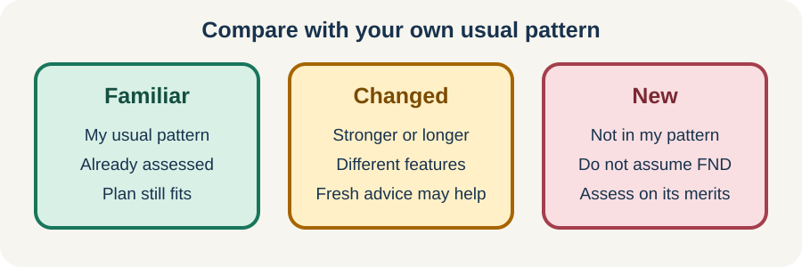

<!-- NAV-BREADCRUMB:START -->
[Home](../../../README.md) › [Course](../../README.md) › Part Two: Safety and Symptom Knowledge › [Module 5: Medical Safety and New Symptoms](README.md) › **Familiar Symptoms, New Symptoms, and Medical Change**
<!-- NAV-BREADCRUMB:END -->

# Familiar Symptoms, New Symptoms, and Medical Change

> **Working draft:** This page was automatically generated and is looking for [contributors and reviewers](https://fnd-education-project.github.io/FND-Education/).

FND can explain real and disabling symptoms. It does not protect you from another illness, injury or medical emergency. The safest question is often not “Is this FND?” but “Is this my usual, medically assessed pattern?” (*citations* [1](#citation-1), [2](#citation-2), [3](#citation-3))

## For the Person With FND

### Definition

A **familiar symptom** matches a pattern that has already been assessed. A **changed symptom** differs in an important way—for example, its start, length, severity or recovery is unusual for you. A **new symptom** has not yet been explained.

*Illustration: compare the current symptom with your own usual pattern before making an assumption.*

### If you read only one thing

Your FND plan can guide a familiar event. It should never become a rule that every future symptom is FND.

### Compare before you assume

When you are able, compare what is happening with your usual pattern:

- Did it begin in the usual way?
- Are the symptoms and body areas the same?
- Is it lasting about as long as usual?
- Is recovery following the usual course?
- Is there a new illness, injury, medicine change or other concern?

One difference does not automatically mean danger. It means the situation deserves fresh thought. An internet checklist cannot account for your diagnoses, medicines, risks or clinician advice.

### Why dismissal can be harmful

**Diagnostic overshadowing** means that a known diagnosis draws attention away from another possible problem. A person with FND can also have epilepsy, migraine, infection, medication effects, stroke, an eye condition or many other illnesses. Clinicians still need to judge a new problem on its own evidence. (*citations* [1](#citation-1), [2](#citation-2), [3](#citation-3))

The opposite problem also matters: repeatedly treating a familiar functional event as a new emergency can lead to frightening or unnecessary tests and treatments. An individual plan helps hold both risks at once.

### Community experiences for review

These are two candidate lived-experience quotations. They show why reassessment can matter; they are not medical advice or proof that the same explanation applies to another person.

**Option 1 — a separate eye problem was found**

> “He gave me steroid droplets ... and since then my light sensitivity is gone.”

— The writer described improvement after an eye clinician treated pollen-related irritation. [Read the public source](https://www.reddit.com/r/FND/comments/1ievray/sharing_my_success_story/).

**Option 2 — an earlier explanation was reconsidered**

> “I recently got done with 3 months of water therapy ... It did nothing.”

— The writer described continuing symptoms and disagreement with an FND diagnosis. [Read the public source](https://www.reddit.com/r/FND/comments/1g4xytc/i_disagree_with_the_diagnosis/).

### Questions

#### What features tell you, “This is my familiar pattern”?

#### What kind of change would make you want fresh medical advice rather than assuming FND?

### One small thing you can do

Write one sentence beginning: **“My usual medically assessed pattern is ...”** Add only the few details that would help someone notice a meaningful difference.

A lower-demand version is to name one familiar symptom and its usual recovery time. Stop if this turns into constant body checking. Ask a clinician to help if you cannot tell which symptoms have actually been assessed.

***
[For the Person With FND](#for-the-person-with-fnd) 
[For Family, Friends, and Other Supporters](#for-family-friends-and-other-supporters) 
[For Clinicians and the Care Team](#for-clinicians-and-the-care-team) 
[Research and Sources](#research-and-sources)
***

## For Family, Friends, and Other Supporters

Follow the person’s plan for a familiar event, while noticing what is different today. Describe what you observe: timing, movement, responsiveness, breathing, colour, injury and recovery. You do not have to decide the diagnosis.

Avoid saying either “This is definitely FND” or “This must be an emergency” without considering the plan and circumstances. If the pattern is new or clearly changed, or you are worried about immediate safety, seek appropriate medical help. Preserve the person’s privacy and choices whenever the situation allows.

***
[For the Person With FND](#for-the-person-with-fnd) 
[For Family, Friends, and Other Supporters](#for-family-friends-and-other-supporters) 
[For Clinicians and the Care Team](#for-clinicians-and-the-care-team) 
[Research and Sources](#research-and-sources)
***

## For Clinicians and the Care Team

### Research quotations for review

**Option 1 — Finkelstein et al., 2021**

> “the presence of positive clinical signs of FND does not exclude the presence of a concomitant neurological condition.”

**Option 2 — Mcloughlin et al., 2025**

> “A balanced approach is needed not to over or under-investigate new symptoms on their own merits.”

*Figure 1 — Research quotations offered for editorial selection. (*citations* [2](#citation-2), [3](#citation-3))*

### Reassess the presentation, not the person’s credibility

Start with physiological stability and time-sensitive differentials. Then compare the current semiology with documented event types. Separate: confirmed diagnoses; the usual presentation; current differences; objective observations; and unresolved risk.

Positive FND signs can support a diagnosis, but they do not rule out comorbidity. Conversely, a stereotyped event with an established plan may not benefit from repeated low-yield investigation or harmful acute treatment. Explain the reasoning for either investigation or non-investigation. (*citations* [1](#citation-1), [2](#citation-2), [3](#citation-3), [4](#citation-4))

When uncertainty remains, name it. Arrange a route for follow-up and revise the safety plan after a new diagnosis, medication change, injury or material change in events.

***
[For the Person With FND](#for-the-person-with-fnd) 
[For Family, Friends, and Other Supporters](#for-family-friends-and-other-supporters) 
[For Clinicians and the Care Team](#for-clinicians-and-the-care-team) 
[Research and Sources](#research-and-sources)
***

<!-- NAV-CONTEXT:START -->
**Continue:** [Next page: Emergency Information and Individual Safety Plans](02-emergency-information-and-individual-safety-plans.md)

**Navigate:** [Home](../../../README.md) · [Course](../../README.md) · [Reference Library](../../../reference/README.md) · [Site Map](../../../SITEMAP.md)
<!-- NAV-CONTEXT:END -->

***

## Research and Sources

The emergency-department reviews and iatrogenic-harm review support positive FND diagnosis alongside appropriate assessment of changed symptoms. They are reviews and clinical guidance, not a validated decision rule for one person. (*citations* [2](#citation-2), [3](#citation-3), [4](#citation-4))

| Citation | Figure | Full citation |
|---|---|---|
| **[1]** | — | Bennett K, Diamond C, Hoeritzauer I, Gardiner P, McWhirter L, Carson A, Stone J. A practical review of functional neurological disorder (FND) for the general physician. *Clinical Medicine*. 2021;21(1):28–36. [FND-CIT-0001](../../../research/citation-index.md#fnd-cit-0001). [https://doi.org/10.7861/clinmed.2020-0987](https://doi.org/10.7861/clinmed.2020-0987) |
| **[2]** | Figure 1 | Finkelstein SA, Cortel-LeBlanc MA, Cortel-LeBlanc A, Stone J. Functional neurological disorder in the emergency department. *Academic Emergency Medicine*. 2021;28(6):685–696. [FND-CIT-0068](../../../research/citation-index.md#fnd-cit-0068). [https://doi.org/10.1111/acem.14263](https://doi.org/10.1111/acem.14263) |
| **[3]** | Figure 1 | Mcloughlin C, Lee WH, Carson A, Stone J. Iatrogenic harm in functional neurological disorder. *Brain*. 2025;148(1):27–38. [FND-CIT-0069](../../../research/citation-index.md#fnd-cit-0069). [https://doi.org/10.1093/brain/awae283](https://doi.org/10.1093/brain/awae283) |
| **[4]** | — | Anderson JR, Nakhate V, Stephen CD, Perez DL. Functional (psychogenic) neurological disorders: assessment and acute management in the emergency department. *Seminars in Neurology*. 2019;39(1):102–114. [FND-CIT-0070](../../../research/citation-index.md#fnd-cit-0070). [https://doi.org/10.1055/s-0038-1676844](https://doi.org/10.1055/s-0038-1676844) |

This page still needs review by people with FND, supporters, emergency clinicians and neurologists.

*Plain-language draft prepared: September 4, 2026 · Research package added September 4, 2026 · Clinical review pending*
