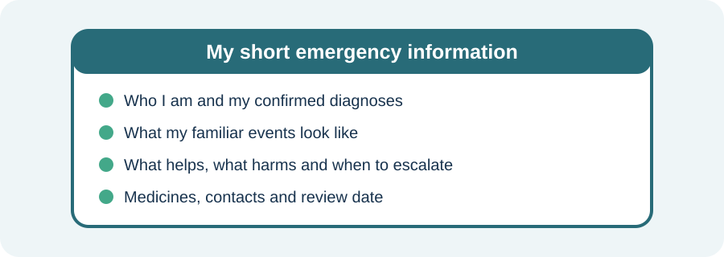

<!-- NAV-BREADCRUMB:START -->
[Home](../../../README.md) › [Course](../../README.md) › Part Two: Safety and Symptom Knowledge › [Module 5: Medical Safety and New Symptoms](README.md) › **Emergency Information and Individual Safety Plans**
<!-- NAV-BREADCRUMB:END -->

# Emergency Information and Individual Safety Plans

> **Working draft:** This page was automatically generated and is looking for [contributors and reviewers](https://fnd-education-project.github.io/FND-Education/).

An emergency plan is easiest to use when it is brief, specific to you and agreed with the clinicians who know your health. It is not a document that asks strangers to ignore every symptom. (*citations* [1](#citation-1), [2](#citation-2))

## For the Person With FND

### Definition

An **individual safety plan** is a short record of what usually happens, what helps, what should be avoided and when to get more help. An **emergency information card** is the quickest part of that plan for another person to read.

*Illustration: keep essential information short enough to use on a difficult day.*

### If you read only one thing

The plan should make a difficult moment simpler. If it is too long to scan during an event, make a shorter front page.

### What to include

Keep confirmed facts separate from possibilities. A useful first page may include:

- your name and preferred way of communicating;
- confirmed diagnoses, including whether epilepsy or another condition coexists;
- a one-sentence description of each familiar event type;
- ordinary recovery time and what helps;
- important allergies, medicines and equipment;
- actions clinicians have said to avoid when they are not otherwise indicated;
- individualized reasons to seek urgent help; and
- whom to contact and when the plan was last reviewed.

Do not use a copied internet red-flag list as though it were personal medical advice. Ask a clinician which details could actually change care.

### Make it usable on a difficult day

Use large type, headings and short sentences. Store the same current version where you, a supporter and emergency staff can find it. If speech can become difficult, include how you answer yes/no, use text or need extra processing time.

The plan can say, “This resembles my familiar event,” while still allowing clinicians to investigate a new feature. (*citations* [1](#citation-1), [2](#citation-2), [3](#citation-3))

### Community experiences for review

These quotations show two different safety needs. They are lived experience, not universal instructions.

**Option 1 — practical protection during seizures**

> “During seizures he makes sure I am safe and not about to smack into something or fall.”

— A person with FND described support from their spouse. [Read the public source](https://www.reddit.com/r/FND/comments/1k8is0m/support_for_my_wife/).

**Option 2 — fear after a choking event**

> “My partner choked, I had to apply the Heimlich ... He’s afraid now.”

— A supporter described an emergency and its emotional effect. [Read the public source](https://www.reddit.com/r/FND/comments/1ij3lns/choking_hazard/).

### Questions

#### During a familiar event, what do you most want another person to know or do?

#### Which part of asking for help is hardest for you: deciding, explaining, being believed or recovering afterwards?

### One small thing you can do

Start with four lines: **my diagnoses; my usual event; what helps; who to contact.**

A lower-demand version is to write only your name, one emergency contact and your preferred communication method. Do not change medication instructions or emergency thresholds without appropriate clinical guidance.

***
[For the Person With FND](#for-the-person-with-fnd) 
[For Family, Friends, and Other Supporters](#for-family-friends-and-other-supporters) 
[For Clinicians and the Care Team](#for-clinicians-and-the-care-team) 
[Research and Sources](#research-and-sources)
***

## For Family, Friends, and Other Supporters

Ask the person what role they want you to have before an event happens. Know where the current plan is kept. During an event, make the space safer, follow the agreed plan and record useful observations without crowding, restraining or arguing.

A supporter is not expected to make a diagnosis. If the event differs from the plan or the situation is unsafe, seek appropriate help. Afterward, ask what the person needs; do not demand an immediate account while they are still recovering.

***
[For the Person With FND](#for-the-person-with-fnd) 
[For Family, Friends, and Other Supporters](#for-family-friends-and-other-supporters) 
[For Clinicians and the Care Team](#for-clinicians-and-the-care-team) 
[Research and Sources](#research-and-sources)
***

## For Clinicians and the Care Team

### Research quotations for review

**Option 1 — Anderson et al., 2019**

> “the rapid triage of potential neurological emergencies remains the initial task”

**Option 2 — Tolchin et al., 2026**

> “Clinicians should provide a specific diagnostic label and rationale for the diagnosis”

*Figure 1 — Research quotations offered for editorial selection. (*citations* [1](#citation-1), [3](#citation-3))*

### Co-produce a plan that can change care

Document the positive basis and certainty of each FND diagnosis, the person’s usual semiology, known comorbidities and unresolved differentials. Add only instructions that can be followed safely outside the originating service.

State which familiar features support the usual response and which changes require reassessment. Avoid blanket language such as “do not investigate” or “never transfer.” Record accessibility, consent and communication needs; the supporter’s role; expected recovery; and the named service responsible for review. (*citations* [1](#citation-1), [2](#citation-2), [3](#citation-3))

Review the plan after a changed event, new diagnosis, injury, pregnancy, important medication change or repeated difficulty using it.

***
[For the Person With FND](#for-the-person-with-fnd) 
[For Family, Friends, and Other Supporters](#for-family-friends-and-other-supporters) 
[For Clinicians and the Care Team](#for-clinicians-and-the-care-team) 
[Research and Sources](#research-and-sources)
***

<!-- NAV-CONTEXT:START -->
**Continue:** [Next page: Using Your Safety Plan and Deciding When to Get Urgent Help](03-using-your-safety-plan-and-deciding-when-to-get-urgent-help.md)

**Navigate:** [Home](../../../README.md) · [Course](../../README.md) · [Reference Library](../../../reference/README.md) · [Site Map](../../../SITEMAP.md)
<!-- NAV-CONTEXT:END -->

***

## Research and Sources

These clinical reviews and the functional-seizure guideline support individualized information, respectful care and reassessment. They do not validate one universal card format or emergency threshold. (*citations* [1](#citation-1), [2](#citation-2), [3](#citation-3))

| Citation | Figure | Full citation |
|---|---|---|
| **[1]** | Figure 1 | Anderson JR, Nakhate V, Stephen CD, Perez DL. Functional (psychogenic) neurological disorders: assessment and acute management in the emergency department. *Seminars in Neurology*. 2019;39(1):102–114. [FND-CIT-0070](../../../research/citation-index.md#fnd-cit-0070). [https://doi.org/10.1055/s-0038-1676844](https://doi.org/10.1055/s-0038-1676844) |
| **[2]** | — | Finkelstein SA, Cortel-LeBlanc MA, Cortel-LeBlanc A, Stone J. Functional neurological disorder in the emergency department. *Academic Emergency Medicine*. 2021;28(6):685–696. [FND-CIT-0068](../../../research/citation-index.md#fnd-cit-0068). [https://doi.org/10.1111/acem.14263](https://doi.org/10.1111/acem.14263) |
| **[3]** | Figure 1 | Tolchin B, Goldstein LH, Reuber M, Stone J, Perez DL, LaFrance WC Jr, et al. Management of Functional Seizures Practice Guideline Executive Summary: Report of the AAN Guidelines Subcommittee. *Neurology*. 2026;106(1):e214466. [FND-CIT-0010](../../../research/citation-index.md#fnd-cit-0010). [https://doi.org/10.1212/WNL.0000000000214466](https://doi.org/10.1212/WNL.0000000000214466) |

This page still needs review by people with FND, supporters and emergency-care teams, including a check that the suggested card fields are practical.

*Plain-language draft prepared: September 4, 2026 · Research package added September 4, 2026 · Clinical review pending*
