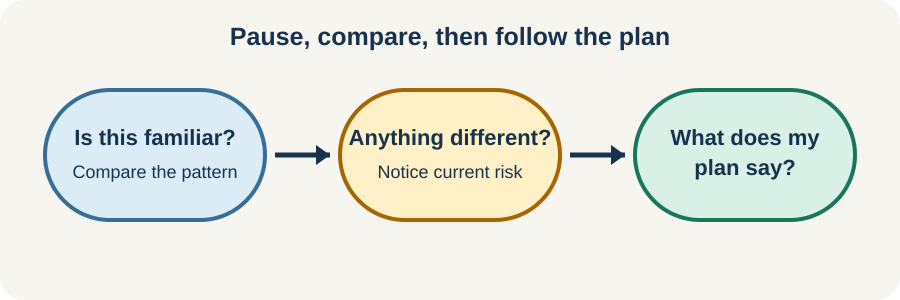

<!-- NAV-BREADCRUMB:START -->
[Home](../../../README.md) › [Course](../../README.md) › Part Two: Safety and Symptom Knowledge › [Module 5: Medical Safety and New Symptoms](README.md) › **Using Your Safety Plan and Deciding When to Get Urgent Help**
<!-- NAV-BREADCRUMB:END -->

# Using Your Safety Plan and Deciding When to Get Urgent Help

> **Working draft:** This page was automatically generated and is looking for [contributors and reviewers](https://fnd-education-project.github.io/FND-Education/).

This page is about using a plan in real time. It cannot tell you whether a particular symptom is an emergency. Local emergency guidance and your own clinical plan come first.

## For the Person With FND

### Definition

An **escalation threshold** is a change or safety concern that your plan says needs more help. To **escalate** may mean contacting your usual team, an urgent service or emergency services, depending on the situation.

*Illustration: pause, compare and use the plan while responding to immediate danger.*

### If you read only one thing

The first job is safety, not proving what caused the event.

### A simple order to remember

1. **Protect.** Stop an unsafe activity and move away from immediate hazards if this can be done safely.
2. **Compare.** Ask whether this matches the event type your clinicians assessed.
3. **Follow.** Use the agreed response, communication method and recovery time.
4. **Get more help when needed.** Follow individualized thresholds. If the plan does not fit, the symptom is new or substantially changed, or the situation seems immediately unsafe, seek appropriate medical help.

Do not delay urgent care in order to finish a checklist. Do not drive yourself if your symptoms make driving unsafe.

### After the event

Recovery can be part of the event. Some people need quiet, sleep, hydration or help rearranging the rest of the day. Use only measures that are safe for you. Record one or two facts if they may change future care; you do not need to write a minute-by-minute account of every familiar event.

If the plan repeatedly feels impossible to use, that is information. Ask for a review rather than blaming yourself.

### Community experiences for review

These accounts show that episodes can affect both recovery time and daily relationships. They are lived experience, not emergency rules.

**Option 1 — recovery can continue after movement stops**

> “Even when the seizure is done, I’m still somewhat-catatonic for at least a few hours.”

— The writer described a long period of reduced responsiveness after episodes. [Read the public source](https://www.reddit.com/r/FND/comments/1o3u59q/what_do_you_guys_think_about_during_seizures/).

**Option 2 — an episode can interrupt ordinary life**

> “Sometimes I get stressed and have a seizure and our conversation sort of ends, is interrupted.”

— The writer described the effect of episodes during difficult conversations. [Read the public source](https://www.reddit.com/r/FND/comments/1g8ebg3/i_need_advice/).

### Questions

#### When an episode starts, what helps you feel protected rather than controlled?

#### What kind of recovery time do you wish other people understood?

### One small thing you can do

Practise finding your plan and reading only its first instruction. A lower-demand version is to show one trusted person where it is stored.

Do not rehearse a symptom or provoke an event. If reading the plan reveals unclear or unsafe instructions, pause and ask the responsible clinician to revise it.

***
[For the Person With FND](#for-the-person-with-fnd) 
[For Family, Friends, and Other Supporters](#for-family-friends-and-other-supporters) 
[For Clinicians and the Care Team](#for-clinicians-and-the-care-team) 
[Research and Sources](#research-and-sources)
***

## For Family, Friends, and Other Supporters

Use the plan as a guide, not a script that overrides what you can see. Protect from hazards, keep your voice calm, time the event if useful and allow the person’s chosen communication method. Do not restrain them or put anything in their mouth during a seizure-like event.

Notice recovery as well as the visible episode. Help reduce demands if asked. Record only information that may matter clinically, and let the person decide who receives it when they have capacity to do so.

***
[For the Person With FND](#for-the-person-with-fnd) 
[For Family, Friends, and Other Supporters](#for-family-friends-and-other-supporters) 
[For Clinicians and the Care Team](#for-clinicians-and-the-care-team) 
[Research and Sources](#research-and-sources)
***

## For Clinicians and the Care Team

### Research quotations for review

**Option 1 — Tolchin et al., 2026**

> “Clinicians should engage in shared decision making regarding the treatment plan”

**Option 2 — Anderson et al., 2019**

> “clinicians in the ED setting are important members of the interdisciplinary approach to FND.”

*Figure 1 — Research quotations offered for editorial selection. (*citations* [1](#citation-1), [2](#citation-2))*

### Make the plan observable and revisable

Describe event types separately. Use observable thresholds where possible, while making clear that no list can replace clinical judgment. Specify who should do what, what ordinary recovery looks like and where uncertainty remains.

Emergency clinicians should still assess stability and relevant differentials. When the event is familiar and stable, follow proportionate care and avoid non-indicated antiseizure medication, restraint, intubation or repeated testing. When the event differs, investigate the difference on its merits. (*citations* [1](#citation-1), [2](#citation-2), [3](#citation-3))

After acute care, communicate what was observed, what was ruled in or out, and whether the existing plan still fits. Arrange continuity rather than sending the patient away with only “it was FND.”

***
[For the Person With FND](#for-the-person-with-fnd) 
[For Family, Friends, and Other Supporters](#for-family-friends-and-other-supporters) 
[For Clinicians and the Care Team](#for-clinicians-and-the-care-team) 
[Research and Sources](#research-and-sources)
***

<!-- NAV-CONTEXT:START -->
**Continue:** [Next module: Functional Seizures and Other Episodes](../module-06-functional-seizures-and-episodic-symptoms/README.md)

**Navigate:** [Home](../../../README.md) · [Course](../../README.md) · [Reference Library](../../../reference/README.md) · [Site Map](../../../SITEMAP.md)
<!-- NAV-CONTEXT:END -->

***

## Research and Sources

The guideline and emergency reviews support shared planning, assessment of coexisting conditions and avoidance of unnecessary harm. Evidence for the exact design and effectiveness of personal emergency plans remains limited. (*citations* [1](#citation-1), [2](#citation-2), [3](#citation-3))

| Citation | Figure | Full citation |
|---|---|---|
| **[1]** | Figure 1 | Tolchin B, Goldstein LH, Reuber M, Stone J, Perez DL, LaFrance WC Jr, et al. Management of Functional Seizures Practice Guideline Executive Summary: Report of the AAN Guidelines Subcommittee. *Neurology*. 2026;106(1):e214466. [FND-CIT-0010](../../../research/citation-index.md#fnd-cit-0010). [https://doi.org/10.1212/WNL.0000000000214466](https://doi.org/10.1212/WNL.0000000000214466) |
| **[2]** | Figure 1 | Anderson JR, Nakhate V, Stephen CD, Perez DL. Functional (psychogenic) neurological disorders: assessment and acute management in the emergency department. *Seminars in Neurology*. 2019;39(1):102–114. [FND-CIT-0070](../../../research/citation-index.md#fnd-cit-0070). [https://doi.org/10.1055/s-0038-1676844](https://doi.org/10.1055/s-0038-1676844) |
| **[3]** | — | Finkelstein SA, Cortel-LeBlanc MA, Cortel-LeBlanc A, Stone J. Functional neurological disorder in the emergency department. *Academic Emergency Medicine*. 2021;28(6):685–696. [FND-CIT-0068](../../../research/citation-index.md#fnd-cit-0068). [https://doi.org/10.1111/acem.14263](https://doi.org/10.1111/acem.14263) |

This page still needs review by people with FND, supporters and emergency-care teams, especially the balance between clarity and over-generalization.

*Plain-language draft prepared: September 4, 2026 · Research package added September 4, 2026 · Clinical review pending*
