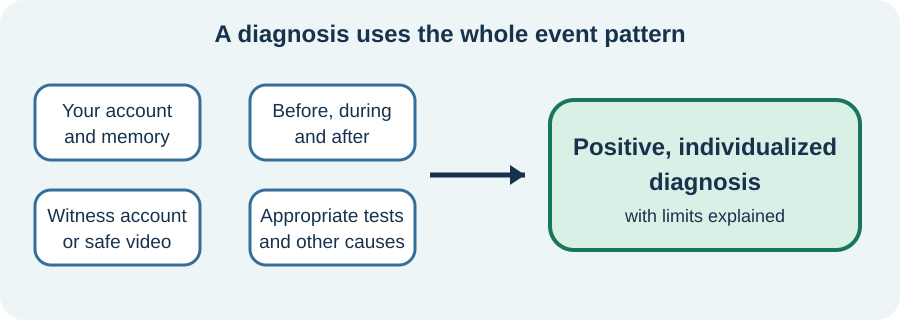

<!-- NAV-BREADCRUMB:START -->
[Home](../../../README.md) › [Course](../../README.md) › Part Two: Safety and Symptom Knowledge › [Module 6: Functional Seizures and Episodic Symptoms](README.md) › **What Functional Seizures Are and How They Are Diagnosed**
<!-- NAV-BREADCRUMB:END -->

# What Functional Seizures Are and How They Are Diagnosed

> **Working draft:** This page was automatically generated and is looking for [contributors and reviewers](https://fnd-education-project.github.io/FND-Education/).

Functional seizures are real, involuntary episodes. They can be frightening and disabling even though their mechanism differs from epileptic seizures. (*citations* [1](#citation-1), [2](#citation-2))

## For the Person With FND

### Definition

A **functional seizure** is a real episode in which movement, awareness or responsiveness changes because brain functioning is disrupted. It does not have the abnormal electrical activity that defines epilepsy. Other names include **dissociative seizure** and **psychogenic nonepileptic seizure (PNES)**. Some people dislike or do not identify with those terms.

*Illustration: diagnosis uses the whole event pattern, not one clue.*

### If you read only one thing

A diagnosis should be based on positive evidence about your typical event—not only on normal tests, stress or exclusion.

### What an episode may look like

An episode may include shaking, stiffening, collapse, staring, altered awareness, inability to respond or another change. People can have more than one event type. Appearance alone cannot safely tell a reader whether an event is functional, epileptic, fainting-related or something else.

### How clinicians reach a diagnosis

Clinicians combine:

- your account of what happens before, during and after;
- an eyewitness description or a safe recording of a typical event;
- positive features in the event pattern;
- examination and relevant tests; and
- video-EEG when it is needed and feasible.

Video-EEG records behaviour and brain electrical activity together. It can be especially useful when a typical event is captured. No single test answers every case, and epilepsy can coexist with functional seizures. The conclusion should say which event type was assessed and how certain it is. (*citations* [1](#citation-1), [2](#citation-2))

### Community experiences for review

These quotations describe different parts of living through an episode. They are individual accounts, not diagnostic signs.

**Option 1 — recovery may take hours**

> “Even when the seizure is done, I’m still somewhat-catatonic for at least a few hours.”

— The writer described reduced responsiveness after the visible event. [Read the public source](https://www.reddit.com/r/FND/comments/1o3u59q/what_do_you_guys_think_about_during_seizures/).

**Option 2 — episodes can interrupt connection**

> “Sometimes I get stressed and have a seizure and our conversation sort of ends, is interrupted.”

— The writer described episodes within ordinary relationship life. [Read the public source](https://www.reddit.com/r/FND/comments/1g8ebg3/i_need_advice/).

### Questions

#### What do you remember—or not remember—before, during and after your episodes?

#### Did the explanation of your diagnosis help you understand the evidence, or did it leave you feeling dismissed?

### One small thing you can do

Write one sentence for each event type you recognize: **“Before ... During ... After ...”** A lower-demand version is one detail about recovery.

Do not try to trigger or record an event if doing so could be unsafe, invasive or distressing. Ask your clinician what evidence supports the diagnosis and whether other event types remain unresolved.

***
[For the Person With FND](#for-the-person-with-fnd) 
[For Family, Friends, and Other Supporters](#for-family-friends-and-other-supporters) 
[For Clinicians and the Care Team](#for-clinicians-and-the-care-team) 
[Research and Sources](#research-and-sources)
***

## For Family, Friends, and Other Supporters

Your calm description can help. Note what happened before the event, the order of changes, responsiveness, movement, breathing, injuries, length and recovery. If recording is safe and permitted, ask in advance how the person feels about video and who may see it.

Do not test whether the person can hear you, accuse them of pretending or demand an explanation. Functional seizures are involuntary. Follow the individual safety plan and treat a new or changed event as needing fresh judgment.

***
[For the Person With FND](#for-the-person-with-fnd) 
[For Family, Friends, and Other Supporters](#for-family-friends-and-other-supporters) 
[For Clinicians and the Care Team](#for-clinicians-and-the-care-team) 
[Research and Sources](#research-and-sources)
***

## For Clinicians and the Care Team

### Research quotations for review

**Option 1 — Tolchin et al., 2026**

> “Clinicians should evaluate patients diagnosed with functional seizures for co-occurring psychiatric disorders and co-occurring epilepsy.”

**Option 2 — Goldstein et al., 2020**

> “Dissociative seizures are paroxysmal events resembling epilepsy or syncope”

*Figure 1 — Research quotations offered for editorial selection. (*citations* [1](#citation-1), [2](#citation-2))*

### Give a positive, event-specific diagnosis

Gather history and semiology from the patient and witnesses; review a safely obtained smartphone video where useful; and capture all typical event types on video-EEG where feasible and clinically needed. Explain the positive features and the limitations of the available evidence.

State whether epilepsy, syncope, sleep disorder, migraine, medication effect or another cause remains possible or coexists. Name the event type to which the diagnosis applies. Communicate that the event is real and involuntary, then offer continuity and a treatment pathway. (*citations* [1](#citation-1), [2](#citation-2))

***
[For the Person With FND](#for-the-person-with-fnd) 
[For Family, Friends, and Other Supporters](#for-family-friends-and-other-supporters) 
[For Clinicians and the Care Team](#for-clinicians-and-the-care-team) 
[Research and Sources](#research-and-sources)
***

<!-- NAV-CONTEXT:START -->
**Continue:** [Next page: Episode Safety, Observation, and Emergency Decisions](02-episode-safety-observation-and-emergency-decisions.md)

**Navigate:** [Home](../../../README.md) · [Course](../../README.md) · [Reference Library](../../../reference/README.md) · [Site Map](../../../SITEMAP.md)
<!-- NAV-CONTEXT:END -->

***

## Research and Sources

The 2026 guideline is current evidence-based guidance. CODES enrolled adults without recent epileptic seizures, so its definition and findings should not be generalized to every episodic presentation. (*citations* [1](#citation-1), [2](#citation-2))

**Related reference pages:** [functional-seizure diagnostic signs](../../../reference/diagnostic-signs/06-functional-seizures.md) · [recovery and management ideas](../../../reference/recovery-techniques/06-functional-seizures.md)

| Citation | Figure | Full citation |
|---|---|---|
| **[1]** | Figure 1 | Tolchin B, Goldstein LH, Reuber M, Stone J, Perez DL, LaFrance WC Jr, et al. Management of Functional Seizures Practice Guideline Executive Summary: Report of the AAN Guidelines Subcommittee. *Neurology*. 2026;106(1):e214466. [FND-CIT-0010](../../../research/citation-index.md#fnd-cit-0010). [https://doi.org/10.1212/WNL.0000000000214466](https://doi.org/10.1212/WNL.0000000000214466) |
| **[2]** | Figure 1 | Goldstein LH, Robinson EJ, Mellers JDC, et al.; CODES study group. Cognitive behavioural therapy for adults with dissociative seizures (CODES): a pragmatic, multicentre, randomised controlled trial. *The Lancet Psychiatry*. 2020;7(6):491–505. [FND-CIT-0033](../../../research/citation-index.md#fnd-cit-0033). [https://doi.org/10.1016/S2215-0366(20)30128-0](https://doi.org/10.1016/S2215-0366(20)30128-0) |

This page still needs review by people with functional seizures, supporters, epilepsy specialists and other clinicians.

*Plain-language draft prepared: September 4, 2026 · Research package added September 4, 2026 · Clinical review pending*
