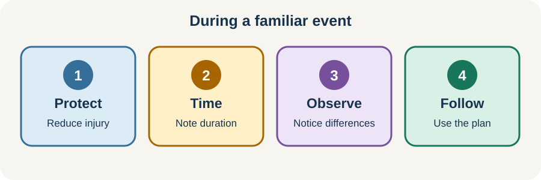

<!-- NAV-BREADCRUMB:START -->
[Home](../../../README.md) › [Course](../../README.md) › Part Two: Safety and Symptom Knowledge › [Module 6: Functional Seizures and Episodic Symptoms](README.md) › **Episode Safety, Observation, and Emergency Decisions**
<!-- NAV-BREADCRUMB:END -->

# Episode Safety, Observation, and Emergency Decisions

> **Working draft:** This page was automatically generated and is looking for [contributors and reviewers](https://fnd-education-project.github.io/FND-Education/).

Safe help during an episode is usually simple: protect from injury, follow the person’s plan, observe without crowding, and reassess if the event is new or different.

## For the Person With FND

### Definition

**Episode first aid** means the immediate actions used to protect you during and just after an event. An **episode plan** describes the safe response for your diagnosed, familiar event type.

*Illustration: simple first-aid priorities for a familiar event with an agreed plan.*

### If you read only one thing

For a familiar functional seizure, people should protect you—not restrain you or put anything in your mouth.

### During a familiar event

An individualized plan may tell others to:

- move hazards and cushion the head if needed;
- allow space and protect privacy;
- keep their voice calm and use few words;
- time the event and notice the order of changes;
- avoid restraint, painful stimulation and objects in the mouth; and
- allow the agreed recovery time.

Do not rely on this list instead of your medical plan. A particular injury, pregnancy, breathing condition, epilepsy diagnosis or other health issue may change what is safe.

### When the plan may not be enough

Use local emergency guidance and the thresholds agreed with your clinicians. A new event type, important injury, medical instability, a clearly different pattern or unusual recovery needs fresh judgment. If you have both epilepsy and functional seizures, the plan should distinguish the known event types as far as reasonably possible. (*citations* [1](#citation-1), [2](#citation-2))

### Community experiences for review

These two accounts show what support can mean. They are not a replacement for first-aid training or clinical advice.

**Option 1 — preventing injury**

> “During seizures he makes sure I am safe and not about to smack into something or fall.”

— A person with FND described practical support from their spouse. [Read the public source](https://www.reddit.com/r/FND/comments/1k8is0m/support_for_my_wife/).

**Option 2 — agreeing ground rules beforehand**

> “One thing that really helps us is discussing ground rules for conflict when we’re not actively IN it.”

— The writer described making plans during a calmer time. [Read the public source](https://www.reddit.com/r/FND/comments/1g8ebg3/i_need_advice/).

### Questions

#### During an episode, what actions help you feel safe, and what actions make things worse?

#### Who would you trust to observe an event without taking away your privacy or control?

### One small thing you can do

Choose one person and tell them the first two actions in your plan. A lower-demand version is to send them the plan’s location.

Do not practise by provoking an episode. Seek clinician review if you have no plan, if people cannot follow it safely or if your events have changed.

***
[For the Person With FND](#for-the-person-with-fnd) 
[For Family, Friends, and Other Supporters](#for-family-friends-and-other-supporters) 
[For Clinicians and the Care Team](#for-clinicians-and-the-care-team) 
[Research and Sources](#research-and-sources)
***

## For Family, Friends, and Other Supporters

Ask before an event whether the person consents to touch, video or sharing information. During the event, protect from immediate harm, follow the plan and keep observers back. Do not pin limbs down, put anything in the mouth or use pain to test responsiveness.

Observe facts without trying to diagnose: timing, movement, awareness, colour, breathing, injury and recovery. If the event does not match the plan or seems unsafe, seek appropriate help.

***
[For the Person With FND](#for-the-person-with-fnd) 
[For Family, Friends, and Other Supporters](#for-family-friends-and-other-supporters) 
[For Clinicians and the Care Team](#for-clinicians-and-the-care-team) 
[Research and Sources](#research-and-sources)
***

## For Clinicians and the Care Team

### Research quotations for review

**Option 1 — Tolchin et al., 2026**

> “Clinicians should adhere to universal standards of care for patients”

**Option 2 — Finkelstein et al., 2021**

> “Patients with FND may present acutely to the emergency department”

*Figure 1 — Research quotations offered for editorial selection. (*citations* [1](#citation-1), [2](#citation-2))*

### Match acute care to the event and current risk

Assess airway, breathing, circulation, injury and time-sensitive alternatives before applying an existing label. Compare current semiology with the documented event type and account for coexisting epilepsy.

For a familiar, stable functional seizure, use calm protection and avoid non-indicated benzodiazepines, antiseizure medication, restraint or intubation. Record the observed basis for decisions. Re-evaluate altered semiology, medical instability, injury, intoxication, withdrawal or unusual recovery. (*citations* [1](#citation-1), [2](#citation-2))

Discharge communication should state what was observed, the current level of certainty, what changed if anything and who will provide follow-up.

***
[For the Person With FND](#for-the-person-with-fnd) 
[For Family, Friends, and Other Supporters](#for-family-friends-and-other-supporters) 
[For Clinicians and the Care Team](#for-clinicians-and-the-care-team) 
[Research and Sources](#research-and-sources)
***

<!-- NAV-CONTEXT:START -->
**Continue:** [Next page: Recovery and Treatment](03-recovery-treatment-and-daily-life.md)

**Navigate:** [Home](../../../README.md) · [Course](../../README.md) · [Reference Library](../../../reference/README.md) · [Site Map](../../../SITEMAP.md)
<!-- NAV-CONTEXT:END -->

***

## Research and Sources

The guideline supports respectful first aid, event-specific assessment and avoidance of medication without epilepsy or another indication. The emergency review is narrative guidance, not an emergency decision rule. (*citations* [1](#citation-1), [2](#citation-2))

**Related reference pages:** [functional-seizure diagnostic signs](../../../reference/diagnostic-signs/06-functional-seizures.md) · [recovery and management ideas](../../../reference/recovery-techniques/06-functional-seizures.md)

| Citation | Figure | Full citation |
|---|---|---|
| **[1]** | Figure 1 | Tolchin B, Goldstein LH, Reuber M, Stone J, Perez DL, LaFrance WC Jr, et al. Management of Functional Seizures Practice Guideline Executive Summary: Report of the AAN Guidelines Subcommittee. *Neurology*. 2026;106(1):e214466. [FND-CIT-0010](../../../research/citation-index.md#fnd-cit-0010). [https://doi.org/10.1212/WNL.0000000000214466](https://doi.org/10.1212/WNL.0000000000214466) |
| **[2]** | Figure 1 | Finkelstein SA, Cortel-LeBlanc MA, Cortel-LeBlanc A, Stone J. Functional neurological disorder in the emergency department. *Academic Emergency Medicine*. 2021;28(6):685–696. [FND-CIT-0068](../../../research/citation-index.md#fnd-cit-0068). [https://doi.org/10.1111/acem.14263](https://doi.org/10.1111/acem.14263) |

This page still needs review by people with functional seizures, supporters and emergency clinicians.

*Plain-language draft prepared: September 4, 2026 · Research package added September 4, 2026 · Clinical review pending*
