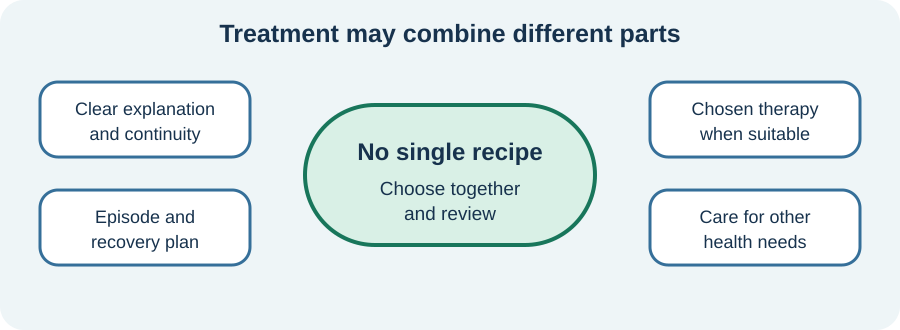

<!-- NAV-BREADCRUMB:START -->
[Home](../../../README.md) › [Course](../../README.md) › Part Two: Safety and Symptom Knowledge › [Module 6: Functional Seizures and Episodic Symptoms](README.md) › **Recovery and Treatment**
<!-- NAV-BREADCRUMB:END -->

# Recovery and Treatment

> **Working draft:** This page was automatically generated and is looking for [contributors and reviewers](https://fnd-education-project.github.io/FND-Education/).

Treatment is not a test of whether you believe the diagnosis. It is a shared attempt to reduce episodes, improve recovery or make life more possible.

## For the Person With FND

### Definition

**Seizure-specific treatment** is care designed around functional seizures rather than epilepsy. It may include education, medical follow-up, psychological therapy, rehabilitation or a clinician-taught skill, depending on your needs and choices.

*Illustration: care may combine several parts chosen and reviewed with the person.*

### If you read only one thing

There is no one treatment that works for everyone. A useful plan matches your event pattern, other health conditions, goals and access.

### What treatment may include

- a clear explanation and continuing neurological care;
- review of epilepsy and other diagnoses;
- a functional-seizure-focused psychological therapy, if wanted and appropriate;
- treatment for anxiety, depression, trauma, migraine, sleep or another separate problem;
- rehabilitation for movement, fatigue or participation; and
- practical planning with family, school or work.

Psychological treatment does not mean the seizures are imaginary. It can work with attention, warning signs, responses, relationships and the effect of episodes on life. It should not be forced or presented as the only legitimate care. (*citations* [1](#citation-1), [2](#citation-2), [3](#citation-3))

### What the trials tell us

The large CODES trial did not find a statistically significant advantage for CBT plus standardized medical care on monthly seizure frequency at 12 months. Several secondary outcomes, including how bothersome seizures felt and some quality-of-life measures, favored CBT. A small breathing-control pilot was encouraging but too small and incomplete to establish effectiveness. Mixed evidence is a reason for honest choice, not hopelessness. (*citations* [2](#citation-2), [3](#citation-3))

### Community experiences for review

These medication experiences are included because other conditions and medication changes can affect a person’s course. They do not recommend a drug or stopping one.

**Option 1 — benefit while treating another condition**

> “I worked with my psychiatrist to find the right medications and it’s helped a lot.”

— The writer described individualized psychiatric care alongside seizures. [Read the public source](https://www.reddit.com/r/FND/comments/1d0l4sy/how_long_do_you_allow_seizures_to_continue/).

**Option 2 — worsening after a medication change**

> “I had way worse symptoms after stopping the medication.”

— The writer described a difficult period after stopping medication. [Read the public source](https://www.reddit.com/r/FND/comments/1k7re4l/looking_for_advice_cause_im_going_a_little_crazy/).

### Questions

#### If treatment helped, what would matter most to you: fewer episodes, safer recovery, more independence or something else?

#### Have you been offered a real choice of treatments, with benefits, burdens and uncertainty explained?

### One small thing you can do

Choose one outcome you care about besides episode count, such as recovery time or returning to one activity. A lower-demand version is to finish: **“I want help with ...”**

Do not start, stop or taper medication from this page. Ask the prescribing clinician to review medication and coexisting conditions.

***
[For the Person With FND](#for-the-person-with-fnd) 
[For Family, Friends, and Other Supporters](#for-family-friends-and-other-supporters) 
[For Clinicians and the Care Team](#for-clinicians-and-the-care-team) 
[Research and Sources](#research-and-sources)
***

## For Family, Friends, and Other Supporters

Ask which goal belongs to the person. Support chosen treatment without becoming a therapist, episode counter or compliance monitor. Acknowledge progress in recovery, participation or confidence even if episodes continue.

Help with transport, notes or protecting recovery time if invited. If a treatment increases distress, symptoms or loss of trust, support the person in raising this with the care team.

***
[For the Person With FND](#for-the-person-with-fnd) 
[For Family, Friends, and Other Supporters](#for-family-friends-and-other-supporters) 
[For Clinicians and the Care Team](#for-clinicians-and-the-care-team) 
[Research and Sources](#research-and-sources)
***

## For Clinicians and the Care Team

### Research quotations for review

**Option 1 — Goldstein et al., 2020**

> “no statistically significant advantage ... for the reduction of monthly seizures”

**Option 2 — Duncan et al., 2024**

> “These preliminary results ... require confirmation by a randomised controlled trial.”

*Figure 1 — Research quotations offered for editorial selection. (*citations* [2](#citation-2), [3](#citation-3))*

### Offer evidence with its limits visible

Discuss seizure-specific psychological interventions through shared decision-making. Describe the CODES primary result alongside its clinically relevant secondary outcomes. The breathing study was an open-label pilot with 18 recruits and 10 completing follow-up; it is not a universal self-help breathing prescription.

Review coexisting epilepsy, psychiatric conditions and other treatment targets. Do not prescribe benzodiazepines or antiseizure medication for functional seizures without another indication; taper only through appropriate clinical management. Continue neurological care and outcome review rather than treating referral as discharge. (*citations* [1](#citation-1), [2](#citation-2), [3](#citation-3))

***
[For the Person With FND](#for-the-person-with-fnd) 
[For Family, Friends, and Other Supporters](#for-family-friends-and-other-supporters) 
[For Clinicians and the Care Team](#for-clinicians-and-the-care-team) 
[Research and Sources](#research-and-sources)
***

<!-- NAV-CONTEXT:START -->
**Continue:** [Next page: Living With Functional Seizures and Planning Ahead](04-living-with-functional-seizures-and-planning-ahead.md)

**Navigate:** [Home](../../../README.md) · [Course](../../README.md) · [Reference Library](../../../reference/README.md) · [Site Map](../../../SITEMAP.md)
<!-- NAV-CONTEXT:END -->

***

## Research and Sources

The guideline synthesizes 12 Class II–III studies. CODES was a large pragmatic trial with a mixed outcome pattern. The breathing study was small and uncontrolled. These differences matter when discussing likely benefit. (*citations* [1](#citation-1), [2](#citation-2), [3](#citation-3))

**Related reference pages:** [functional-seizure diagnostic signs](../../../reference/diagnostic-signs/06-functional-seizures.md) · [recovery and management ideas](../../../reference/recovery-techniques/06-functional-seizures.md)

| Citation | Figure | Full citation |
|---|---|---|
| **[1]** | — | Tolchin B, Goldstein LH, Reuber M, Stone J, Perez DL, LaFrance WC Jr, et al. Management of Functional Seizures Practice Guideline Executive Summary: Report of the AAN Guidelines Subcommittee. *Neurology*. 2026;106(1):e214466. [FND-CIT-0010](../../../research/citation-index.md#fnd-cit-0010). [https://doi.org/10.1212/WNL.0000000000214466](https://doi.org/10.1212/WNL.0000000000214466) |
| **[2]** | Figure 1 | Goldstein LH, Robinson EJ, Mellers JDC, et al.; CODES study group. Cognitive behavioural therapy for adults with dissociative seizures (CODES): a pragmatic, multicentre, randomised controlled trial. *The Lancet Psychiatry*. 2020;7(6):491–505. [FND-CIT-0033](../../../research/citation-index.md#fnd-cit-0033). [https://doi.org/10.1016/S2215-0366(20)30128-0](https://doi.org/10.1016/S2215-0366(20)30128-0) |
| **[3]** | Figure 1 | Duncan R, Berlowitz DJ, Mullen S, et al. Breathing control training for functional seizures: a multi-site, open-label pilot study. *Epilepsy & Behavior*. 2024;154:109745. [FND-CIT-0034](../../../research/citation-index.md#fnd-cit-0034). [https://doi.org/10.1016/j.yebeh.2024.109745](https://doi.org/10.1016/j.yebeh.2024.109745) |

This page still needs review by people with functional seizures, therapists, neurologists and primary-care clinicians.

*Plain-language draft prepared: September 4, 2026 · Research package added September 4, 2026 · Clinical review pending*
