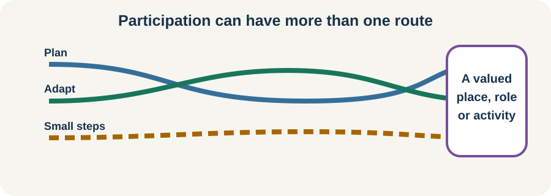

<!-- NAV-BREADCRUMB:START -->
[Home](../../../README.md) › [Course](../../README.md) › Part Two: Safety and Symptom Knowledge › [Module 6: Functional Seizures and Episodic Symptoms](README.md) › **Living With Functional Seizures and Planning Ahead**
<!-- NAV-BREADCRUMB:END -->

# Living With Functional Seizures and Planning Ahead

> **Working draft:** This page was automatically generated and is looking for [contributors and reviewers](https://fnd-education-project.github.io/FND-Education/).

Functional seizures can shape travel, relationships, study, work and time alone. Planning can create room for life; it should not turn every activity into a risk exercise.

## For the Person With FND

### Definition

A **participation plan** is a practical agreement for doing an activity as safely and independently as possible. It can include access needs, an episode response and a way back into the activity after a setback.

*Illustration: participation can have more than one route.*

### If you read only one thing

The goal is not to remove every uncertainty before living. It is to make one chosen activity more possible.

### Plan around the real situation

Consider only what matters for that activity:

- What would make injury less likely?
- Who needs to know, and what do they need to know?
- How will you communicate during or after an episode?
- What transport or recovery time is realistic?
- Is there a rule or restriction that needs professional advice?

Driving, swimming, heights, machinery, bathing alone and caring for another person can carry particular consequences during loss of awareness or control. Ask the relevant clinician or authority about individual restrictions; do not infer clearance from a course page.

### Independence can include support

Using a check-in, quieter space, medical ID, flexible schedule or trusted companion does not make an activity less meaningful. A plan should be reviewed when episodes, diagnoses, treatment or responsibilities change. (*citations* [1](#citation-1), [2](#citation-2))

### Community experiences for review

These quotations show relationship and recovery needs. They are lived experience, not a formula for prevention.

**Option 1 — planning outside the crisis**

> “One thing that really helps us is discussing ground rules for conflict when we’re not actively IN it.”

— The writer described agreeing on communication at a calmer time. [Read the public source](https://www.reddit.com/r/FND/comments/1g8ebg3/i_need_advice/).

**Option 2 — support without taking over**

> “During seizures he makes sure I am safe and not about to smack into something or fall.”

— A person with FND described their spouse’s role. [Read the public source](https://www.reddit.com/r/FND/comments/1k8is0m/support_for_my_wife/).

### Questions

#### What have functional seizures taken out of your week that you most want to reclaim?

#### What kind of help would increase your independence rather than make you feel watched?

### One small thing you can do

Choose one low-stakes activity and write a Plan A and a smaller Plan B. A lower-demand version is to name the activity only.

Do not test safety restrictions on your own. Ask for professional advice when an episode could endanger you or someone else.

***
[For the Person With FND](#for-the-person-with-fnd) 
[For Family, Friends, and Other Supporters](#for-family-friends-and-other-supporters) 
[For Clinicians and the Care Team](#for-clinicians-and-the-care-team) 
[Research and Sources](#research-and-sources)
***

## For Family, Friends, and Other Supporters

Ask, “What would make this activity possible?” rather than deciding the person cannot do it. Offer specific help and accept no. Agree on episode responses before the activity, including when you should step in and when you should give space.

Supporters also need realistic boundaries and their own rest. A shared plan is stronger when it does not depend on one person being constantly available.

***
[For the Person With FND](#for-the-person-with-fnd) 
[For Family, Friends, and Other Supporters](#for-family-friends-and-other-supporters) 
[For Clinicians and the Care Team](#for-clinicians-and-the-care-team) 
[Research and Sources](#research-and-sources)
***

## For Clinicians and the Care Team

### Research quotations for review

**Option 1 — Tolchin et al., 2026**

> “Clinicians should provide continuity of care to individuals diagnosed with functional seizures.”

**Option 2 — Goldstein et al., 2020**

> “improvements were observed in a number of clinically relevant secondary outcomes”

*Figure 1 — Research quotations offered for editorial selection. (*citations* [1](#citation-1), [2](#citation-2))*

### Treat participation as an outcome

Ask what the patient wants to resume and assess the actual risks of that task. Give specific advice on driving and safety-sensitive activities within the relevant law and clinical context. Coordinate written plans with school, work, rehabilitation and supporters with consent.

Track more than seizure frequency: recovery time, injury, confidence, participation, quality of life and treatment burden may all matter. The CODES secondary outcomes show why a single frequency measure can miss meaningful change, while its primary result prevents overclaiming. (*citations* [1](#citation-1), [2](#citation-2))

Continue care when seizures persist. Revisit diagnosis or comorbidity when event types change, and adapt access when treatment is unavailable or not chosen.

***
[For the Person With FND](#for-the-person-with-fnd) 
[For Family, Friends, and Other Supporters](#for-family-friends-and-other-supporters) 
[For Clinicians and the Care Team](#for-clinicians-and-the-care-team) 
[Research and Sources](#research-and-sources)
***

<!-- NAV-CONTEXT:START -->
**Continue:** [Next module: Movement, Weakness, Walking, and Falls](../module-07-functional-movement-weakness-and-gait-symptoms/README.md)

**Navigate:** [Home](../../../README.md) · [Course](../../README.md) · [Reference Library](../../../reference/README.md) · [Site Map](../../../SITEMAP.md)
<!-- NAV-CONTEXT:END -->

***

## Research and Sources

The guideline supports continuity, shared decisions and involvement of chosen supporters. CODES shows a mixed pattern across seizure frequency and broader outcomes; it does not define what participation plan will help one person. (*citations* [1](#citation-1), [2](#citation-2))

**Related reference pages:** [functional-seizure diagnostic signs](../../../reference/diagnostic-signs/06-functional-seizures.md) · [recovery and management ideas](../../../reference/recovery-techniques/06-functional-seizures.md)

| Citation | Figure | Full citation |
|---|---|---|
| **[1]** | Figure 1 | Tolchin B, Goldstein LH, Reuber M, Stone J, Perez DL, LaFrance WC Jr, et al. Management of Functional Seizures Practice Guideline Executive Summary: Report of the AAN Guidelines Subcommittee. *Neurology*. 2026;106(1):e214466. [FND-CIT-0010](../../../research/citation-index.md#fnd-cit-0010). [https://doi.org/10.1212/WNL.0000000000214466](https://doi.org/10.1212/WNL.0000000000214466) |
| **[2]** | Figure 1 | Goldstein LH, Robinson EJ, Mellers JDC, et al.; CODES study group. Cognitive behavioural therapy for adults with dissociative seizures (CODES): a pragmatic, multicentre, randomised controlled trial. *The Lancet Psychiatry*. 2020;7(6):491–505. [FND-CIT-0033](../../../research/citation-index.md#fnd-cit-0033). [https://doi.org/10.1016/S2215-0366(20)30128-0](https://doi.org/10.1016/S2215-0366(20)30128-0) |

This page still needs review by people with functional seizures, supporters and clinicians, including review of safety-sensitive activity wording.

*Plain-language draft prepared: September 4, 2026 · Research package added September 4, 2026 · Clinical review pending*
