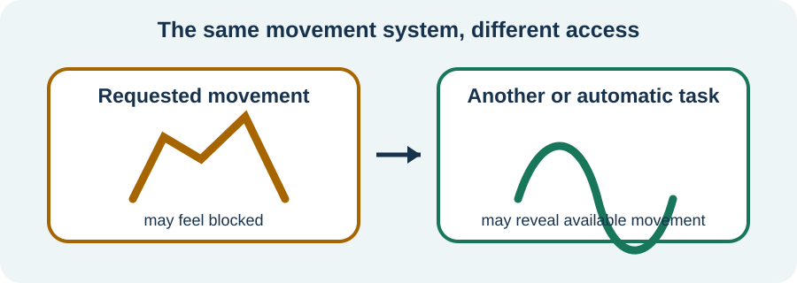

<!-- NAV-BREADCRUMB:START -->
[Home](../../../README.md) › [Course](../../README.md) › Part Two: Safety and Symptom Knowledge › [Module 7: Movement, Weakness, and Gait Symptoms](README.md) › **Functional Weakness and Paralysis**
<!-- NAV-BREADCRUMB:END -->

# Functional Weakness and Paralysis

> **Working draft:** This page was automatically generated and is looking for [contributors and reviewers](https://fnd-education-project.github.io/FND-Education/).

Functional weakness can make a limb feel heavy, disconnected or impossible to move. The loss of control is real and involuntary. (*citations* [1](#citation-1), [2](#citation-2))

## For the Person With FND

### Definition

**Functional weakness** is real difficulty making a limb move, even though examination shows that movement can still become available in some situations. **Functional paralysis** is the more complete end of that difficulty.

*Illustration: available movement in another task does not mean the difficulty is chosen.*

### If you read only one thing

Your clinician may show that movement is still available under some conditions. This is positive evidence for the diagnosis and a possible starting point for retraining—not proof that you could move normally if you tried harder.

### What positive signs mean

During an examination, strength may change when attention, position or the other limb changes. Hoover’s sign is one example involving automatic hip movement. It is a clinician’s comparison within a full assessment, not a self-test or a stand-alone answer. (*citations* [1](#citation-1), [2](#citation-2))

Weakness may fluctuate, happen in episodes or last much longer. New sudden weakness still needs appropriate assessment, especially when the pattern differs from what has already been diagnosed.

### Living with weakness

Safety and access matter now, even while recovery is pursued. A walking aid, chair, shower seat or help with a task can reduce falls and open up life. Equipment should fit the person and task; it is not a verdict about whether recovery is possible.

Rehabilitation may use meaningful or automatic movement, redirected attention and gradual practice. The right starting point may be very small. Pain, fatigue, other diagnoses and post-activity worsening can change what is tolerable. (*citations* [3](#citation-3), [4](#citation-4))

### Community experiences for review

These two accounts show benefit and ongoing need. They are lived experience, not predictions.

**Option 1 — improvement with specialist therapy**

> “Neurological physical therapy has given me the ability to walk and function again.”

— The writer described improvement while still living with limitations. [Read the public source](https://www.reddit.com/r/FND/comments/18gbf7f/how_did_you_regain_your_ability_to_walk/).

**Option 2 — an aid made life more possible**

> “My mobility aids have been incredibly helpful and enable me to live life more fully.”

— The writer described access and independence rather than failure. [Read the public source](https://www.reddit.com/r/FND/comments/106utzh/advice_needed_considering_using_mobility_aid_for/).

### Questions

#### When does movement feel even slightly easier or more automatic for you?

#### Would an aid or adaptation help you take part in something important now?

### One small thing you can do

Notice one ordinary task in which the limb joins in more easily, such as adjusting clothing or shifting in a chair. A lower-demand version is simply to write down the task.

Do not repeatedly test strength, force a weak limb or practise near a fall risk. Use a clinician-taught exercise and appropriate support.

***
[For the Person With FND](#for-the-person-with-fnd) 
[For Family, Friends, and Other Supporters](#for-family-friends-and-other-supporters) 
[For Clinicians and the Care Team](#for-clinicians-and-the-care-team) 
[Research and Sources](#research-and-sources)
***

## For Family, Friends, and Other Supporters

Believe the difficulty even when movement varies. Variation is part of the clinical information. Ask before lifting, pulling or physically guiding a limb. Help make the route safer and keep useful aids within reach.

Praise meaningful participation rather than normal-looking movement. Do not hide equipment, demand repeated demonstrations or turn every activity into therapy. Seek fresh assessment for new or substantially changed weakness or injury.

***
[For the Person With FND](#for-the-person-with-fnd) 
[For Family, Friends, and Other Supporters](#for-family-friends-and-other-supporters) 
[For Clinicians and the Care Team](#for-clinicians-and-the-care-team) 
[Research and Sources](#research-and-sources)
***

## For Clinicians and the Care Team

### Research quotations for review

**Option 1 — McWhirter et al., 2011**

> “Hoover’s sign was moderately sensitive and very specific for a diagnosis of functional weakness.”

**Option 2 — Nielsen et al., 2015**

> “there are insufficient data to produce evidence-based guidelines”

*Figure 1 — Research quotations offered for editorial selection. (*citations* [1](#citation-1), [3](#citation-3))*

### Turn the examination into an explanation

Demonstrate a positive sign only when it matches the phenotype and the patient can follow the comparison. Explain that preserved automatic recruitment supports reversibility of function without implying intact capacity at every moment. Hoover’s study included only eight participants with functional disorder; do not present its accuracy estimates as universal. (*citations* [1](#citation-1), [2](#citation-2))

Assess falls, pain, fatigue, comorbidity, task demands and equipment needs. Use patient-chosen goals and appropriately dosed practice. The Physio4FMD primary physical-function outcome was not significantly different at 12 months, although some patient-rated secondary outcomes favored specialist care. Continue access and symptom management when motor change is limited. (*citations* [3](#citation-3), [4](#citation-4))

***
[For the Person With FND](#for-the-person-with-fnd) 
[For Family, Friends, and Other Supporters](#for-family-friends-and-other-supporters) 
[For Clinicians and the Care Team](#for-clinicians-and-the-care-team) 
[Research and Sources](#research-and-sources)
***

<!-- NAV-CONTEXT:START -->
**Continue:** [Next page: Tremor, Jerks, and Spasms](02-tremor-jerks-and-spasms.md)

**Navigate:** [Home](../../../README.md) · [Course](../../README.md) · [Reference Library](../../../reference/README.md) · [Site Map](../../../SITEMAP.md)
<!-- NAV-CONTEXT:END -->

***

## Research and Sources

The diagnostic studies support specific positive comparisons, not self-diagnosis. The physiotherapy sources provide consensus and program-level trial evidence with important limitations. (*citations* [1](#citation-1), [2](#citation-2), [3](#citation-3), [4](#citation-4))

**Related reference pages:** [weakness signs](../../../reference/diagnostic-signs/01-functional-limb-weakness.md) · [weakness recovery ideas](../../../reference/recovery-techniques/01-functional-limb-weakness.md) · [paralysis signs](../../../reference/diagnostic-signs/15-functional-paralysis.md) · [paralysis recovery ideas](../../../reference/recovery-techniques/15-functional-paralysis.md)

| Citation | Figure | Full citation |
|---|---|---|
| **[1]** | Figure 1 | McWhirter L, Stone J, Sandercock P, Whiteley W. Hoover’s sign for the diagnosis of functional weakness: a prospective unblinded cohort study in patients with suspected stroke. *Journal of Psychosomatic Research*. 2011;71(6):384–386. [FND-CIT-0018](../../../research/citation-index.md#fnd-cit-0018). [https://doi.org/10.1016/j.jpsychores.2011.09.003](https://doi.org/10.1016/j.jpsychores.2011.09.003) |
| **[2]** | — | Sonoo M. Abductor sign: a reliable new sign to detect unilateral non-organic paresis of the lower limb. *Journal of Neurology, Neurosurgery & Psychiatry*. 2004;75(1):121–125. [FND-CIT-0058](../../../research/citation-index.md#fnd-cit-0058). [https://pmc.ncbi.nlm.nih.gov/articles/PMC1757483/](https://pmc.ncbi.nlm.nih.gov/articles/PMC1757483/) |
| **[3]** | Figure 1 | Nielsen G, Stone J, Matthews A, et al. Physiotherapy for functional motor disorders: a consensus recommendation. *Journal of Neurology, Neurosurgery & Psychiatry*. 2015;86(10):1113–1119. [FND-CIT-0028](../../../research/citation-index.md#fnd-cit-0028). [https://doi.org/10.1136/jnnp-2014-309255](https://doi.org/10.1136/jnnp-2014-309255) |
| **[4]** | — | Nielsen G, Stone J, Lee TC, et al.; Physio4FMD study group. Specialist physiotherapy for functional motor disorder in England and Scotland (Physio4FMD): a pragmatic, multicentre, phase 3 randomised controlled trial. *The Lancet Neurology*. 2024;23(7):675–686. [FND-CIT-0029](../../../research/citation-index.md#fnd-cit-0029). [https://doi.org/10.1016/S1474-4422(24)00135-2](https://doi.org/10.1016/S1474-4422(24)00135-2) |

This page still needs review by people with weakness or paralysis, physiotherapists and neurologists.

*Plain-language draft prepared: September 4, 2026 · Research package added September 4, 2026 · Clinical review pending*
