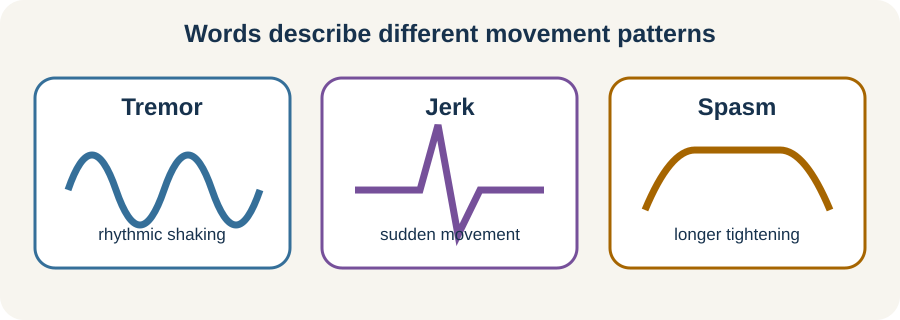

<!-- NAV-BREADCRUMB:START -->
[Home](../../../README.md) › [Course](../../README.md) › Part Two: Safety and Symptom Knowledge › [Module 7: Movement, Weakness, and Gait Symptoms](README.md) › **Tremor, Jerks, and Spasms**
<!-- NAV-BREADCRUMB:END -->

# Tremor, Jerks, and Spasms

> **Working draft:** This page was automatically generated and is looking for [contributors and reviewers](https://fnd-education-project.github.io/FND-Education/).

These movements can be brief, continuous or arrive in long bouts. They are involuntary, even when attention or another movement changes them. (*citations* [1](#citation-1), [2](#citation-2))

## For the Person With FND

### Definition

A **tremor** is a repeated back-and-forth movement. A **jerk** is a sudden brief movement. **Spasm** is a broad everyday word for a sudden tightening or movement; a clinician may use a more specific term after assessment.

*Illustration: these words describe movement patterns; diagnosis still needs assessment.*

### If you read only one thing

A movement changing with rhythm, attention or another task can be positive evidence for a functional diagnosis. It does not mean you are controlling it on purpose.

### How diagnosis may be supported

Functional tremor may vary in speed or size, pause with distraction, or move toward the rhythm of another action. This last change is called **entrainment**. Functional jerks may have patterns seen in the examination or in combined muscle-and-brain electrical testing. No single change should be used as a do-it-yourself test. (*citations* [1](#citation-1), [2](#citation-2))

### Make the immediate situation safer

If a familiar bout begins, put down hot, sharp or breakable objects and move away from stairs or traffic. Use only a cue taught for your movement pattern. Repeatedly fighting, suppressing or testing a movement can add effort and pain.

New movements, injury, loss of awareness or a substantially different pattern need appropriate assessment. Medicines and other neurological conditions can also cause tremor or jerks.

### Community experiences for review

These accounts show two very different responses. They are not evidence that the same activity will help another person.

**Option 1 — a competing hand task changed tremor**

> “She handed me a rainbow coloured dodgeball and asked me to rotate it ... And the tremors stopped.”

— The writer described an occupational therapist testing a competing hand task during continuous tremor. [Read the public source](https://www.reddit.com/r/FND/comments/1pslgkk/there_is_a_light_at_the_end_of_the_tunnel/).

**Option 2 — focused attention sometimes helped jerks**

> “If I meditate or focus on something else I can stop it.”

— The writer described one personal way of interrupting jerks. [Read the public source](https://www.reddit.com/r/FND/comments/17jx51h/).

### Questions

#### What does the movement stop you from doing, and what still feels possible during it?

#### Have you noticed a context in which the movement changes without you forcing it?

### One small thing you can do

Choose one safe, familiar activity that naturally uses both hands or a steady rhythm, but only if it has been safe for you before. A lower-demand version is to discuss such an activity with a therapist.

Stop if movement, pain, dizziness or fall risk increases. Do not practise with dangerous objects or near hazards.

***
[For the Person With FND](#for-the-person-with-fnd) 
[For Family, Friends, and Other Supporters](#for-family-friends-and-other-supporters) 
[For Clinicians and the Care Team](#for-clinicians-and-the-care-team) 
[Research and Sources](#research-and-sources)
***

## For Family, Friends, and Other Supporters

Make the space safer and ask whether the person wants help. Avoid holding a moving limb down, drawing a crowd or repeatedly pointing out the movement. Quietly offer the agreed cue or a meaningful task if requested.

Variation is not evidence of pretending. Record a short video only with consent and only when doing so does not delay safety or care.

***
[For the Person With FND](#for-the-person-with-fnd) 
[For Family, Friends, and Other Supporters](#for-family-friends-and-other-supporters) 
[For Clinicians and the Care Team](#for-clinicians-and-the-care-team) 
[Research and Sources](#research-and-sources)
***

## For Clinicians and the Care Team

### Research quotations for review

**Option 1 — Bartl et al., 2020**

> “response to distraction by motor and cognitive tasks is a key diagnostic feature”

**Option 2 — Nielsen et al., 2015**

> “Retraining movement with diverted attention”

*Figure 1 — Research quotations offered for editorial selection. (*citations* [1](#citation-1), [3](#citation-3))*

### Diagnose the phenotype, then use the sign therapeutically

Characterize tremor, jerks, dystonia, tic-like movement, medication effects and other movement disorders rather than treating “spasm” as a diagnosis. For tremor, assess variability, distractibility and entrainment across tasks. For jerks, clinical neurophysiology may add support, but an absent Bereitschaftspotential does not exclude the diagnosis. (*citations* [1](#citation-1), [2](#citation-2))

If a positive sign is clear, show it respectfully as evidence of preserved movement options. Link it to an individualized retraining strategy. Address pain, injury, fatigue, equipment and participation even when movement frequency does not improve.

***
[For the Person With FND](#for-the-person-with-fnd) 
[For Family, Friends, and Other Supporters](#for-family-friends-and-other-supporters) 
[For Clinicians and the Care Team](#for-clinicians-and-the-care-team) 
[Research and Sources](#research-and-sources)
***

<!-- NAV-CONTEXT:START -->
**Continue:** [Next page: Functional Dystonia and Fixed Postures](03-functional-dystonia-and-fixed-postures.md)

**Navigate:** [Home](../../../README.md) · [Course](../../README.md) · [Reference Library](../../../reference/README.md) · [Site Map](../../../SITEMAP.md)
<!-- NAV-CONTEXT:END -->

***

## Research and Sources

The tremor review and neurophysiology chapter describe supportive clinical and laboratory features. The physiotherapy paper is consensus guidance; individual exercises have not all been tested in controlled trials. (*citations* [1](#citation-1), [2](#citation-2), [3](#citation-3))

**Related reference pages:** [tremor signs](../../../reference/diagnostic-signs/02-functional-tremor.md) · [tremor recovery ideas](../../../reference/recovery-techniques/02-functional-tremor.md) · [jerk signs](../../../reference/diagnostic-signs/03-functional-jerks-and-myoclonus.md) · [jerk recovery ideas](../../../reference/recovery-techniques/03-functional-jerks-and-myoclonus.md)

| Citation | Figure | Full citation |
|---|---|---|
| **[1]** | Figure 1 | Bartl M, Kewitsch R, Hallett M, Tegenthoff M, Paulus W. Diagnosis and therapy of functional tremor: a systematic review illustrated by a case report. *Neurological Research and Practice*. 2020;2:35. [FND-CIT-0019](../../../research/citation-index.md#fnd-cit-0019). [https://doi.org/10.1186/s42466-020-00073-1](https://doi.org/10.1186/s42466-020-00073-1) |
| **[2]** | — | Edwards MJ, Koens LH, Liepert J, Nonnekes J, Schwingenschuh P, van de Stouwe AMM, Morgante F. Clinical neurophysiology of functional motor disorders: IFCN Handbook Chapter. *Clinical Neurophysiology Practice*. 2024;9:69–77. [FND-CIT-0022](../../../research/citation-index.md#fnd-cit-0022). [https://doi.org/10.1016/j.cnp.2023.12.006](https://doi.org/10.1016/j.cnp.2023.12.006) |
| **[3]** | Figure 1 | Nielsen G, Stone J, Matthews A, et al. Physiotherapy for functional motor disorders: a consensus recommendation. *Journal of Neurology, Neurosurgery & Psychiatry*. 2015;86(10):1113–1119. [FND-CIT-0028](../../../research/citation-index.md#fnd-cit-0028). [https://doi.org/10.1136/jnnp-2014-309255](https://doi.org/10.1136/jnnp-2014-309255) |

This page still needs review by people with tremor or jerks, movement-disorder clinicians and therapists.

*Plain-language draft prepared: September 4, 2026 · Research package added September 4, 2026 · Clinical review pending*
