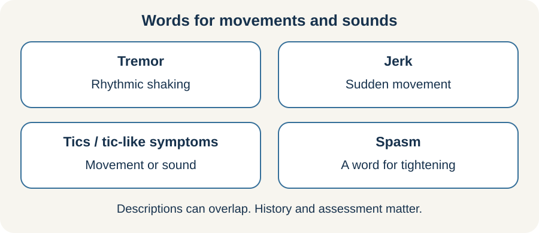

<!-- NAV-BREADCRUMB:START -->
[Home](../../../README.md) › [Course](../../README.md) › Part Two: Safety and Symptom Knowledge › [Module 7: Movement, Weakness, and Gait Symptoms](README.md) › **Tremor, Jerks, Tics, and Spasms**
<!-- NAV-BREADCRUMB:END -->

# Tremor, Jerks, Tics, and Spasms

> **Working draft:** This page was automatically generated and is looking for [contributors and reviewers](https://fnd-education-project.github.io/FND-Education/).

These movements and sounds can be brief, continuous or arrive in long bouts. They are involuntary, even when attention or another movement changes them. (*citations* [1](#citation-1), [2](#citation-2))

## For the Person With FND

### Definition

A **tremor** is a repeated back-and-forth movement. A **jerk** is a sudden brief movement. **Tics and tic-like symptoms** may involve movements (motor) or sounds (vocal/phonic), including words or phrases. [4](#citation-4), [8](#citation-8) **Spasm** is a broad everyday word for a sudden tightening or movement; a clinician may use a more specific term after assessment.

*Illustration: these words describe movement patterns; diagnosis still needs assessment.*

### If you read only one thing

Some movement changes can support a functional diagnosis when interpreted by a clinician. Tics need assessment of the whole history and pattern; no single movement or sound settles the diagnosis. Involuntary symptoms are not evidence of pretending. [4](#citation-4), [5](#citation-5)

### How diagnosis may be supported

Functional tremor may vary in speed or size, pause with distraction, or move toward the rhythm of another action. This last change is called **entrainment**. Functional jerks may have patterns seen in the examination or in combined muscle-and-brain electrical testing. No single change should be used as a do-it-yourself test. (*citations* [1](#citation-1), [2](#citation-2))

### When movements or sounds are tic-like

An involuntary word can be especially hard when other people think you meant it. You do not have to prove that distress by demonstrating a symptom. Motor and vocal/phonic tic-like symptoms deserve assessment and a plan for daily life, including how other people can help.

Vocal symptoms can be sounds, throat clearing, words or phrases. A change from movements to sounds does not by itself distinguish functional symptoms from Tourette syndrome or another primary tic disorder. The two can coexist. Neither age, gender, sudden onset, an urge, suppressibility nor seeing tics online decides the diagnosis alone. [4](#citation-4), [5](#citation-5), [8](#citation-8)

Treatment should follow that assessment. A small I-CBiT report described improvement in eight young people, without a comparison group. It offers an approach for further study, not proof that its methods work for everyone. Work with a clinician to choose treatment and manageable goals. Forced suppression is not an entry requirement for school, work or care. [7](#citation-7)

For familiar intense bouts or “tic attacks,” agree on safety, supporter response, communication and recovery time. New injury, breathing danger or a substantially changed pattern needs assessment. An attack is not automatically a functional seizure. See [functional-tic diagnosis](../../../reference/diagnostic-signs/17-functional-tics-and-tic-like-symptoms.md) and the [recovery overview](../../../reference/recovery-techniques/17-functional-tics-and-tic-like-symptoms.md).

### Make the immediate situation safer

If a familiar bout begins, put down hot, sharp or breakable objects and move away from stairs or traffic. Use only a cue taught for your movement pattern. Repeatedly fighting, suppressing or testing a movement can add effort and pain.

New movements, injury, loss of awareness or a substantially different pattern need appropriate assessment. Medicines and other neurological conditions can also cause tremor or jerks.

### Community experiences for review

These accounts show two very different responses. They are not evidence that the same activity will help another person.

**Option 1 — a competing hand task changed tremor**

> “She handed me a rainbow coloured dodgeball and asked me to rotate it ... And the tremors stopped.”

— The writer described an occupational therapist testing a competing hand task during continuous tremor. [Read the public source](https://www.reddit.com/r/FND/comments/1pslgkk/there_is_a_light_at_the_end_of_the_tunnel/).

**Option 2 — focused attention sometimes helped jerks**

> “If I meditate or focus on something else I can stop it.”

— The writer described one personal way of interrupting jerks. [Read the public source](https://www.reddit.com/r/FND/comments/17jx51h/).

### Questions

#### What does the movement stop you from doing, and what still feels possible during it?

#### Have you noticed a context in which the movement changes without you forcing it?

### One small thing you can do

For tremor or jerks, choose one safe, familiar activity that naturally uses both hands or a steady rhythm, but only if it has been safe for you before. A lower-demand version is to discuss such an activity with a therapist.

For tic-like symptoms, start instead by agreeing how others should respond or how you can finish a message. The movement examples above are not a tic-treatment prescription.

Stop if movement, pain, dizziness or fall risk increases. Do not practise with dangerous objects or near hazards.

***
[For the Person With FND](#for-the-person-with-fnd) 
[For Family, Friends, and Other Supporters](#for-family-friends-and-other-supporters) 
[For Clinicians and the Care Team](#for-clinicians-and-the-care-team) 
[Research and Sources](#research-and-sources)
***

## For Family, Friends, and Other Supporters

Make the space safer and ask whether the person wants help. Avoid holding a moving limb down, drawing a crowd or repeatedly pointing out the movement. Quietly offer the agreed cue or a meaningful task if requested.

For vocal symptoms, let the person finish their intended message and offer writing or typing if wanted. Agree on school/work responses and breaks privately; avoid punishment for involuntary words or demands to stop.

Variation is not evidence of pretending. Record a short video only with consent and only when doing so does not delay safety or care.

***
[For the Person With FND](#for-the-person-with-fnd) 
[For Family, Friends, and Other Supporters](#for-family-friends-and-other-supporters) 
[For Clinicians and the Care Team](#for-clinicians-and-the-care-team) 
[Research and Sources](#research-and-sources)
***

## For Clinicians and the Care Team

### Tic-specific assessment and treatment limits

Assess developmental history, motor and vocal symptoms, primary tic disorders and possible coexistence. ESSTS diagnostic criteria were expert consensus without prospective diagnostic-accuracy testing in the publication; the later critique highlights unresolved benchmarks and reasoning issues. Do not borrow tremor entrainment as a decisive tic sign. [4](#citation-4), [5](#citation-5), [6](#citation-6)

Select treatment with consent and monitor injury, distress and participation. I-CBiT is preliminary, uncontrolled and multicomponent; its findings cannot establish the efficacy of isolated exercises or generalize automatically to adults. [7](#citation-7)

### Research quotations for review

**Option 1 — Bartl et al., 2020**

> “response to distraction by motor and cognitive tasks is a key diagnostic feature”

**Option 2 — Nielsen et al., 2015**

> “Retraining movement with diverted attention”

*Figure 1 — Research quotations offered for editorial selection. (*citations* [1](#citation-1), [3](#citation-3))*

### Diagnose the phenotype, then use the sign therapeutically

Characterize tremor, jerks, dystonia, tic-like movement, medication effects and other movement disorders rather than treating “spasm” as a diagnosis. For tremor, assess variability, distractibility and entrainment across tasks. For jerks, clinical neurophysiology may add support, but an absent Bereitschaftspotential does not exclude the diagnosis. (*citations* [1](#citation-1), [2](#citation-2))

If a positive sign is clear, show it respectfully as evidence of preserved movement options. Link it to an individualized retraining strategy. Address pain, injury, fatigue, equipment and participation even when movement frequency does not improve.

***
[For the Person With FND](#for-the-person-with-fnd) 
[For Family, Friends, and Other Supporters](#for-family-friends-and-other-supporters) 
[For Clinicians and the Care Team](#for-clinicians-and-the-care-team) 
[Research and Sources](#research-and-sources)
***

<!-- NAV-CONTEXT:START -->
**Continue:** [Next page: Functional Dystonia and Fixed Postures](03-functional-dystonia-and-fixed-postures.md)

**Navigate:** [Home](../../../README.md) · [Course](../../README.md) · [Reference Library](../../../reference/README.md) · [Site Map](../../../SITEMAP.md)
<!-- NAV-CONTEXT:END -->

***

## Research and Sources

The tremor review and neurophysiology chapter describe supportive clinical and laboratory features. The physiotherapy paper is consensus guidance; individual exercises have not all been tested in controlled trials. (*citations* [1](#citation-1), [2](#citation-2), [3](#citation-3))

**Related reference pages:** [tremor signs](../../../reference/diagnostic-signs/02-functional-tremor.md) · [tremor recovery ideas](../../../reference/recovery-techniques/02-functional-tremor.md) · [jerk signs](../../../reference/diagnostic-signs/03-functional-jerks-and-myoclonus.md) · [jerk recovery ideas](../../../reference/recovery-techniques/03-functional-jerks-and-myoclonus.md)

| Citation | Figure | Full citation |
|---|---|---|
| **[1]** | Figure 1 | Bartl M, Kewitsch R, Hallett M, Tegenthoff M, Paulus W. Diagnosis and therapy of functional tremor: a systematic review illustrated by a case report. *Neurological Research and Practice*. 2020;2:35. [FND-CIT-0019](../../../research/citation-index.md#fnd-cit-0019). [https://doi.org/10.1186/s42466-020-00073-1](https://doi.org/10.1186/s42466-020-00073-1) |
| **[2]** | — | Edwards MJ, Koens LH, Liepert J, Nonnekes J, Schwingenschuh P, van de Stouwe AMM, Morgante F. Clinical neurophysiology of functional motor disorders: IFCN Handbook Chapter. *Clinical Neurophysiology Practice*. 2024;9:69–77. [FND-CIT-0022](../../../research/citation-index.md#fnd-cit-0022). [https://doi.org/10.1016/j.cnp.2023.12.006](https://doi.org/10.1016/j.cnp.2023.12.006) |
| **[3]** | Figure 1 | Nielsen G, Stone J, Matthews A, et al. Physiotherapy for functional motor disorders: a consensus recommendation. *Journal of Neurology, Neurosurgery & Psychiatry*. 2015;86(10):1113–1119. [FND-CIT-0028](../../../research/citation-index.md#fnd-cit-0028). [https://doi.org/10.1136/jnnp-2014-309255](https://doi.org/10.1136/jnnp-2014-309255) |

| **[4]** | — | Malaty IA, Anderson S, Bennett SM, et al. Diagnosis and management of functional tic-like phenomena. *Journal of Clinical Medicine*. 2022;11(21):6470. [FND-CIT-0110](../../../research/citation-index.md#fnd-cit-0110). [Source](https://doi.org/10.3390/jcm11216470). Expert review; diagnostic formulation and individualized management. The review reported no controlled treatment studies specific to functional tic-like symptoms. |
| **[5]** | — | Pringsheim T, Ganos C, McGuire JF, et al. European Society for the Study of Tourette Syndrome 2022 criteria for clinical diagnosis of functional tic-like behaviours: international consensus from experts in tic disorders. *European Journal of Neurology*. 2023;30(4):902–910. [FND-CIT-0111](../../../research/citation-index.md#fnd-cit-0111). [Source](https://doi.org/10.1111/ene.15672). Expert Delphi consensus. The publication explicitly states that prospective sensitivity and specificity testing was lacking; not a validated self-diagnostic checklist. |
| **[6]** | — | Andersen K, Cavanna AE, Szejko N, et al. A critical examination of the clinical diagnosis of functional tic-like behaviors. *Movement Disorders Clinical Practice*. 2024;11(9):1065–1071. [FND-CIT-0112](../../../research/citation-index.md#fnd-cit-0112). [Source](https://doi.org/10.1002/mdc3.14150). Critical review of diagnostic reasoning, clinical benchmarks and coexistence. Supports transparent uncertainty, not dismissal of symptoms. |
| **[7]** | — | Maxwell A, Zouki JJ, Eapen V. Integrated cognitive behavioral intervention for functional tics (I-CBiT): case reports and treatment formulation. *Frontiers in Pediatrics*. 2023;11:1265123. [FND-CIT-0113](../../../research/citation-index.md#fnd-cit-0113). [Source](https://doi.org/10.3389/fped.2023.1265123). Uncontrolled case series of eight young people. Reported improvement cannot establish causal efficacy, comparative benefit or generalizability to other populations. |
| **[8]** | — | Szejko N, Robinson S, Hartmann A, et al. European clinical guidelines for Tourette syndrome and other tic disorders—version 2.0. Part I: assessment. *European Child & Adolescent Psychiatry*. 2022;31:383–402. [FND-CIT-0114](../../../research/citation-index.md#fnd-cit-0114). [Source](https://doi.org/10.1007/s00787-021-01842-2). Primary tic-disorder assessment guideline; adjacent evidence for terminology and differential diagnosis, not functional-tic treatment evidence. |

This page still needs review by people with tremor, jerks and motor/vocal tics, tic and FND specialists, therapists and communication-access reviewers.

*Plain-language draft prepared: September 4, 2026 · Research package added September 4, 2026 · Clinical review pending*
