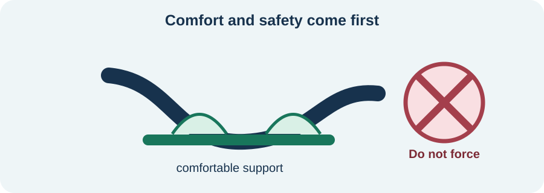

<!-- NAV-BREADCRUMB:START -->
[Home](../../../README.md) › [Course](../../README.md) › Part Two: Safety and Symptom Knowledge › [Module 7: Movement, Weakness, and Gait Symptoms](README.md) › **Functional Dystonia and Fixed Postures**
<!-- NAV-BREADCRUMB:END -->

# Functional Dystonia and Fixed Postures

> **Working draft:** This page was automatically generated and is looking for [contributors and reviewers](https://fnd-education-project.github.io/FND-Education/).

A foot, hand, jaw, face or another body part may pull into a painful posture or feel stuck there. Functional dystonia is one possible explanation, but posture alone does not decide the diagnosis. (*citations* [1](#citation-1))

## For the Person With FND

### Definition

**Dystonia** means sustained or repeated muscle activity that causes twisting, movement or an unusual posture. In **functional dystonia**, a clinician finds positive signs in the movement itself that show control is working differently across tasks.

*Illustration: protect comfort and safety; do not force a painful posture straight.*

### If you read only one thing

Do not force a painful fixed posture back into place. Support the body part and use only gentle changes taught for you.

### What assessment may include

Clinicians consider how the posture began, whether it was sudden or gradual, pain, swelling, injury, medication and other neurological conditions. Functional and other forms of dystonia can resemble one another, and treatment can differ. (*citations* [1](#citation-1))

A functional pattern may be fixed early, vary across tasks or occur with other functional symptoms. These features belong in a specialist assessment; they are not a checklist for diagnosing yourself.

### Care can have more than one goal

Treatment may work on comfort, skin and joint protection, movement options, daily tasks and participation. Physiotherapy, occupational therapy, speech therapy or psychological support may be used according to the body area and the person’s goals.

When change is slow, pain relief, splint review, footwear, seating, personal care and access still deserve attention. Aggressive stretching, repeated painful testing or a poorly fitted device can make things harder.

### Community experiences for review

These experiences show partial improvement rather than a guaranteed cure.

**Option 1 — therapy helped facial control**

> “With PT I managed to get my face under control.”

— The writer discussed facial dystonia and later treatment questions. [Read the public source](https://www.reddit.com/r/FND/comments/1q94cj6/botox_and_facial_dystonia/).

**Option 2 — symptoms remained variable**

> “It feels like I am stuck in a sit-up and like I am wearing the tightest belt.”

— The writer described the lived sensation of prolonged spasm and posture. [Read the public source](https://www.reddit.com/r/FND/comments/1jcjqlv/spasming/).

### Questions

#### What is the hardest part for you: pain, the position itself, unpredictability, appearance or loss of an activity?

#### Does anyone try to move the body part in a way that feels unsafe or takes away your control?

### One small thing you can do

Find the most supported, least forced position that is already safe for you. A lower-demand version is to note where pressure or friction occurs so you can show a clinician.

Stop if pain, colour, temperature, swelling or injury worsens. New fixed posturing or a major change needs reassessment.

***
[For the Person With FND](#for-the-person-with-fnd) 
[For Family, Friends, and Other Supporters](#for-family-friends-and-other-supporters) 
[For Clinicians and the Care Team](#for-clinicians-and-the-care-team) 
[Research and Sources](#research-and-sources)
***

## For Family, Friends, and Other Supporters

Ask before touching or repositioning the person. Support the affected part as agreed, reduce nearby hazards and help with the task—not by overpowering the posture.

Notice pain, skin pressure, swelling and function. Avoid comments about how the posture looks. Help the person seek reassessment when the pattern or physical condition of the limb changes.

***
[For the Person With FND](#for-the-person-with-fnd) 
[For Family, Friends, and Other Supporters](#for-family-friends-and-other-supporters) 
[For Clinicians and the Care Team](#for-clinicians-and-the-care-team) 
[Research and Sources](#research-and-sources)
***

## For Clinicians and the Care Team

### Research quotations for review

**Option 1 — Frucht et al., 2021**

> “distinguishing between FD and OD is important, as the management of these disorders is distinct.”

**Option 2 — Nielsen et al., 2015**

> “Patients with functional motor disorder ... are commonly referred to physiotherapists.”

*Figure 1 — Research quotations offered for editorial selection. (*citations* [1](#citation-1), [2](#citation-2))*

### Protect first, then seek useful variability

Differentiate functional dystonia from isolated, combined and secondary dystonias; assess pain, complex regional pain syndrome features, medication effects, contracture and coexisting disease. Do not infer diagnosis from fixed posture alone. (*citations* [1](#citation-1))

Use supported positioning and gentle, task-relevant exploration. Avoid forced correction that increases pain or threat. Coordinate skin, joint, footwear, splint, seating and self-care needs. Where botulinum toxin or another intervention is considered, explain its specific target, uncertainty and risks rather than using treatment response to prove diagnosis.

***
[For the Person With FND](#for-the-person-with-fnd) 
[For Family, Friends, and Other Supporters](#for-family-friends-and-other-supporters) 
[For Clinicians and the Care Team](#for-clinicians-and-the-care-team) 
[Research and Sources](#research-and-sources)
***

<!-- NAV-CONTEXT:START -->
**Continue:** [Next page: Gait and Falls](04-gait-falls-and-movement-retraining.md)

**Navigate:** [Home](../../../README.md) · [Course](../../README.md) · [Reference Library](../../../reference/README.md) · [Site Map](../../../SITEMAP.md)
<!-- NAV-CONTEXT:END -->

***

## Research and Sources

The dystonia review describes recognized presentations, diagnostic difficulty and multidisciplinary care. The physiotherapy source is professional consensus, not proof that a particular technique will help every fixed posture. (*citations* [1](#citation-1), [2](#citation-2))

**Related reference pages:** [dystonia signs](../../../reference/diagnostic-signs/04-functional-dystonia.md) · [dystonia recovery ideas](../../../reference/recovery-techniques/04-functional-dystonia.md)

| Citation | Figure | Full citation |
|---|---|---|
| **[1]** | Figure 1 | Frucht L, Perez DL, Callahan J, et al. Functional dystonia: differentiation from primary dystonia and multidisciplinary treatments. *Frontiers in Neurology*. 2021;11:605262. [FND-CIT-0021](../../../research/citation-index.md#fnd-cit-0021). [https://doi.org/10.3389/fneur.2020.605262](https://doi.org/10.3389/fneur.2020.605262) |
| **[2]** | Figure 1 | Nielsen G, Stone J, Matthews A, et al. Physiotherapy for functional motor disorders: a consensus recommendation. *Journal of Neurology, Neurosurgery & Psychiatry*. 2015;86(10):1113–1119. [FND-CIT-0028](../../../research/citation-index.md#fnd-cit-0028). [https://doi.org/10.1136/jnnp-2014-309255](https://doi.org/10.1136/jnnp-2014-309255) |

This page still needs review by people with dystonia, movement-disorder clinicians and rehabilitation professionals.

*Plain-language draft prepared: September 4, 2026 · Research package added September 4, 2026 · Clinical review pending*
