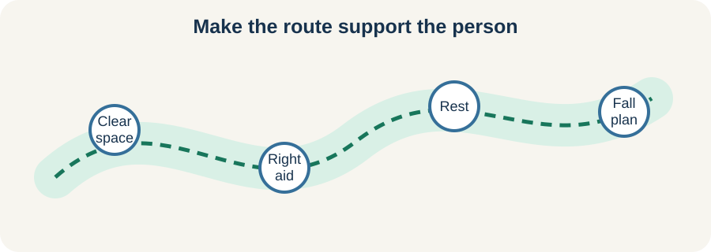

<!-- NAV-BREADCRUMB:START -->
[Home](../../../README.md) › [Course](../../README.md) › Part Two: Safety and Symptom Knowledge › [Module 7: Movement, Weakness, and Gait Symptoms](README.md) › **Gait and Falls**
<!-- NAV-BREADCRUMB:END -->

# Gait and Falls

> **Working draft:** This page was automatically generated and is looking for [contributors and reviewers](https://fnd-education-project.github.io/FND-Education/).

Walking can become slow, effortful, unsteady or unpredictable. A person may drag a leg, buckle, sway, freeze or fall. An unusual-looking walk is not a diagnosis by itself. (*citations* [1](#citation-1), [2](#citation-2))

## For the Person With FND

### Definition

A **functional gait disorder** is a problem with walking caused by functional changes in movement control. **Gait** simply means the way a person walks.

*Illustration: shape the route around the person’s safety and access needs.*

### If you read only one thing

Safety aids and movement retraining can be used together. You do not have to choose between living now and working toward change.

### How a diagnosis is supported

A clinician looks for a pattern of positive signs across walking tasks, not whether the gait appears unusual. The pattern may change with speed, rhythm, direction, support, attention or a more automatic task. Functional and other gait disorders can coexist. (*citations* [1](#citation-1))

Falls may have many causes, including weakness, balance problems, fainting, seizures, medication effects and environmental hazards. Some people have sudden functional drop attacks. The event needs its own assessment.

### Reduce harm without shrinking life

Consider footwear, lighting, clear routes, rails, a correctly fitted aid and a plan for difficult places. A physiotherapist or occupational therapist can help judge what support is safe. Avoid removing an aid simply to force a more normal walk.

The next page explains why rehabilitation may use rhythm, a destination or another task instead of asking you to think harder about every step.

### Community experiences for review

These accounts show improvement and non-response. Both belong in an honest course.

**Option 1 — gait improved with therapy**

> “It was described as a severe ataxic gait. Physical therapy was what helped me recover.”

— The writer identified gait as the defining early FND feature. [Read the public source](https://www.reddit.com/r/FND/comments/wzfpye/how_does_fnd_affect_your_walk/).

**Option 2 — specialist care did not restore walking**

> “They spent 6 weeks at Re-Active, which did nothing to help them regain their ability to walk.”

— A supporter described no walking recovery after an intensive program. [Read the public source](https://www.reddit.com/r/FND/comments/1kchl1l/how_to_get_out_of_paralysis_epsiode/).

### Questions

#### Where do you feel least safe while walking, and what would make that place easier?

#### What matters more to you right now: fewer falls, less effort, greater distance or access to one place?

### One small thing you can do

Choose one route you use often and remove one avoidable hazard. A lower-demand version is to ask someone to look at the route with you.

Do not practise a difficult walking pattern alone or without the aid you need. New falls, blackout, injury or a major change needs assessment.

***
[For the Person With FND](#for-the-person-with-fnd) 
[For Family, Friends, and Other Supporters](#for-family-friends-and-other-supporters) 
[For Clinicians and the Care Team](#for-clinicians-and-the-care-team) 
[Research and Sources](#research-and-sources)
***

## For Family, Friends, and Other Supporters

Ask how the person wants help before reaching for them. Unexpected pulling can disturb balance. Keep aids available, reduce hazards and walk at the person’s pace.

Do not judge severity by how unusual the gait looks. Notice actual falls, near-falls, injuries, loss of awareness and meaningful changes. Support participation without turning every trip into a walking test.

***
[For the Person With FND](#for-the-person-with-fnd) 
[For Family, Friends, and Other Supporters](#for-family-friends-and-other-supporters) 
[For Clinicians and the Care Team](#for-clinicians-and-the-care-team) 
[Research and Sources](#research-and-sources)
***

## For Clinicians and the Care Team

### Research quotations for review

**Option 1 — Nonnekes et al., 2020**

> “there is not a single pathognomonic gait pattern”

**Option 2 — Hoeritzauer et al., 2018**

> “evidence of overlap with functional neurological disorder”

*Figure 1 — Research quotations offered for editorial selection. (*citations* [1](#citation-1), [2](#citation-2))*

### Use a sign-based assessment and a safety-based plan

Assess inconsistency and incongruity across relevant tasks while considering neurological, vestibular, musculoskeletal, cardiovascular and medication-related causes. A bizarre appearance is neither necessary nor sufficient. Functional and organic gait disorders may coexist. (*citations* [1](#citation-1))

Characterize falls separately: buckling, imbalance, loss of consciousness, seizure-related falls and drop attacks imply different questions. Match aids and supervision to actual risk and participation goals. When teaching a positive sign, connect it to a treatment possibility without withdrawing needed access.

***
[For the Person With FND](#for-the-person-with-fnd) 
[For Family, Friends, and Other Supporters](#for-family-friends-and-other-supporters) 
[For Clinicians and the Care Team](#for-clinicians-and-the-care-team) 
[Research and Sources](#research-and-sources)
***

<!-- NAV-CONTEXT:START -->
**Continue:** [Next page: How Movement Retraining Works](05-how-movement-retraining-works.md)

**Navigate:** [Home](../../../README.md) · [Course](../../README.md) · [Reference Library](../../../reference/README.md) · [Site Map](../../../SITEMAP.md)
<!-- NAV-CONTEXT:END -->

***

## Research and Sources

The gait article offers a clinical sign-based approach. The drop-attack cohort supports overlap in a selected group, not a functional explanation for every unexplained fall. (*citations* [1](#citation-1), [2](#citation-2))

**Related reference pages:** [gait signs](../../../reference/diagnostic-signs/05-functional-gait-disorder.md) · [gait recovery ideas](../../../reference/recovery-techniques/05-functional-gait-disorder.md) · [drop-attack signs](../../../reference/diagnostic-signs/16-functional-drop-attacks.md) · [drop-attack recovery ideas](../../../reference/recovery-techniques/16-functional-drop-attacks.md)

| Citation | Figure | Full citation |
|---|---|---|
| **[1]** | Figure 1 | Nonnekes J, Růžička E, Serranová T, Reich SG, Bloem BR, Hallett M. Functional gait disorders: a sign-based approach. *Neurology*. 2020;94(24):1093–1099. [FND-CIT-0020](../../../research/citation-index.md#fnd-cit-0020). [https://doi.org/10.1212/WNL.0000000000009649](https://doi.org/10.1212/WNL.0000000000009649) |
| **[2]** | Figure 1 | Hoeritzauer I, Carson AJ, Stone J. “Cryptogenic drop attacks” revisited: evidence of overlap with functional neurological disorder. *Journal of Neurology, Neurosurgery & Psychiatry*. 2018;89(7):769–776. [FND-CIT-0059](../../../research/citation-index.md#fnd-cit-0059). [https://doi.org/10.1136/jnnp-2017-317396](https://doi.org/10.1136/jnnp-2017-317396) |

This page still needs review by people with gait symptoms or falls, physiotherapists and relevant medical specialists.

*Plain-language draft prepared: September 4, 2026 · Research package added September 4, 2026 · Clinical review pending*
