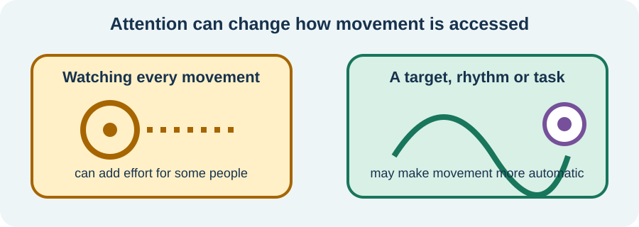

<!-- NAV-BREADCRUMB:START -->
[Home](../../../README.md) › [Course](../../README.md) › Part Two: Safety and Symptom Knowledge › [Module 7: Movement, Weakness, and Gait Symptoms](README.md) › **How Movement Retraining Works**
<!-- NAV-BREADCRUMB:END -->

# How Movement Retraining Works

> **Working draft:** This page was automatically generated and is looking for [contributors and reviewers](https://fnd-education-project.github.io/FND-Education/).

Trying harder at the exact movement that is stuck can sometimes add effort without restoring control. Rehabilitation may begin where movement is easier or more automatic.

## For the Person With FND

### Definition

**Movement retraining** is guided practice that helps the nervous system find a more useful movement pattern. **Redirected attention** means focusing on a goal, rhythm or outside task rather than closely controlling each body part.

*Illustration: an external focus may make movement more automatic for some people.*

### If you read only one thing

Retraining is not “push through.” The dose, cue and goal should fit your body, safety and recovery.

### What practice may look like

A therapist may use rhythm, weight shift, a familiar task, an external target, another body part or a changed starting position. The aim is to find a movement option and build from it. The method should be explained, agreed and adapted to the symptom pattern. (*citations* [1](#citation-1))

Practice does not have to look like normal exercise. A useful dose might be one repeat followed by recovery. More is not automatically better. Pain, fatigue, dizziness, post-activity worsening and other diagnoses may require a different pace.

### What improvement may mean

Possible gains include easier movement, fewer falls, less effort, greater confidence or returning to an activity. Symptoms can remain while function improves. If a technique does not help—or repeatedly causes a harmful flare—the plan should change.

Trials give a mixed picture. In Physio4FMD, specialist physiotherapy did not improve the primary physical-function outcome more than usual neurophysiotherapy at 12 months, though some secondary and patient-rated outcomes favored specialist care. Both approaches were valued by selected participants. (*citations* [2](#citation-2))

### Community experiences for review

These quotations show careful progress and the possibility of no benefit.

**Option 1 — very gradual walking practice**

> “Gradually increasing my tolerance for walking helped a lot. I took baby steps and I mean BABY steps.”

— The writer emphasized a personally tolerable pace. [Read the public source](https://www.reddit.com/r/FND/comments/1jtyslg/).

**Option 2 — rehabilitation did not help**

> “They spent 6 weeks at Re-Active, which did nothing to help them regain their ability to walk.”

— A supporter described non-response to an intensive program. [Read the public source](https://www.reddit.com/r/FND/comments/1kchl1l/how_to_get_out_of_paralysis_epsiode/).

### Questions

#### Which movement goal would make a real difference to your day, even if symptoms remained?

#### How does your body tell you that practice was enough—or too much?

### One small thing you can do

Choose one therapist-approved movement and pair it with a simple outside focus, such as a target or rhythm. A lower-demand version is to write down a meaningful movement goal for your next appointment.

Stop for unsafe balance, new pain, injury or a significant symptom flare. Do not copy a stranger’s exercise when your diagnosis, risks and capacity may differ.

***
[For the Person With FND](#for-the-person-with-fnd) 
[For Family, Friends, and Other Supporters](#for-family-friends-and-other-supporters) 
[For Clinicians and the Care Team](#for-clinicians-and-the-care-team) 
[Research and Sources](#research-and-sources)
***

## For Family, Friends, and Other Supporters

Support the goal without supervising every repetition. Ask whether the person wants a cue, practical help or quiet. Do not withhold aids to create practice or treat a symptom increase as lack of effort.

Notice costs after the session as well as performance during it. Help protect recovery time and ordinary enjoyable activity.

***
[For the Person With FND](#for-the-person-with-fnd) 
[For Family, Friends, and Other Supporters](#for-family-friends-and-other-supporters) 
[For Clinicians and the Care Team](#for-clinicians-and-the-care-team) 
[Research and Sources](#research-and-sources)
***

## For Clinicians and the Care Team

### Research quotations for review

**Option 1 — Nielsen et al., 2015**

> “Retraining movement with diverted attention”

**Option 2 — Nielsen et al., 2024**

> “the intervention did not result in better self-reported physical functioning at 12 months.”

*Figure 1 — Research quotations offered for editorial selection. (*citations* [1](#citation-1), [2](#citation-2))*

### Individualize the mechanism, dose and outcome

Use positive signs and preserved automatic movement to support an intelligible rationale. Select external focus, task-oriented practice and graded progression around the phenotype and patient’s goal. Assess comorbidity, pain, fatigue, autonomic symptoms and delayed worsening before prescribing dose.

Represent trial evidence completely. Physio4FMD found no significant primary-outcome difference but some favorable secondary outcomes; a small single-center trial found benefit from combined physiotherapy and CBT but cannot identify the active component. (*citations* [2](#citation-2), [3](#citation-3))

If symptom-focused retraining is ineffective, continue equipment, falls prevention, pain management, accessibility and participation work. Non-response should prompt reformulation, not blame.

***
[For the Person With FND](#for-the-person-with-fnd) 
[For Family, Friends, and Other Supporters](#for-family-friends-and-other-supporters) 
[For Clinicians and the Care Team](#for-clinicians-and-the-care-team) 
[Research and Sources](#research-and-sources)
***

<!-- NAV-CONTEXT:START -->
**Continue:** [Next module: Sensory, Visual, Balance, and Dizziness Symptoms](../module-08-sensory-visual-balance-and-dizziness-symptoms/README.md)

**Navigate:** [Home](../../../README.md) · [Course](../../README.md) · [Reference Library](../../../reference/README.md) · [Site Map](../../../SITEMAP.md)
<!-- NAV-CONTEXT:END -->

***

## Research and Sources

The consensus paper describes treatment principles. Physio4FMD provides the largest pragmatic trial evidence and had a mixed outcome pattern. The combined trial was smaller and cannot separate treatment components. (*citations* [1](#citation-1), [2](#citation-2), [3](#citation-3))

**Related reference collections:** [symptom recovery pages](../../../reference/recovery-techniques/README.md) · [technique index](../../../reference/recovery-techniques/technique-index.md)

| Citation | Figure | Full citation |
|---|---|---|
| **[1]** | Figure 1 | Nielsen G, Stone J, Matthews A, et al. Physiotherapy for functional motor disorders: a consensus recommendation. *Journal of Neurology, Neurosurgery & Psychiatry*. 2015;86(10):1113–1119. [FND-CIT-0028](../../../research/citation-index.md#fnd-cit-0028). [https://doi.org/10.1136/jnnp-2014-309255](https://doi.org/10.1136/jnnp-2014-309255) |
| **[2]** | Figure 1 | Nielsen G, Stone J, Lee TC, et al.; Physio4FMD study group. Specialist physiotherapy for functional motor disorder in England and Scotland (Physio4FMD): a pragmatic, multicentre, phase 3 randomised controlled trial. *The Lancet Neurology*. 2024;23(7):675–686. [FND-CIT-0029](../../../research/citation-index.md#fnd-cit-0029). [https://doi.org/10.1016/S1474-4422(24)00135-2](https://doi.org/10.1016/S1474-4422(24)00135-2) |
| **[3]** | — | Macías-García D, Méndez-Del Barrio M, Canal-Rivero M, et al. Combined physiotherapy and cognitive behavioral therapy for functional movement disorders: a randomized clinical trial. *JAMA Neurology*. 2024;81(9):966–976. [FND-CIT-0030](../../../research/citation-index.md#fnd-cit-0030). [https://doi.org/10.1001/jamaneurol.2024.2393](https://doi.org/10.1001/jamaneurol.2024.2393) |

This page still needs review by people with motor symptoms, rehabilitation professionals and clinicians, especially the description of dosage and post-activity worsening.

*Plain-language draft prepared: September 4, 2026 · Research package added September 4, 2026 · Clinical review pending*
