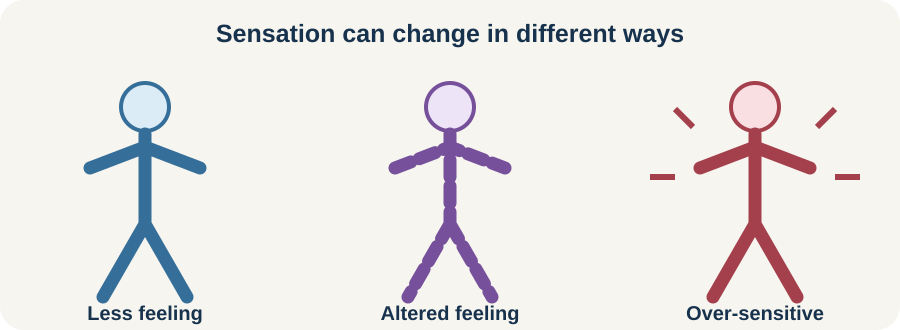

<!-- NAV-BREADCRUMB:START -->
[Home](../../../README.md) › [Course](../../README.md) › Part Two: Safety and Symptom Knowledge › [Module 8: Sensory, Visual, Balance, and Dizziness Symptoms](README.md) › **Numbness, Altered Sensation, and Hypersensitivity**
<!-- NAV-BREADCRUMB:END -->

# Numbness, Altered Sensation, and Hypersensitivity

> **Working draft:** This page was automatically generated and is looking for [contributors and reviewers](https://fnd-education-project.github.io/FND-Education/).

Functional sensory symptoms can include too little sensation, too much sensation or a sensation that feels changed. The experience is real even when routine tests do not show tissue damage. (*citations* [1](#citation-1))

## For the Person With FND

### Definition

**Altered sensation** means touch, temperature, pain, body position or another feeling is experienced differently. **Numbness** is reduced sensation. **Hypersensitivity** is an unusually strong or distressing response to sensory input.

*Illustration: a person’s sensory map can vary; this is not a self-diagnostic chart.*

### If you read only one thing

Sensory symptoms deserve a careful history and examination. Older bedside signs should not be used alone to decide that a symptom is functional.

### What this may feel like

People describe pins and needles, burning, coldness, heaviness, a missing body part, an altered boundary or pain from ordinary touch. Symptoms may be steady or change with position, activity, attention, migraine, fatigue or other health conditions.

Functional sensory symptoms can coexist with neuropathy, migraine, nerve injury, medication effects and other causes. A new distribution, injury, weakness or major change needs appropriate assessment.

### What may help

An occupational therapist or physiotherapist may explore safe ways to use touch, texture, movement, vision and meaningful activity. Access strategies can reduce immediate load. Rehabilitation may gently expand tolerance or improve use of the affected area. These are different goals and can be combined. (*citations* [2](#citation-2), [3](#citation-3))

Avoid aggressive rubbing, extreme temperatures or repeated checking of an area with reduced sensation. Protect skin and follow advice for any separate medical condition.

### Community experiences for review

These accounts show sensory variety and a practical adaptation. They are lived experience, not treatment evidence.

**Option 1 — several sensations at once**

> “I get tingling, needles, numbness, and burning sensations.”

— The writer listed multiple sensory symptoms within a broader FND experience. [Read the public source](https://www.reddit.com/r/FND/comments/1hmedeg/please_explain_your_symptoms_in_detail/).

**Option 2 — occupational therapy and daily function**

> “My OT helped me ... learn exercises to calm myself and avoid sensory overwhelm.”

— The writer also described a prescribed sensory routine as helping them stay within a tolerable range. [Read the public source](https://www.reddit.com/r/FND/comments/1j0nopp/tell_me_how_ot_will_help_my_fnd/).

### Questions

#### Which sensation is hardest to live with, and what does it stop or interrupt?

#### Do you need less sensory load now, greater tolerance over time, or both?

### One small thing you can do

Choose one safe adjustment, such as a softer fabric or moving an irritating object. A lower-demand version is to name one sensory barrier in your day.

Stop any experiment that causes pain, skin damage, dizziness or a lasting flare. Seek assessment for a new or substantially changed pattern.

***
[For the Person With FND](#for-the-person-with-fnd) 
[For Family, Friends, and Other Supporters](#for-family-friends-and-other-supporters) 
[For Clinicians and the Care Team](#for-clinicians-and-the-care-team) 
[Research and Sources](#research-and-sources)
***

## For Family, Friends, and Other Supporters

Ask before touching an affected area or changing the environment. A light touch may feel painful, while numbness may hide pressure or heat injury. Help with skin checks or practical changes only if the person wants this.

Do not repeatedly test sensation or insist on exposure. Support immediate access and any clinician-guided rehabilitation as separate, chosen needs.

***
[For the Person With FND](#for-the-person-with-fnd) 
[For Family, Friends, and Other Supporters](#for-family-friends-and-other-supporters) 
[For Clinicians and the Care Team](#for-clinicians-and-the-care-team) 
[Research and Sources](#research-and-sources)
***

## For Clinicians and the Care Team

### Research quotations for review

**Option 1 — Nielsen et al., 2026**

> “We currently lack data on the prevalence, impact and prognosis of sensory symptoms in FND.”

**Option 2 — McCombs et al., 2024**

> “limited research has been conducted to examine the efficacy of OT interventions for FND.”

*Figure 1 — Research quotations offered for editorial selection. (*citations* [1](#citation-1), [3](#citation-3))*

### Do not overstate bedside signs or treatment evidence

Map the symptom and its functional effect, then assess relevant neurological, peripheral-nerve, migraine, pain, dermatological and medication-related alternatives. The 2026 case-control study found limits in classic signs such as midline or vibration splitting; avoid using one sign as proof. (*citations* [1](#citation-1))

Clarify whether the goal is protection, accommodation, functional use, desensitization or another chosen outcome. McCombs and colleagues reported preliminary outcomes from an uncontrolled retrospective cohort; frame sensory-based OT as emerging evidence, not established cure. (*citations* [2](#citation-2), [3](#citation-3))

***
[For the Person With FND](#for-the-person-with-fnd) 
[For Family, Friends, and Other Supporters](#for-family-friends-and-other-supporters) 
[For Clinicians and the Care Team](#for-clinicians-and-the-care-team) 
[Research and Sources](#research-and-sources)
***

<!-- NAV-CONTEXT:START -->
**Continue:** [Next page: Visual Symptoms and Photophobia](02-visual-symptoms-photophobia-and-sensory-overload.md)

**Navigate:** [Home](../../../README.md) · [Course](../../README.md) · [Reference Library](../../../reference/README.md) · [Site Map](../../../SITEMAP.md)
<!-- NAV-CONTEXT:END -->

***

## Research and Sources

The sensory case-control study directly examines diagnostic signs. The OT sources offer consensus and preliminary observational evidence, so causal treatment claims would be premature. (*citations* [1](#citation-1), [2](#citation-2), [3](#citation-3))

**Related reference pages:** [sensory signs](../../../reference/diagnostic-signs/07-functional-sensory-symptoms.md) · [sensory recovery ideas](../../../reference/recovery-techniques/07-functional-sensory-symptoms.md)

| Citation | Figure | Full citation |
|---|---|---|
| **[1]** | Figure 1 | Nielsen G, Higgins R, Stone J, Coebergh J, Edwards MJ. Functional sensory symptoms and signs: a case-control study of 102 patients. *Brain Communications*. 2026;8(1):fcag031. [FND-CIT-0023](../../../research/citation-index.md#fnd-cit-0023). [https://doi.org/10.1093/braincomms/fcag031](https://doi.org/10.1093/braincomms/fcag031) |
| **[2]** | — | Nicholson C, Edwards MJ, Carson AJ, et al. Occupational therapy consensus recommendations for functional neurological disorder. *Journal of Neurology, Neurosurgery & Psychiatry*. 2020;91(10):1037–1045. [FND-CIT-0011](../../../research/citation-index.md#fnd-cit-0011). [https://doi.org/10.1136/jnnp-2019-322281](https://doi.org/10.1136/jnnp-2019-322281) |
| **[3]** | Figure 1 | McCombs KE, MacLean J, Finkelstein SA, Goedeken S, Perez DL, Ranford J. Sensory processing difficulties and occupational therapy outcomes for functional neurological disorder: a retrospective cohort study. *Neurology: Clinical Practice*. 2024;14(3):e200286. [FND-CIT-0035](../../../research/citation-index.md#fnd-cit-0035). [https://doi.org/10.1212/CPJ.0000000000200286](https://doi.org/10.1212/CPJ.0000000000200286) |

This page still needs review by people with sensory symptoms, occupational therapists and neurologists.

*Plain-language draft prepared: September 4, 2026 · Research package added September 4, 2026 · Clinical review pending*
