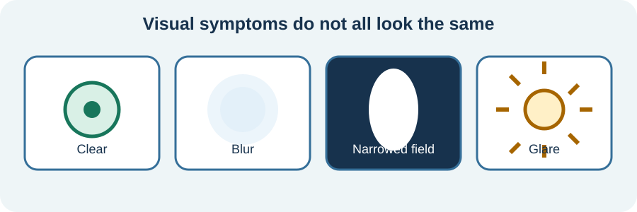

<!-- NAV-BREADCRUMB:START -->
[Home](../../../README.md) › [Course](../../README.md) › Part Two: Safety and Symptom Knowledge › [Module 8: Sensory, Visual, Balance, and Dizziness Symptoms](README.md) › **Visual Symptoms and Photophobia**
<!-- NAV-BREADCRUMB:END -->

# Visual Symptoms and Photophobia

> **Working draft:** This page was automatically generated and is looking for [contributors and reviewers](https://fnd-education-project.github.io/FND-Education/).

Vision may blur, narrow, double, darken or feel unreliable. Light and busy scenes may become painful or overwhelming. Functional visual symptoms are one possible diagnosis; eye, migraine and neurological causes still matter. (*citations* [1](#citation-1), [2](#citation-2))

## For the Person With FND

### Definition

A **functional visual symptom** is a real change in seeing. A clinician supports the diagnosis by showing that vision works better in a different task or condition—not merely because a test was normal. **Photophobia** means light causes discomfort or worsens symptoms.

*Illustration: visual symptoms do not all look or feel the same.*

### If you read only one thing

A positive diagnosis should demonstrate preserved visual function and explain it without implying that you are pretending.

### Assessment and overlap

An eye or neuro-ophthalmic assessment may compare vision across tasks and look for signs that vision is working outside the difficult test. The clinician should also consider eye disease, migraine, medication and neurological conditions. Normal structure alone is not enough to diagnose a functional symptom. (*citations* [1](#citation-1))

If a familiar episode begins, stop driving, using tools, cooking or navigating stairs until vision is reliable. Sudden new or painful visual loss, flashes or floaters, a curtain-like shadow, or visual change with acute neurological symptoms needs urgent assessment.

### Access now, rehabilitation when suitable

Tint, lower glare, screen settings, breaks, a guide or a quieter route may make an activity possible. Long-term avoidance or very dark lenses can have tradeoffs for some conditions, so discuss persistent photophobia with an appropriate clinician. Accommodation is not failure; rehabilitation is not compulsory exposure. The later [sensory-overload page](04-sensory-overload-accommodations-and-gradual-change.md) looks more broadly at light, sound, touch, motion and busy environments.

### Community experiences for review

These accounts show an aid and a separate diagnosis. They do not prove what will help another person.

**Option 1 — tinted lenses helped**

> “I’ve got FL-41 lens coating sunglasses to help with light sensitivity.”

— The writer described one accessibility aid. [Read the public source](https://www.reddit.com/r/FND/comments/1h7poki/accessibility_aids/).

**Option 2 — an eye problem was treated**

> “He gave me steroid droplets ... and since then my light sensitivity is gone.”

— The writer described improvement after eye assessment and treatment. [Read the public source](https://www.reddit.com/r/FND/comments/1ievray/sharing_my_success_story/).

### Questions

#### Which visual setting makes you lose access most quickly, and what would help you stay involved?

#### Have your visual symptoms been positively assessed, or mainly explained by tests that were normal?

### One small thing you can do

Change one controllable source of glare or visual clutter. A lower-demand version is to note the setting you want help adapting.

Do not test vision while driving or near hazards. Seek appropriate care for a new, painful or substantially changed visual symptom.

***
[For the Person With FND](#for-the-person-with-fnd) 
[For Family, Friends, and Other Supporters](#for-family-friends-and-other-supporters) 
[For Clinicians and the Care Team](#for-clinicians-and-the-care-team) 
[Research and Sources](#research-and-sources)
***

## For Family, Friends, and Other Supporters

Guide only with permission. Describe obstacles and offer an arm in the way the person prefers. Reduce glare, motion or crowding when practical without insisting that they tolerate more.

Do not wave fingers, flash lights or create surprise tests. Help the person access eye or neurological reassessment when the symptom is new or changed.

***
[For the Person With FND](#for-the-person-with-fnd) 
[For Family, Friends, and Other Supporters](#for-family-friends-and-other-supporters) 
[For Clinicians and the Care Team](#for-clinicians-and-the-care-team) 
[Research and Sources](#research-and-sources)
***

## For Clinicians and the Care Team

### Research quotations for review

**Option 1 — Ramsay et al., 2024**

> “Trust and transparency are an essential element in any doctor-patient relationship”

**Option 2 — Ramsay et al., 2024**

> “Make a positive diagnosis based on investigations that demonstrate normal vision”

*Figure 1 — Research quotations offered for editorial selection. (*citations* [1](#citation-1))*

### Demonstrate, explain and preserve access

Use a complete ophthalmic or neuro-ophthalmic assessment to identify positive evidence of preserved vision and relevant comorbidity. Show the patient what the finding means, its limits and why it supports a functional diagnosis. Avoid surprise manoeuvres that feel like attempts to catch the patient out. (*citations* [1](#citation-1))

Assess migraine, ocular disease, neurological conditions and medication effects. Provide immediate visual access while considering individualized rehabilitation. Evidence-based treatment remains limited; do not turn tint removal, visual exposure or attention strategies into universal requirements.

***
[For the Person With FND](#for-the-person-with-fnd) 
[For Family, Friends, and Other Supporters](#for-family-friends-and-other-supporters) 
[For Clinicians and the Care Team](#for-clinicians-and-the-care-team) 
[Research and Sources](#research-and-sources)
***

<!-- NAV-CONTEXT:START -->
**Continue:** [Next page: Dizziness, Balance, and Vestibular Overlap](03-dizziness-balance-and-vestibular-overlap.md)

**Navigate:** [Home](../../../README.md) · [Course](../../README.md) · [Reference Library](../../../reference/README.md) · [Site Map](../../../SITEMAP.md)
<!-- NAV-CONTEXT:END -->

***

## Research and Sources

The 2024 clinical paper supports a positive, transparent visual assessment and consideration of comorbid disease. The migraine review supports overlap but does not show that every visual symptom in FND is migraine. (*citations* [1](#citation-1), [2](#citation-2))

**Related reference pages:** [visual signs](../../../reference/diagnostic-signs/08-functional-visual-symptoms.md) · [visual recovery ideas](../../../reference/recovery-techniques/08-functional-visual-symptoms.md)

| Citation | Figure | Full citation |
|---|---|---|
| **[1]** | Figure 1 | Ramsay N, McKee J, Al-Ani G, Stone J. How do I manage functional visual loss. *Eye*. 2024;38:2257–2266. [FND-CIT-0024](../../../research/citation-index.md#fnd-cit-0024). [https://doi.org/10.1038/s41433-024-03126-w](https://doi.org/10.1038/s41433-024-03126-w) |
| **[2]** | — | Stone J, Coebergh J, Khoja L, Butler M, Nicholson TR, Dodick DW. Migraine and functional neurological disorder (FND)—a review of comorbidity and potential overlap. *Brain Communications*. 2025;7(4):fcaf288. [FND-CIT-0049](../../../research/citation-index.md#fnd-cit-0049). [https://doi.org/10.1093/braincomms/fcaf288](https://doi.org/10.1093/braincomms/fcaf288) |

This page still needs review by people with visual symptoms, ophthalmic clinicians, neurologists and accessibility reviewers.

*Plain-language draft prepared: September 4, 2026 · Research package added September 4, 2026 · Clinical review pending*
