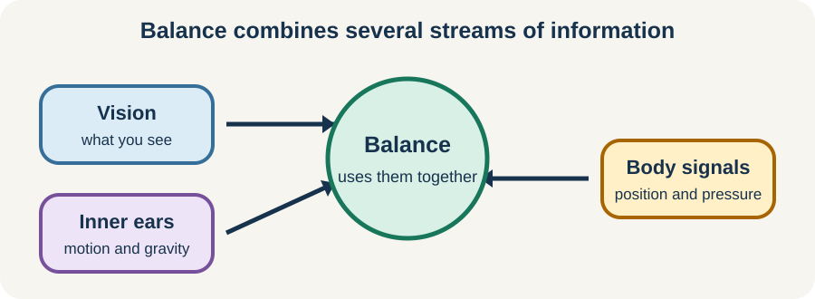

<!-- NAV-BREADCRUMB:START -->
[Home](../../../README.md) › [Course](../../README.md) › Part Two: Safety and Symptom Knowledge › [Module 8: Sensory, Visual, Balance, and Dizziness Symptoms](README.md) › **Dizziness, Balance, and Vestibular Overlap**
<!-- NAV-BREADCRUMB:END -->

# Dizziness, Balance, and Vestibular Overlap

> **Working draft:** This page was automatically generated and is looking for [contributors and reviewers](https://fnd-education-project.github.io/FND-Education/).

“Dizzy” can mean spinning, rocking, faintness, imbalance, visual motion or a hard-to-name sense that the world is unstable. The meaning matters because the possible causes and treatments differ.

## For the Person With FND

### Definition

The **vestibular system** uses inner-ear and brain signals to help with balance and steady vision. **Persistent postural-perceptual dizziness (PPPD)** is a diagnosed functional condition. It causes dizziness or unsteadiness on most days for at least three months and is made worse by standing upright, movement or complex visual scenes. Clinicians use five full criteria to diagnose it. (*citations* [1](#citation-1))

*Illustration: balance combines several streams of information; dizziness can have more than one cause.*

### If you read only one thing

Not all dizziness in a person with FND is PPPD. The symptom needs assessment before a rehabilitation label or exercise plan is chosen.

### Sort the experience before treating it

A clinician may ask whether you feel spinning, light-headed, about to faint, off balance, pulled, visually overwhelmed or worse when upright. They may assess eye movement, hearing, balance, blood pressure and heart rate, migraine, medication and neurological features.

PPPD can begin after a vestibular illness, migraine, medical event or psychological distress, and can coexist with another condition. Normal inner-ear tests alone do not diagnose it. (*citations* [1](#citation-1))

### Rehabilitation needs the right dose

Vestibular rehabilitation uses selected eye, head, body and balance tasks. A 2025 review found improved dizziness-handicap scores across included studies, but the studies were varied and often small. Treatment should be customized, and a large or lasting flare is information to review the dose. (*citations* [2](#citation-2), [3](#citation-3))

### Community experiences for review

These accounts show slow benefit and early worsening. They are not a timetable for another person.

**Option 1 — improvement took time**

> “I improved over time with neurology based vestibular rehab. Not quick movements, not intense.”

— The writer described slow, repetitive practice below the symptom threshold. [Read the public source](https://www.reddit.com/r/FND/comments/1pbgomb/dizziness/).

**Option 2 — symptoms first became worse**

> “Vestibular and optokinetic exercises helped tremendously but I did feel worse ... in the beginning.”

— The writer also used an SSRI and reported regression as well as progress. [Read the public source](https://www.reddit.com/r/pppdizziness/comments/1qwiah2/vestibular_rehab_hypervigilance_pppd_can_this/).

### Questions

#### When you say “dizzy,” what does the experience actually feel like in your body and surroundings?

#### Which matters most right now: preventing falls, tolerating motion, standing longer or reaching a place you miss?

### One small thing you can do

Choose the one word that best describes a typical episode—spinning, faint, rocking, unsteady or visually overwhelmed—and note what position you were in. A lower-demand version is the word alone.

Do not begin vestibular exercises from this page. Stop an activity if you are at risk of falling or fainting, and seek assessment for a new or substantially changed pattern.

***
[For the Person With FND](#for-the-person-with-fnd) 
[For Family, Friends, and Other Supporters](#for-family-friends-and-other-supporters) 
[For Clinicians and the Care Team](#for-clinicians-and-the-care-team) 
[Research and Sources](#research-and-sources)
***

## For Family, Friends, and Other Supporters

Offer a stable arm or seat in the way the person prefers. Reduce immediate visual or motion load and allow recovery. Do not rapidly move the person’s head or test balance unexpectedly.

Notice whether the event involved fainting, injury, new neurological symptoms or an unusual recovery. Support reassessment rather than assuming all dizziness is FND or PPPD.

***
[For the Person With FND](#for-the-person-with-fnd) 
[For Family, Friends, and Other Supporters](#for-family-friends-and-other-supporters) 
[For Clinicians and the Care Team](#for-clinicians-and-the-care-team) 
[Research and Sources](#research-and-sources)
***

## For Clinicians and the Care Team

### Research quotations for review

**Option 1 — Staab et al., 2017**

> “PPPD may be present alone or co-exist with other conditions.”

**Option 2 — Li et al., 2025**

> “additional randomized controlled trials are necessary”

*Figure 1 — Research quotations offered for editorial selection. (*citations* [1](#citation-1), [2](#citation-2))*

### Diagnose the dizziness phenotype

Apply all five PPPD criteria and assess precipitating and coexisting vestibular, migraine, neurological, cardiovascular and medication-related conditions. Separate vertigo, presyncope, disequilibrium and visually induced dizziness. A normal vestibular test is not sufficient for PPPD. (*citations* [1](#citation-1))

If using vestibular rehabilitation, customize the tasks and progression. The 2025 meta-analysis pooled eight heterogeneous studies and had unresolved heterogeneity; the Cochrane review found very limited eligible controlled evidence under stricter criteria. Explain that early symptoms can increase without assuming every flare is therapeutic. (*citations* [2](#citation-2), [3](#citation-3))

***
[For the Person With FND](#for-the-person-with-fnd) 
[For Family, Friends, and Other Supporters](#for-family-friends-and-other-supporters) 
[For Clinicians and the Care Team](#for-clinicians-and-the-care-team) 
[Research and Sources](#research-and-sources)
***

<!-- NAV-CONTEXT:START -->
**Continue:** [Next page: Sensory Overload, Accommodations, and Gradual Change](04-sensory-overload-accommodations-and-gradual-change.md)

**Navigate:** [Home](../../../README.md) · [Course](../../README.md) · [Reference Library](../../../reference/README.md) · [Site Map](../../../SITEMAP.md)
<!-- NAV-CONTEXT:END -->

***

## Research and Sources

The Bárány Society document defines PPPD. Later reviews reach different levels of confidence because they use different inclusion rules and study sets; neither supports one universal protocol. (*citations* [1](#citation-1), [2](#citation-2), [3](#citation-3))

**Related reference pages:** [PPPD diagnostic criteria](../../../reference/diagnostic-signs/13-persistent-postural-perceptual-dizziness.md) · [PPPD recovery ideas](../../../reference/recovery-techniques/13-persistent-postural-perceptual-dizziness.md)

| Citation | Figure | Full citation |
|---|---|---|
| **[1]** | Figure 1 | Staab JP, Eckhardt-Henn A, Horii A, Jacob R, Strupp M, Brandt T, Bronstein A. Diagnostic criteria for persistent postural-perceptual dizziness (PPPD): consensus document of the Committee for the Classification of Vestibular Disorders of the Bárány Society. *Journal of Vestibular Research*. 2017;27(4):191–208. [FND-CIT-0027](../../../research/citation-index.md#fnd-cit-0027). [https://doi.org/10.3233/VES-170622](https://doi.org/10.3233/VES-170622) |
| **[2]** | Figure 1 | Li Y, Pei X, Ding R, Liu Z, Xu Y, Wang Z, Li Y, Li L. Effect of vestibular rehabilitation therapy in patients with persistent postural perceptual dizziness: a systematic review and meta-analysis. *Frontiers in Neurology*. 2025;16:1599201. [FND-CIT-0038](../../../research/citation-index.md#fnd-cit-0038). [https://doi.org/10.3389/fneur.2025.1599201](https://doi.org/10.3389/fneur.2025.1599201) |
| **[3]** | — | Webster KE, Kamo T, Smith L, et al. Non-pharmacological interventions for persistent postural-perceptual dizziness (PPPD). *Cochrane Database of Systematic Reviews*. 2023;3:CD015333. [FND-CIT-0040](../../../research/citation-index.md#fnd-cit-0040). [https://doi.org/10.1002/14651858.CD015333.pub2](https://doi.org/10.1002/14651858.CD015333.pub2) |

This page still needs review by people with dizziness, vestibular clinicians, neurologists and physiotherapists.

*Plain-language draft prepared: September 4, 2026 · Research package added September 4, 2026 · Clinical review pending*
