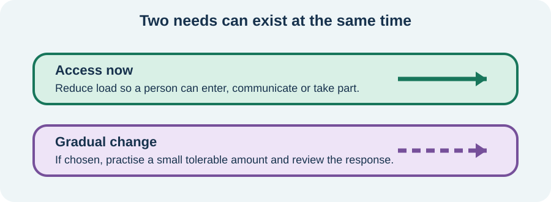

<!-- NAV-BREADCRUMB:START -->
[Home](../../../README.md) › [Course](../../README.md) › Part Two: Safety and Symptom Knowledge › [Module 8: Sensory, Visual, Balance, and Dizziness Symptoms](README.md) › **Sensory Overload, Accommodations, and Gradual Change**
<!-- NAV-BREADCRUMB:END -->

# Sensory Overload, Accommodations, and Gradual Change

> **Working draft:** This page was automatically generated and is looking for [contributors and reviewers](https://fnd-education-project.github.io/FND-Education/).

The world does not become accessible simply because someone is offered rehabilitation. A person may need less sensory load today and still choose to build tolerance later.

## For the Person With FND

### Definition

An **accommodation** changes a task or environment so you can take part. **Gradual change** is carefully dosed practice toward a chosen goal. They solve different problems and can be used together.

*Illustration: access now and gradual change are separate choices that can work together.*

### If you read only one thing

You should not have to earn access by tolerating avoidable pain or overload.

### Examples of accommodation

Depending on the person and setting, access might include softer lighting, reduced glare, ear protection, fewer people speaking, a seat near an exit, written instructions, a quieter appointment time or breaks.

An aid can have tradeoffs. Constantly blocking all light or sound may narrow tolerance for some people, while too little protection may make participation impossible. The useful balance is individual and can change across days.

### If you choose gradual practice

Begin with a meaningful goal and a tolerable starting point. Change one part at a time—brightness, duration, motion, sound or complexity. Plan recovery. Review the dose if symptoms remain much worse, function shrinks or trust is lost.

Evidence for sensory-based occupational therapy in FND is still preliminary. Vestibular rehabilitation evidence is also varied. These approaches should be offered with uncertainty, consent and a way to stop or adapt. (*citations* [1](#citation-1), [2](#citation-2), [3](#citation-3))

### Community experiences for review

These accounts show two types of practical support. They are not proof of a treatment effect.

**Option 1 — comfort and grounding**

> “I quickly have my dog do deep pressure therapy or grab a weighted blanket.”

— The writer also reported sensory brushing and breathing as part of a broader routine. [Read the public source](https://www.reddit.com/r/FND/comments/1bk5oyt/things_that_help_my_fnd/).

**Option 2 — overload and seizure risk**

> “My FND symptoms, especially risk of seizures, get worse around sensory overload.”

— A person with autism and sensory processing difficulties described a strong relationship between overwhelm and FND flares. [Read the public source](https://www.reddit.com/r/FND/comments/1bpx5du/how_many_autistics_are_here/).

### Questions

#### Where are you currently spending most of your energy just enduring the environment?

#### Is there one sensory experience you would choose to approach gradually because it leads to something you value?

### One small thing you can do

Pick one setting and write two columns: **access I need now** and **change I might choose later**. A lower-demand version is one item in the first column.

Do not force exposure or remove a needed aid to prove progress. Seek clinical help when sensory symptoms are new, injurious or linked with another concerning change.

***
[For the Person With FND](#for-the-person-with-fnd) 
[For Family, Friends, and Other Supporters](#for-family-friends-and-other-supporters) 
[For Clinicians and the Care Team](#for-clinicians-and-the-care-team) 
[Research and Sources](#research-and-sources)
***

## For Family, Friends, and Other Supporters

Ask what should be changed in the environment before suggesting the person work harder to tolerate it. Offer one practical adjustment and respect the answer. Do not remove sunglasses, headphones or another aid as a surprise test.

If the person chooses gradual practice, support the agreed dose and recovery. Your role is not to decide when they should progress.

***
[For the Person With FND](#for-the-person-with-fnd) 
[For Family, Friends, and Other Supporters](#for-family-friends-and-other-supporters) 
[For Clinicians and the Care Team](#for-clinicians-and-the-care-team) 
[Research and Sources](#research-and-sources)
***

## For Clinicians and the Care Team

### Research quotations for review

**Option 1 — Nicholson et al., 2020**

> “Education, rehabilitation within functional activity and the use of taught self-management strategies are central”

**Option 2 — McCombs et al., 2024**

> “limited research has been conducted to examine the efficacy of OT interventions for FND.”

*Figure 1 — Research quotations offered for editorial selection. (*citations* [1](#citation-1), [2](#citation-2))*

### Separate access from exposure

Assess sensory barriers within actual occupations and environments. Co-produce accommodations that protect participation, then discuss graded practice only when it serves a chosen goal. Explain possible tradeoffs without using them to deny immediate access.

Sensory-based OT evidence comes from consensus and an uncontrolled retrospective cohort. PPPD and vestibular evidence concerns a different but sometimes overlapping population. Name that indirectness. Monitor function, delayed worsening and burden rather than assuming symptom provocation means progress. (*citations* [1](#citation-1), [2](#citation-2), [3](#citation-3))

***
[For the Person With FND](#for-the-person-with-fnd) 
[For Family, Friends, and Other Supporters](#for-family-friends-and-other-supporters) 
[For Clinicians and the Care Team](#for-clinicians-and-the-care-team) 
[Research and Sources](#research-and-sources)
***

<!-- NAV-CONTEXT:START -->
**Continue:** [Next module: Speech, Voice, Swallowing, and Breathing Symptoms](../module-09-speech-voice-swallowing-and-breathing-symptoms/README.md)

**Navigate:** [Home](../../../README.md) · [Course](../../README.md) · [Reference Library](../../../reference/README.md) · [Site Map](../../../SITEMAP.md)
<!-- NAV-CONTEXT:END -->

***

## Research and Sources

The OT consensus supplies practice principles. McCombs and colleagues provide preliminary retrospective evidence. The vestibular review concerns PPPD and should not be generalized to all sensory overload. (*citations* [1](#citation-1), [2](#citation-2), [3](#citation-3))

**Related recovery pages:** [sensory symptoms](../../../reference/recovery-techniques/07-functional-sensory-symptoms.md) · [visual symptoms](../../../reference/recovery-techniques/08-functional-visual-symptoms.md) · [PPPD](../../../reference/recovery-techniques/13-persistent-postural-perceptual-dizziness.md)

| Citation | Figure | Full citation |
|---|---|---|
| **[1]** | Figure 1 | Nicholson C, Edwards MJ, Carson AJ, et al. Occupational therapy consensus recommendations for functional neurological disorder. *Journal of Neurology, Neurosurgery & Psychiatry*. 2020;91(10):1037–1045. [FND-CIT-0011](../../../research/citation-index.md#fnd-cit-0011). [https://doi.org/10.1136/jnnp-2019-322281](https://doi.org/10.1136/jnnp-2019-322281) |
| **[2]** | Figure 1 | McCombs KE, MacLean J, Finkelstein SA, Goedeken S, Perez DL, Ranford J. Sensory processing difficulties and occupational therapy outcomes for functional neurological disorder: a retrospective cohort study. *Neurology: Clinical Practice*. 2024;14(3):e200286. [FND-CIT-0035](../../../research/citation-index.md#fnd-cit-0035). [https://doi.org/10.1212/CPJ.0000000000200286](https://doi.org/10.1212/CPJ.0000000000200286) |
| **[3]** | — | Li Y, Pei X, Ding R, Liu Z, Xu Y, Wang Z, Li Y, Li L. Effect of vestibular rehabilitation therapy in patients with persistent postural perceptual dizziness: a systematic review and meta-analysis. *Frontiers in Neurology*. 2025;16:1599201. [FND-CIT-0038](../../../research/citation-index.md#fnd-cit-0038). [https://doi.org/10.3389/fneur.2025.1599201](https://doi.org/10.3389/fneur.2025.1599201) |

This page still needs review by people with sensory overload, occupational therapists and accessibility reviewers.

*Plain-language draft prepared: September 4, 2026 · Research package added September 4, 2026 · Clinical review pending*
