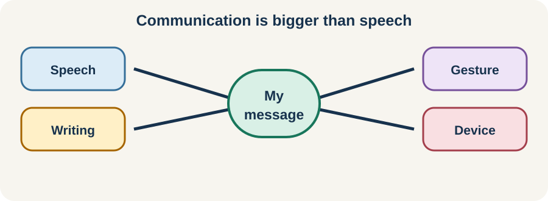

<!-- NAV-BREADCRUMB:START -->
[Home](../../../README.md) › [Course](../../README.md) › Part Two: Safety and Symptom Knowledge › [Module 9: Speech, Voice, Swallowing, and Breathing Symptoms](README.md) › **Speech, Voice, and Word Blocking**
<!-- NAV-BREADCRUMB:END -->

# Speech, Voice, and Word Blocking

> **Working draft:** This page was automatically generated and is looking for [contributors and reviewers](https://fnd-education-project.github.io/FND-Education/).

Functional communication symptoms can change speech, voice, fluency, articulation or access to words. A person may know exactly what they want to say while their spoken output is altered or unavailable. (*citation* [1](#citation-1))

## For the Person With FND

### Definition

A **functional communication symptom** is a real difficulty with speech, voice or language. A clinician looks for positive signs in how communication changes across tasks. **Word blocking** means knowing or reaching for a word but being unable to say it at that moment.

*Illustration: communication is bigger than speech.*

### If you read only one thing

Difficulty speaking is not difficulty thinking. You deserve time and another way to communicate.

### What symptoms may look like

Speech may become slurred, effortful, very quiet, unusually accented, stuttered or temporarily absent. Voice may become breathy, strained or lost. Symptoms may vary across conversation, reading, singing, automatic phrases or quieter settings.

That variation can help a speech and language professional make a positive diagnosis and find a treatment starting point. It does not mean the symptom is chosen. Sudden new speech or language change still needs appropriate urgent assessment because other neurological conditions can look similar.

### Treatment and access

Therapy may compare tasks, reduce excessive effort, shift attention, use rhythm or automatic speech, and build toward the situations that matter to you. Evidence is mainly expert consensus rather than large trials, so the approach should be explained and reviewed. (*citations* [1](#citation-1))

Communication access should not wait for symptom improvement. Writing, text-to-speech, gesture, yes/no signals or extra time may help now.

### Community experiences for review

These accounts show recovery and partial adaptation. They are not promises about outcome.

**Option 1 — speech returned after therapy**

> “I did some FND-focused speech therapy, and since then my speech has recovered significantly.”

— The writer also used group psychotherapy and medication, so change cannot be assigned to speech therapy alone. [Read the public source](https://www.reddit.com/r/FND/comments/1ptks6f/people_assume_im_deafdumb_because_of_my/).

**Option 2 — communication still took effort**

> “They gave me some tools to help ... I still will have times where it’s difficult to speak, but not as frequently.”

— The writer described partial improvement after a speech-therapist assessment. [Read the public source](https://www.reddit.com/r/FND/comments/1m1m78h/speaking_feels_like_too_much_effort/).

### Questions

#### What do you wish people understood about what is happening inside you when speech changes?

#### Which communication route feels easiest or most like you during a difficult period?

### One small thing you can do

Choose one backup method and put it within easy reach. A lower-demand version is to write: **“Please give me time; I can answer by ...”**

Do not force repeated speech practice when it increases strain. Seek fresh assessment for sudden new or substantially changed communication symptoms.

***
[For the Person With FND](#for-the-person-with-fnd) 
[For Family, Friends, and Other Supporters](#for-family-friends-and-other-supporters) 
[For Clinicians and the Care Team](#for-clinicians-and-the-care-team) 
[Research and Sources](#research-and-sources)
***

## For Family, Friends, and Other Supporters

Speak to the person directly and give them time. Ask whether they want yes/no questions, writing, typing or quiet. Do not finish every sentence, imitate the speech or speak as though understanding is impaired.

Keep the conversation adult and ordinary. Help others respect the person’s chosen communication method, especially in healthcare.

***
[For the Person With FND](#for-the-person-with-fnd) 
[For Family, Friends, and Other Supporters](#for-family-friends-and-other-supporters) 
[For Clinicians and the Care Team](#for-clinicians-and-the-care-team) 
[Research and Sources](#research-and-sources)
***

## For Clinicians and the Care Team

### Research quotations for review

**Option 1 — Baker et al., 2021**

> “FND should be diagnosed on the basis of positive clinical features.”

**Option 2 — Baker et al., 2021**

> “Speech and language professionals have a key role”

*Figure 1 — Research quotations offered for editorial selection. (*citations* [1](#citation-1))*

### Make the diagnosis useful

Characterize dysphonia, dysfluency, articulation, language and motor-speech features. Compare relevant tasks and identify positive variability while assessing structural, neurological and medication-related causes. Explain findings collaboratively rather than using a surprise performance to challenge credibility.

Use symptom-specific speech-and-language therapy within a supportive environment, but name the evidence as consensus. Provide communication access throughout care. If improvement is limited, support participation, identity and reliable alternative communication rather than withholding therapy or assuming psychological resistance. (*citation* [1](#citation-1))

***
[For the Person With FND](#for-the-person-with-fnd) 
[For Family, Friends, and Other Supporters](#for-family-friends-and-other-supporters) 
[For Clinicians and the Care Team](#for-clinicians-and-the-care-team) 
[Research and Sources](#research-and-sources)
***

<!-- NAV-CONTEXT:START -->
**Continue:** [Next page: Swallowing, Globus, and Nutrition Safety](02-swallowing-globus-and-nutrition-safety.md)

**Navigate:** [Home](../../../README.md) · [Course](../../README.md) · [Reference Library](../../../reference/README.md) · [Site Map](../../../SITEMAP.md)
<!-- NAV-CONTEXT:END -->

***

## Research and Sources

The central source is an international expert consensus paper, not a controlled treatment trial. It supports the presence and variety of these symptoms but cannot establish comparative treatment effectiveness. (*citation* [1](#citation-1))

**Related reference pages:** [speech and voice signs](../../../reference/diagnostic-signs/09-functional-speech-and-voice-symptoms.md) · [speech and voice recovery ideas](../../../reference/recovery-techniques/09-functional-speech-and-voice-symptoms.md)

| Citation | Figure | Full citation |
|---|---|---|
| **[1]** | Figure 1 | Baker J, Barnett C, Cavalli L, et al. Management of functional communication, swallowing, cough and related disorders: consensus recommendations for speech and language therapy. *Journal of Neurology, Neurosurgery & Psychiatry*. 2021;92(10):1112–1125. [FND-CIT-0025](../../../research/citation-index.md#fnd-cit-0025). [https://doi.org/10.1136/jnnp-2021-326767](https://doi.org/10.1136/jnnp-2021-326767) |

This page still needs review by people with communication symptoms and speech and language professionals.

*Plain-language draft prepared: September 4, 2026 · Research package added September 4, 2026 · Clinical review pending*
