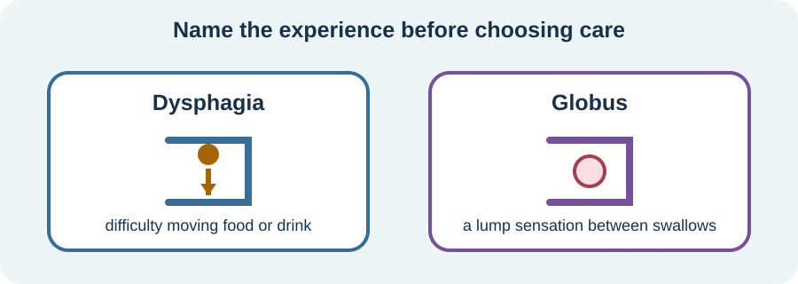

<!-- NAV-BREADCRUMB:START -->
[Home](../../../README.md) › [Course](../../README.md) › Part Two: Safety and Symptom Knowledge › [Module 9: Speech, Voice, Swallowing, and Breathing Symptoms](README.md) › **Swallowing, Globus, and Nutrition Safety**
<!-- NAV-BREADCRUMB:END -->

# Swallowing, Globus, and Nutrition Safety

> **Working draft:** This page was automatically generated and is looking for [contributors and reviewers](https://fnd-education-project.github.io/FND-Education/).

Swallowing symptoms can feel frightening and can affect food, drink, medicines and social life. Safety comes before deciding whether the symptom is functional.

## For the Person With FND

### Definition

**Dysphagia** means difficulty moving food, drink or saliva safely and effectively. **Globus** means a lump or tight feeling in the throat that is not the same as food sticking during a swallow. Functional forms can be diagnosed after appropriate assessment and with positive features. (*citations* [1](#citation-1))

*Illustration: similar throat feelings can need different assessment.*

### If you read only one thing

Do not use distraction as a swallowing test. Follow your assessed eating and drinking plan.

### Start with safety and nutrition

A clinician may ask about coughing or choking, wet voice, food sticking, pain, weight loss, dehydration, chest infections and which textures are difficult. Assessment may include a speech and language professional, examination and an instrumental swallowing study when indicated.

If familiar difficulty starts during a meal, stop when the current swallow does not feel safe and follow the posture, texture and strategy approved for you. Choking, inability to swallow saliva, breathing difficulty or a substantially changed pattern needs appropriate urgent assessment.

### Treatment depends on the problem

Functional swallowing or globus treatment may use explanation, reduction of excessive throat effort, attention changes, breathing or voice work, and gradual return to chosen foods. A separate structural, reflux, motility or neurological problem needs its own care.

Medication evidence from functional esophageal disorders is not the same as evidence for FND swallowing symptoms. A 2026 review found some benefit for globus but lacked convincing evidence for functional dysphagia. (*citations* [2](#citation-2))

### Community experiences for review

These accounts show practical adaptation and fear. They are not swallowing instructions.

**Option 1 — adjusting the meal**

> “They gave me coping strategies ... chew food much more, and put smaller amounts of food into my mouth.”

— The writer said dysphagia became less frequent after a withdrawal period; the specific contribution of the strategies is unclear. [Read the public source](https://www.reddit.com/r/FND/comments/1he9t87/does_anyone_else_have_problems_swallowing_and/).

**Option 2 — fear after choking**

> “My partner choked, I had to apply the Heimlich ... He’s afraid now.”

— A supporter described a real emergency and its aftermath. [Read the public source](https://www.reddit.com/r/FND/comments/1ij3lns/choking_hazard/).

### Questions

#### How have swallowing or throat symptoms changed what, where or with whom you eat?

#### Do you feel physically unsafe, frightened by the sensation, undernourished—or more than one of these?

### One small thing you can do

Put your current swallowing recommendations in one easy-to-find place. A lower-demand version is to write the name of the clinician or service responsible for the plan.

Do not change food texture, practise difficult swallows or alter medication form based on this page. Ask for an assessment when safety or nutrition is uncertain.

***
[For the Person With FND](#for-the-person-with-fnd) 
[For Family, Friends, and Other Supporters](#for-family-friends-and-other-supporters) 
[For Clinicians and the Care Team](#for-clinicians-and-the-care-team) 
[Research and Sources](#research-and-sources)
***

## For Family, Friends, and Other Supporters

Follow the person’s assessed plan for food, drink, position, pace and supervision. Do not offer a difficult texture to see whether distraction changes the symptom. In an emergency, use your local first-aid and emergency guidance.

Keep meals as dignified and social as the person wants. Avoid watching every mouthful unless supervision is part of the agreed safety plan.

***
[For the Person With FND](#for-the-person-with-fnd) 
[For Family, Friends, and Other Supporters](#for-family-friends-and-other-supporters) 
[For Clinicians and the Care Team](#for-clinicians-and-the-care-team) 
[Research and Sources](#research-and-sources)
***

## For Clinicians and the Care Team

### Research quotations for review

**Option 1 — Baker et al., 2021**

> “FND should be diagnosed on the basis of positive clinical features.”

**Option 2 — Wang et al., 2026**

> “Convincing evidence to support the use of GBN in the treatment of FD is lacking.”

*Figure 1 — Research quotations offered for editorial selection. (*citations* [1](#citation-1), [2](#citation-2))*

### Keep phenotype and safety explicit

Differentiate dysphagia from globus and assess structural, inflammatory, reflux, motility, neurological and medication-related causes. Establish nutrition, hydration and aspiration risk before introducing symptom-modification strategies. Use instrumental assessment when indicated.

When a functional diagnosis is supported, explain the positive findings and offer individualized speech-and-language therapy. Keep any texture or posture prescription current and communicate who will review it. Wang and colleagues studied functional esophageal disorders rather than FND-specific dysphagia, so use that evidence only as an adjacent, clinician-led discussion. (*citations* [1](#citation-1), [2](#citation-2))

***
[For the Person With FND](#for-the-person-with-fnd) 
[For Family, Friends, and Other Supporters](#for-family-friends-and-other-supporters) 
[For Clinicians and the Care Team](#for-clinicians-and-the-care-team) 
[Research and Sources](#research-and-sources)
***

<!-- NAV-CONTEXT:START -->
**Continue:** [Next page: Cough, Breathing, and Upper-Airway Symptoms](03-cough-breathing-and-upper-airway-symptoms.md)

**Navigate:** [Home](../../../README.md) · [Course](../../README.md) · [Reference Library](../../../reference/README.md) · [Site Map](../../../SITEMAP.md)
<!-- NAV-CONTEXT:END -->

***

## Research and Sources

The speech-and-language paper is expert consensus. The 2026 systematic review concerns functional esophageal disorders and medication, not specifically FND swallowing; its applicability is limited. (*citations* [1](#citation-1), [2](#citation-2))

**Related reference pages:** [swallowing and globus signs](../../../reference/diagnostic-signs/10-functional-swallowing-and-globus.md) · [swallowing and globus recovery ideas](../../../reference/recovery-techniques/10-functional-swallowing-and-globus.md)

| Citation | Figure | Full citation |
|---|---|---|
| **[1]** | Figure 1 | Baker J, Barnett C, Cavalli L, et al. Management of functional communication, swallowing, cough and related disorders: consensus recommendations for speech and language therapy. *Journal of Neurology, Neurosurgery & Psychiatry*. 2021;92(10):1112–1125. [FND-CIT-0025](../../../research/citation-index.md#fnd-cit-0025). [https://doi.org/10.1136/jnnp-2021-326767](https://doi.org/10.1136/jnnp-2021-326767) |
| **[2]** | Figure 1 | Wang Z, Zheng Z, Wei X, et al. Efficacy of gut-brain neuromodulators in functional esophageal disorders: a systematic review. *BMC Gastroenterology*. 2026. [FND-CIT-0042](../../../research/citation-index.md#fnd-cit-0042). [https://doi.org/10.1186/s12876-026-05089-6](https://doi.org/10.1186/s12876-026-05089-6) |

This page still needs review by people with swallowing symptoms, speech and language professionals, gastroenterologists and dietitians.

*Plain-language draft prepared: September 4, 2026 · Research package added September 4, 2026 · Clinical review pending*
