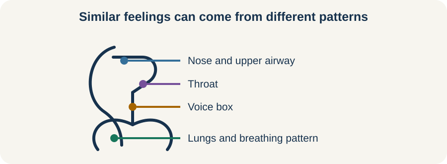

<!-- NAV-BREADCRUMB:START -->
[Home](../../../README.md) › [Course](../../README.md) › Part Two: Safety and Symptom Knowledge › [Module 9: Speech, Voice, Swallowing, and Breathing Symptoms](README.md) › **Cough, Breathing, and Upper-Airway Symptoms**
<!-- NAV-BREADCRUMB:END -->

# Cough, Breathing, and Upper-Airway Symptoms

> **Working draft:** This page was automatically generated and is looking for [contributors and reviewers](https://fnd-education-project.github.io/FND-Education/).

Cough, throat closure, noisy breathing and breathlessness can have functional causes, medical causes or both. Breathing difficulty must be made safe before anyone tries to explain it.

## For the Person With FND

### Definition

A **functional cough** is a real cough in which a clinician finds positive signs of altered control after checking other possible causes. **Functional upper-airway symptoms** involve altered control around the throat or voice box. Similar symptoms may instead be called **inducible laryngeal obstruction** or **vocal cord dysfunction** when a clinician diagnoses one of those specific conditions.

*Illustration: a breathing sound or feeling does not show where the problem is; assessment helps locate it.*

### If you read only one thing

Do not assume breathing trouble is FND. Use your emergency plan and seek appropriate help when breathing is new, severe, clearly changed or unsafe.

### What assessment may ask

A clinician may consider asthma, allergy, infection, heart or lung disease, reflux, medication and structural or movement problems of the voice box. They may listen to when the sound occurs, check oxygen and breathing effort, examine the upper airway or arrange other tests.

A functional diagnosis should be explained with positive evidence, not made only because initial tests were normal. (*citations* [1](#citation-1))

### Treatment is specific to the pattern

A speech and language professional or respiratory physiotherapist may teach breathing, cough-control, throat-release or attention strategies. These should be demonstrated for your assessed symptom. A technique that helps one upper-airway pattern may be wrong during another breathing problem.

If a familiar episode begins, use only the plan or technique taught for you. Sit or position yourself as advised and reduce unnecessary talking or exertion. Do not delay urgent assessment to keep attempting an exercise.

### Community experiences for review

These accounts show different clinical pathways. They are lived experience, not instructions or proof of diagnosis.

**Option 1 — breathing work with a physiotherapist**

> “Breathing physiotherapy helped me a lot! It took months to gradually improve.”

— The writer described gradual change; the specific diagnosis and exercise sequence still need source review. [Read the public source](https://www.reddit.com/r/FND/comments/1hkj97a/dae_just_stop_breathing/).

**Option 2 — another upper-airway diagnosis**

> “The doc says I have Vocal cord dysfunction.”

— The writer described receiving a separate diagnosis and treatment. [Read the public source](https://www.reddit.com/r/FND/comments/1cl91gf/can_fnd_mimic_asthma_symptoms/).

### Questions

#### What feels most frightening during these symptoms: air hunger, the sound, loss of voice, uncertainty or other people’s reactions?

#### Do you have a clear plan for what to try during a familiar episode and when to get more help?

### One small thing you can do

Write the name of your diagnosed breathing or airway pattern and the clinician-taught first action. A lower-demand version is to locate the plan.

Do not practise breath-holding or copy a breathing exercise from this page. Seek appropriate help for unsafe, new or substantially changed breathing.

***
[For the Person With FND](#for-the-person-with-fnd) 
[For Family, Friends, and Other Supporters](#for-family-friends-and-other-supporters) 
[For Clinicians and the Care Team](#for-clinicians-and-the-care-team) 
[Research and Sources](#research-and-sources)
***

## For Family, Friends, and Other Supporters

Follow the person’s plan, help them reach the advised position or medicine, and keep the surroundings calm. Do not diagnose the sound or repeatedly instruct them to “just breathe.”

Notice objective changes and whether this matches the usual pattern. If the plan does not fit or the situation seems unsafe, seek appropriate medical help.

***
[For the Person With FND](#for-the-person-with-fnd) 
[For Family, Friends, and Other Supporters](#for-family-friends-and-other-supporters) 
[For Clinicians and the Care Team](#for-clinicians-and-the-care-team) 
[Research and Sources](#research-and-sources)
***

## For Clinicians and the Care Team

### Research quotations for review

**Option 1 — Baker et al., 2021**

> “cough and upper airway symptoms ... are commonly encountered by speech and language professionals.”

**Option 2 — Baker et al., 2021**

> “there are few descriptions in the literature of the most effective practical management approaches.”

*Figure 1 — Research quotations offered for editorial selection. (*citations* [1](#citation-1))*

### Establish stability and phenotype before retraining

Assess acute respiratory stability and relevant pulmonary, cardiac, allergic, infectious, reflux, medication and laryngeal causes. Distinguish cough, breathing-pattern disorder and inducible laryngeal obstruction rather than grouping every symptom under FND.

When positive functional features support the diagnosis, demonstrate them respectfully and teach a symptom-specific technique. Coordinate speech and language, respiratory and medical care. The main FND source is consensus; explain that the comparative treatment evidence is limited. Continue safety planning and symptom relief when retraining does not help. (*citations* [1](#citation-1), [2](#citation-2))

***
[For the Person With FND](#for-the-person-with-fnd) 
[For Family, Friends, and Other Supporters](#for-family-friends-and-other-supporters) 
[For Clinicians and the Care Team](#for-clinicians-and-the-care-team) 
[Research and Sources](#research-and-sources)
***

<!-- NAV-CONTEXT:START -->
**Continue:** [Next page: Communication Access When Speech or Voice Is Difficult](04-communication-access-when-speech-or-voice-is-difficult.md)

**Navigate:** [Home](../../../README.md) · [Course](../../README.md) · [Reference Library](../../../reference/README.md) · [Site Map](../../../SITEMAP.md)
<!-- NAV-CONTEXT:END -->

***

## Research and Sources

The main FND-specific source is expert consensus across related communication, swallowing, cough and upper-airway presentations. The emergency review supports fresh acute assessment but is not specific to functional breathing symptoms. (*citations* [1](#citation-1), [2](#citation-2))

**Related reference pages:** [cough and upper-airway signs](../../../reference/diagnostic-signs/11-functional-cough-and-upper-airway-symptoms.md) · [cough and upper-airway recovery ideas](../../../reference/recovery-techniques/11-functional-cough-and-upper-airway-symptoms.md)

| Citation | Figure | Full citation |
|---|---|---|
| **[1]** | Figure 1 | Baker J, Barnett C, Cavalli L, et al. Management of functional communication, swallowing, cough and related disorders: consensus recommendations for speech and language therapy. *Journal of Neurology, Neurosurgery & Psychiatry*. 2021;92(10):1112–1125. [FND-CIT-0025](../../../research/citation-index.md#fnd-cit-0025). [https://doi.org/10.1136/jnnp-2021-326767](https://doi.org/10.1136/jnnp-2021-326767) |
| **[2]** | — | Finkelstein SA, Cortel-LeBlanc MA, Cortel-LeBlanc A, Stone J. Functional neurological disorder in the emergency department. *Academic Emergency Medicine*. 2021;28(6):685–696. [FND-CIT-0068](../../../research/citation-index.md#fnd-cit-0068). [https://doi.org/10.1111/acem.14263](https://doi.org/10.1111/acem.14263) |

This page still needs review by people with breathing or cough symptoms, respiratory clinicians and speech and language professionals.

*Plain-language draft prepared: September 4, 2026 · Research package added September 4, 2026 · Clinical review pending*
