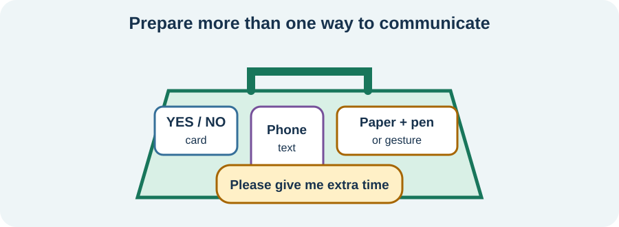

<!-- NAV-BREADCRUMB:START -->
[Home](../../../README.md) › [Course](../../README.md) › Part Two: Safety and Symptom Knowledge › [Module 9: Speech, Voice, Swallowing, and Breathing Symptoms](README.md) › **Communication Access When Speech or Voice Is Difficult**
<!-- NAV-BREADCRUMB:END -->

# Communication Access When Speech or Voice Is Difficult

> **Working draft:** This page was automatically generated and is looking for [contributors and reviewers](https://fnd-education-project.github.io/FND-Education/).

A person should not lose their choices because spoken communication is slow, changed or unavailable. Access can begin immediately, whether or not speech later improves.

## For the Person With FND

### Definition

**Communication access** means having a reliable way to understand, express yourself and make choices. **Augmentative and alternative communication (AAC)** includes tools that add to or replace speech, from gesture and writing to a letter board or speech-generating device.

*Illustration: use the lightest tool that works today; needing a tool does not reduce understanding.*

### If you read only one thing

Your chosen communication method is your voice. Other people should speak to you, wait for your answer and confirm what they understood.

### Build a small communication kit

Possible tools include:

- an agreed yes/no movement;
- a card explaining that speech is temporarily difficult;
- writing or typing;
- common needs and names saved on a phone;
- an alphabet or picture board;
- text-to-speech; and
- a supporter who helps communication without answering for you.

Choose tools you can reach, see and use during your hardest periods. A method that works at home may not work in bright, noisy or urgent care.

### Protect choice and consent

Difficulty speaking does not show whether someone can understand or decide. People should use short clear questions, allow processing time and check the intended answer. A supporter can interpret a familiar signal but should separate the person’s message from their own opinion.

Therapy and AAC are not opposites. A tool can reduce strain and keep life moving while speech is being assessed or retrained. (*citations* [1](#citation-1), [2](#citation-2))

### Community experiences for review

These accounts show different routes into communication. They are lived experience, not therapy instructions.

**Option 1 — singing remained available**

> “We would just hum or sing sentences together ... Sometimes it happens again and we revert to singing to one another.”

— A spouse described a strategy used when their wife could sing but not speak. [Read the public source](https://www.reddit.com/r/FND/comments/1pgpas6/suddenly_cant_speak/).

**Option 2 — speech was absent for a long period**

> “I have been mute for 2 weeks now and it doesn’t look like it’s going to resolve anytime soon.”

— The writer described stress, overwhelm, pain and fatigue while seeking next steps. [Read the public source](https://www.reddit.com/r/FND/comments/1mer8ej/tw_symptom_discussion_anyone_else_mute/).

### Questions

#### When speech is difficult, what do other people wrongly assume about you?

#### Which two messages would you most need to communicate during a hard day or medical visit?

### One small thing you can do

Create one phone note: **“I understand you. Please give me time. I communicate by ...”** A lower-demand version is to save those first two sentences.

Ask a speech and language professional about AAC if simple tools are not enough. Seek fresh medical assessment for a sudden new communication change.

***
[For the Person With FND](#for-the-person-with-fnd) 
[For Family, Friends, and Other Supporters](#for-family-friends-and-other-supporters) 
[For Clinicians and the Care Team](#for-clinicians-and-the-care-team) 
[Research and Sources](#research-and-sources)
***

## For Family, Friends, and Other Supporters

Speak to the person, not around them. Ask how they want you to help and wait through silence. Offer the agreed tool without making them prove that speech is unavailable.

When interpreting, say what the person indicated and what is your own observation. Preserve privacy and do not share messages, recordings or health details without permission unless immediate safety requires it.

***
[For the Person With FND](#for-the-person-with-fnd) 
[For Family, Friends, and Other Supporters](#for-family-friends-and-other-supporters) 
[For Clinicians and the Care Team](#for-clinicians-and-the-care-team) 
[Research and Sources](#research-and-sources)
***

## For Clinicians and the Care Team

### Research quotations for review

**Option 1 — Baker et al., 2021**

> “Speech and language professionals have a key role in the management of people with communication”

**Option 2 — Nicholson et al., 2020**

> “rehabilitation within functional activity ... [is] central”

*Figure 1 — Research quotations offered for editorial selection. (*citations* [1](#citation-1), [2](#citation-2))*

### Provide access before testing performance

Establish the patient’s receptive language, reliable response mode, processing time and preferred supports. Do not equate dysfluency, dysphonia, mutism or word-finding difficulty with lack of capacity. Record accessible communication needs where every team member can find them.

Use cross-task variability to support diagnosis and treatment only with consent and a clear explanation. Select low-tech or high-tech AAC according to access, motor and sensory needs. Measure participation and autonomy as well as speech form. Continue communication access when symptom-focused treatment is unavailable, unwanted or ineffective. (*citations* [1](#citation-1), [2](#citation-2))

***
[For the Person With FND](#for-the-person-with-fnd) 
[For Family, Friends, and Other Supporters](#for-family-friends-and-other-supporters) 
[For Clinicians and the Care Team](#for-clinicians-and-the-care-team) 
[Research and Sources](#research-and-sources)
***

<!-- NAV-CONTEXT:START -->
**Continue:** [Next part: Non-Motor and Whole-Body Symptoms](../../part-3-non-motor-symptoms/module-10-cognition-memory-and-dissociation/README.md)

**Navigate:** [Home](../../../README.md) · [Course](../../README.md) · [Reference Library](../../../reference/README.md) · [Site Map](../../../SITEMAP.md)
<!-- NAV-CONTEXT:END -->

***

## Research and Sources

Both sources are professional consensus recommendations. They support functional activity and communication care but do not provide controlled evidence comparing AAC tools for FND. (*citations* [1](#citation-1), [2](#citation-2))

**Related reference pages:** [speech and voice signs](../../../reference/diagnostic-signs/09-functional-speech-and-voice-symptoms.md) · [speech and voice recovery ideas](../../../reference/recovery-techniques/09-functional-speech-and-voice-symptoms.md)

| Citation | Figure | Full citation |
|---|---|---|
| **[1]** | Figure 1 | Baker J, Barnett C, Cavalli L, et al. Management of functional communication, swallowing, cough and related disorders: consensus recommendations for speech and language therapy. *Journal of Neurology, Neurosurgery & Psychiatry*. 2021;92(10):1112–1125. [FND-CIT-0025](../../../research/citation-index.md#fnd-cit-0025). [https://doi.org/10.1136/jnnp-2021-326767](https://doi.org/10.1136/jnnp-2021-326767) |
| **[2]** | Figure 1 | Nicholson C, Edwards MJ, Carson AJ, et al. Occupational therapy consensus recommendations for functional neurological disorder. *Journal of Neurology, Neurosurgery & Psychiatry*. 2020;91(10):1037–1045. [FND-CIT-0011](../../../research/citation-index.md#fnd-cit-0011). [https://doi.org/10.1136/jnnp-2019-322281](https://doi.org/10.1136/jnnp-2019-322281) |

This page still needs review by people with communication symptoms, AAC users, speech and language professionals and accessibility reviewers.

*Plain-language draft prepared: September 4, 2026 · Research package added September 4, 2026 · Clinical review pending*
