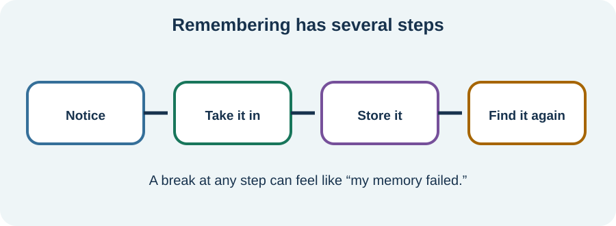

<!-- NAV-BREADCRUMB:START -->
[Home](../../../README.md) › [Course](../../README.md) › Part Three: Common Non-Motor Difficulties › [Module 10](README.md) › **Attention, Memory, Word Finding, and Functional Cognitive Disorder**
<!-- NAV-BREADCRUMB:END -->

# Attention, Memory, Word Finding, and Functional Cognitive Disorder

> **Working draft:** This page was automatically generated and is looking for [contributors and reviewers](https://fnd-education-project.github.io/FND-Education/).

Losing a word, a plan or part of a conversation can feel frightening. The difficulty is real even when a scan is normal or a formal test shows an uneven pattern.

## For the Person With FND

### Definition

**Cognition** is the work involved in noticing, thinking, planning, using words and remembering. **Functional Cognitive Disorder (FCD)** means distressing or disabling cognitive symptoms with positive signs that the difficulty is functional and not better explained by another condition.

*Illustration: memory is a path, not one box. Trouble at an earlier step can feel like lost storage.*

### If you read only one thing

FCD is not “imagined memory loss,” and it is not the name for every thinking problem in FND. A clinician should look for features supporting the diagnosis and check for other contributors. (*citations* [1](#citation-1), [2](#citation-2))

### One everyday example

Imagine being told three instructions while a television is on and pain is flaring. If attention catches only the first instruction, the other two may never be stored. Later, this feels like forgetting.

Word finding can work similarly: you know the person or object, but the word does not arrive when needed. Thinking speed, working memory and planning may also become overloaded.

### What “internal inconsistency” means

In FCD research, **internal inconsistency** means a person’s cognitive ability is available at some times or in some tasks but becomes hard to access in others. It is not proof of pretending. It can appear in the history, conversation or testing and must be interpreted carefully.

Some people with FCD have persistent disability. Others improve. A normal score on one test does not describe the demands of a whole day. (*citations* [1](#citation-1), [2](#citation-2))

### Other causes still matter

Poor sleep, migraine, pain, fatigue, medication or substance effects, depression, anxiety, seizures, head injury, nutritional or hormone problems and neurological disease can all affect cognition. More than one can be present.

Seek prompt assessment for a sudden new confusion, new neurological signs, getting lost in familiar places, a major safety error, a changed seizure pattern, decline after a head injury, or rapid or progressive worsening.

### Community experiences for review

These are lived experiences, not evidence that one approach will work for everyone.

**Option 1 — improvement with tailored support**

> “I worked tirelessly with a speech therapist ... and regained a lot of cognition.”

— The writer also said traditional methods could worsen their FND and valued FND-informed pacing cues. [Read the public source](https://www.reddit.com/r/FND/comments/182yliv/lapse_of_memory_randomly/).

**Option 2 — familiar work became difficult**

> “Simple tasks I’ve done at work for years now demand major concentration ... I’ve been making many mistakes in my work.”

— The writer described the effect on a business run with their husband. [Read the public source](https://www.reddit.com/r/FND/comments/1czpbko/major_cognitive_issues_with_fnd/).

### Questions

#### Which thinking difficulty most changes your day: taking information in, holding it briefly, finding it later, using words or planning steps?

#### When does that ability become easier to access, even a little?

### One small thing you can do

For one task today, remove one competing demand: mute the television, sit down, or ask for one instruction at a time. A lower-demand version is simply to notice which competing demand was present.

Stop if the experiment increases distress or makes a task unsafe. Ask for clinical or occupational support when cognitive problems affect medication, cooking, driving, money, work or personal safety.

***
[For the Person With FND](#for-the-person-with-fnd) 
[For Family, Friends, and Other Supporters](#for-family-friends-and-other-supporters) 
[For Clinicians and the Care Team](#for-clinicians-and-the-care-team) 
[Research and Sources](#research-and-sources)
***

## For Family, Friends, and Other Supporters

Give one subject at a time and allow extra processing time. Offer a cue or written note instead of testing the person: “The appointment is at two” is usually kinder and more useful than “Don’t you remember?”

Do not assume that an inconsistent ability is voluntary. Also do not take over every decision. Ask which tasks need backup and which the person wants to keep doing independently.

***
[For the Person With FND](#for-the-person-with-fnd) 
[For Family, Friends, and Other Supporters](#for-family-friends-and-other-supporters) 
[For Clinicians and the Care Team](#for-clinicians-and-the-care-team) 
[Research and Sources](#research-and-sources)
***

## For Clinicians and the Care Team

### Research quotations for review

**Option 1 — Ball et al., 2020**

> “the chief clinical indicator of which is internal inconsistency”

**Option 2 — McWhirter et al., 2022**

> “Identifying functional cognitive disorder”

*Figure 1 — Research quotations offered for editorial selection. (*citations* [1](#citation-1), [2](#citation-2))*

### Make a positive but proportionate assessment

Characterize attention, processing speed, working memory, prospective memory, episodic encoding and retrieval, semantic access and executive function. Look for positive internal inconsistency across history, observation and testing; do not infer FCD from distress, normal imaging or an invalid score alone.

Review onset, course, functional impact, medication and substances, sleep, pain, migraine, mood, epilepsy, head injury and systemic contributors. Neuropsychological assessment may clarify a profile and practical needs, but test performance has imperfect ecological validity. Discuss validity measures without accusation.

Treat contributing conditions and reduce cognitive load. Consider occupational therapy, speech-language therapy, neuropsychology or other rehabilitation for external aids and metacognitive strategies. Evidence for FCD-specific interventions remains preliminary. (*citations* [1](#citation-1), [2](#citation-2), [3](#citation-3), [4](#citation-4))

***
[For the Person With FND](#for-the-person-with-fnd) 
[For Family, Friends, and Other Supporters](#for-family-friends-and-other-supporters) 
[For Clinicians and the Care Team](#for-clinicians-and-the-care-team) 
[Research and Sources](#research-and-sources)
***

<!-- NAV-CONTEXT:START -->
**Continue:** [Dissociation and Altered Awareness →](02-dissociation-and-altered-awareness.md)

**Navigate:** [Module overview](README.md) · [Course](../../README.md) · [Reference Library](../../../reference/README.md) · [Site Map](../../../SITEMAP.md)
<!-- NAV-CONTEXT:END -->

***

## Research and Sources

The FCD sources offer a proposed diagnostic model and preliminary definition rather than a universally decisive test. The online intervention trial was a small feasibility study, not proof of effectiveness. (*citations* [1](#citation-1), [2](#citation-2), [3](#citation-3), [4](#citation-4))

**Related reference pages:** [FCD diagnostic signs](../../../reference/diagnostic-signs/12-functional-cognitive-disorder.md) · [FCD recovery ideas](../../../reference/recovery-techniques/12-functional-cognitive-disorder.md)

| Citation | Figure | Full citation |
|---|---|---|
| **[1]** | Figure 1 | Ball HA, McWhirter L, Ballard C, et al. Functional cognitive disorder: dementia's blind spot. *Brain*. 2020;143(10):2895–2903. [FND-CIT-0071](../../../research/citation-index.md#fnd-cit-0071). [https://doi.org/10.1093/brain/awaa224](https://doi.org/10.1093/brain/awaa224) |
| **[2]** | Figure 1 | McWhirter L, Ritchie C, Stone J, Carson A. Identifying functional cognitive disorder: a proposed diagnostic risk model. *CNS Spectrums*. 2022;27(6):754–763. [FND-CIT-0026](../../../research/citation-index.md#fnd-cit-0026). [https://doi.org/10.1017/S1092852921000845](https://doi.org/10.1017/S1092852921000845) |
| **[3]** | — | Nicholson C, Edwards MJ, Carson AJ, et al. Occupational therapy consensus recommendations for functional neurological disorder. *Journal of Neurology, Neurosurgery & Psychiatry*. 2020;91(10):1037–1045. [FND-CIT-0011](../../../research/citation-index.md#fnd-cit-0011). [https://doi.org/10.1136/jnnp-2019-322281](https://doi.org/10.1136/jnnp-2019-322281) |
| **[4]** | — | Poole N, Cope S, Vanzan S, et al. Randomised controlled feasibility trial of online group acceptance and commitment therapy for functional cognitive disorder. *BJPsych Open*. 2025;11(3):e91. [FND-CIT-0036](../../../research/citation-index.md#fnd-cit-0036). [https://doi.org/10.1192/bjo.2025.33](https://doi.org/10.1192/bjo.2025.33) |

This page still needs review by people with cognitive symptoms, neuropsychologists, occupational therapists, neurologists and accessibility reviewers.

*Plain-language draft and research package prepared: September 5, 2026 · Clinical review pending*
