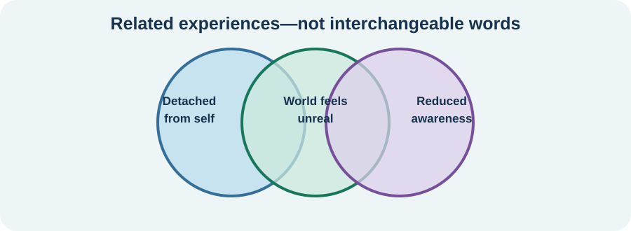

<!-- NAV-BREADCRUMB:START -->
[Home](../../../README.md) › [Course](../../README.md) › Part Three: Common Non-Motor Difficulties › [Module 10](README.md) › **Dissociation and Altered Awareness**
<!-- NAV-BREADCRUMB:END -->

# Dissociation and Altered Awareness

> **Working draft:** This page was automatically generated and is looking for [contributors and reviewers](https://fnd-education-project.github.io/FND-Education/).

Dissociation can be hard to describe. Words such as “far away,” “unreal,” “foggy,” “not in my body” or “missing time” may describe different experiences and need careful assessment.

## For the Person With FND

### Definition

**Dissociation** means a change in how parts of experience are connected. **Depersonalization** is feeling detached from yourself. **Derealization** is feeling that the world is unreal or distant. **Altered awareness** is a broader term for being less aware or responsive.

*Illustration: these experiences can overlap, but the words do not all mean the same thing.*

### If you read only one thing

Dissociation occurs in some people with FND, especially in some seizure groups, but it is not required for FND and does not explain everyone’s symptoms. (*citation* [1](#citation-1))

### What it can feel like

You might feel distant from your body, as though a room is dreamlike, or unable to take in what someone says. Time may feel strange. You may remain conscious but have trouble moving or responding.

These experiences can also occur with panic, trauma-related conditions, migraine, epilepsy, sleep loss, medication effects and other medical or mental health conditions. Similar words do not guarantee the same cause.

### Notice without forcing an explanation

A simple sequence can be more useful than a theory:

1. What did you notice first?
2. What changed in awareness, memory, movement or speech?
3. How long did it last?
4. What helped you become more present?

Do not force yourself to search for trauma or a psychological cause. A trauma history is neither necessary nor sufficient for an FND diagnosis.

### Community experiences for review

These writers use their own words. Their experiences do not define dissociation for everyone.

**Option 1 — a warning before an episode**

> “I feel like I’m floating away (dissociating) before an episode hits where I’m conscious but can’t move or speak.”

— The writer described severe dissociation connected with their seizure-like episodes. [Read the public source](https://www.reddit.com/r/FND/comments/1i2hxh5/anyone_else_diagnosed_with_did_feeling_scared/).

**Option 2 — difficult to separate symptoms**

> “For the FND part it’s memory issues, possible dissociation, brain fog, and just general poor function.”

— The writer also named several coexisting diagnoses and said it was difficult to know what caused what. [Read the public source](https://www.reddit.com/r/FND/comments/1j7hmdb/what_do_cognitive_symptoms_look_like_for_you/).

### Questions

#### If “dissociation” fits anything you experience, what changes first: your sense of self, the world around you, time, memory or responsiveness?

#### What helps you feel safely present without demanding that the experience stop immediately?

### One small thing you can do

Write one grounding choice on a card: **name the date and place**, **feel the chair**, or **look for three blue things**. A lower-demand version is to choose the one that feels least irritating.

Stop a technique that increases panic, traumatic memories, pain or symptoms. Seek urgent assessment for a first or substantially changed episode, prolonged unresponsiveness, injury, new weakness, severe headache, breathing difficulty or another emergency concern.

***
[For the Person With FND](#for-the-person-with-fnd) 
[For Family, Friends, and Other Supporters](#for-family-friends-and-other-supporters) 
[For Clinicians and the Care Team](#for-clinicians-and-the-care-team) 
[Research and Sources](#research-and-sources)
***

## For Family, Friends, and Other Supporters

Use the person’s name and brief orientation cues: where they are, what is happening and that you are nearby. Ask before touching. Reduce noise and the number of people speaking.

Follow any agreed seizure or episode plan. Do not demand eye contact, quiz memory or insist that the person discuss a cause during the episode. Get emergency help according to the person’s plan and ordinary safety guidance.

***
[For the Person With FND](#for-the-person-with-fnd) 
[For Family, Friends, and Other Supporters](#for-family-friends-and-other-supporters) 
[For Clinicians and the Care Team](#for-clinicians-and-the-care-team) 
[Research and Sources](#research-and-sources)
***

## For Clinicians and the Care Team

### Research quotations for review

**Option 1 — Campbell et al., 2023**

> “the potential clinical utility of assessing patients with FND”

**Option 2 — Campbell et al., 2023**

> “heterogeneity between studies and risk of bias were high”

*Figure 1 — Research quotations offered for editorial selection. (*citation* [1](#citation-1))*

### Describe the phenomenon before assigning the mechanism

Clarify detachment, derealization, amnesia, trance-like experience, responsiveness and the temporal relationship to motor, sensory or seizure symptoms. Assess neurological, sleep, medication, substance, trauma-related, mood and anxiety differentials as appropriate.

The systematic review found elevated dissociative symptoms at group level, with important differences among FND subgroups and substantial heterogeneity. It does not support treating dissociation as a universal cause. Share that uncertainty with the patient.

Co-create grounding or episode strategies that the patient finds tolerable. Trauma-focused treatment is appropriate when there is a relevant condition and the person wants it, not as a compulsory explanation for FND. (*citation* [1](#citation-1))

***
[For the Person With FND](#for-the-person-with-fnd) 
[For Family, Friends, and Other Supporters](#for-family-friends-and-other-supporters) 
[For Clinicians and the Care Team](#for-clinicians-and-the-care-team) 
[Research and Sources](#research-and-sources)
***

<!-- NAV-CONTEXT:START -->
**Continue:** [Build an External Thinking and Memory System →](03-build-an-external-thinking-and-memory-system.md)

**Navigate:** [← Previous page](01-attention-memory-word-finding-and-functional-cognitive-disorder.md) · [Module overview](README.md) · [Course](../../README.md) · [Site Map](../../../SITEMAP.md)
<!-- NAV-CONTEXT:END -->

***

## Research and Sources

The review combines many study designs and FND subgroups. It supports asking about dissociation but not using a questionnaire score as a stand-alone diagnosis or assuming one mechanism. (*citation* [1](#citation-1))

| Citation | Figure | Full citation |
|---|---|---|
| **[1]** | Figure 1 | Campbell MC, Smakowski A, Rojas-Aguiluz M, et al. Dissociation and its biological and clinical associations in functional neurological disorder: systematic review and meta-analysis. *BJPsych Open*. 2023;9(1):e2. [FND-CIT-0072](../../../research/citation-index.md#fnd-cit-0072). [https://doi.org/10.1192/bjo.2022.597](https://doi.org/10.1192/bjo.2022.597) |

This page still needs review by people with dissociative experiences, neurologists, psychologists, psychiatrists, trauma specialists and accessibility reviewers.

*Plain-language draft and research package prepared: September 5, 2026 · Clinical review pending*
