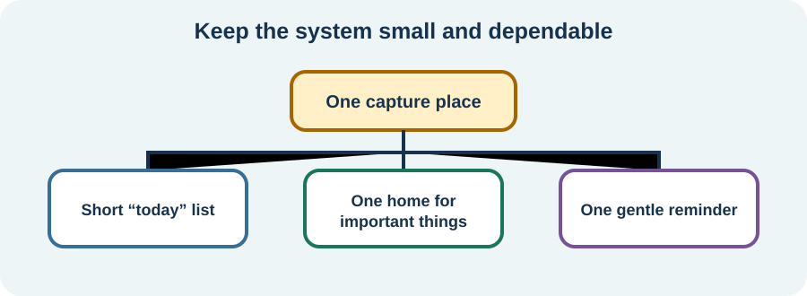

<!-- NAV-BREADCRUMB:START -->
[Home](../../../README.md) › [Course](../../README.md) › Part Three: Common Non-Motor Difficulties › [Module 10](README.md) › **Build an External Thinking and Memory System**
<!-- NAV-BREADCRUMB:END -->

# Build an External Thinking and Memory System

> **Working draft:** This page was automatically generated and is looking for [contributors and reviewers](https://fnd-education-project.github.io/FND-Education/).

A support system moves some thinking work out of your head and into your surroundings. It can help whether the cause is FCD, fatigue, migraine, pain, poor sleep or a mixture.

## For the Person With FND

### Definition

An **external cognitive aid** holds information or prompts an action for you. Examples include a calendar, alarm, checklist, labelled storage place, written visit summary or another person giving an agreed cue.

*Illustration: a small dependable system is easier to use than many competing systems.*

### If you read only one thing

Using an aid is not cheating or giving up on recovery. It protects energy, choice and participation while other symptoms are assessed or treated.

### Start with one repeated problem

Do not reorganize your whole life. Choose one problem that happens often:

- missing appointments;
- losing keys or medication;
- forgetting the next step;
- losing track during a conversation; or
- leaving a task unfinished.

Match one tool to that problem. Put appointments in one calendar. Give keys one visible home. Ask for one written instruction. Use a checklist with only the next few steps.

### Make the system easy on a hard day

Place the tool where the action happens. A medication prompt beside unrelated notifications may disappear into phone noise. A note on the door may work better than a list in another room.

Review whether the aid reduces errors or merely creates more checking. Keep the smallest useful version. Rehabilitation can combine these supports with treatment of contributing conditions and gradual return to meaningful cognitive activity. (*citations* [1](#citation-1), [2](#citation-2))

### Community experiences for review

These accounts show both regained participation and continuing need for support.

**Option 1 — returning to learning**

> “I successfully took a free 6 month class and regained my ability to ... be a student.”

— The writer described the beginning as difficult and the return as gradual. [Read the public source](https://www.reddit.com/r/FND/comments/1i2oee9/did_your_symptoms_improve_just_from_receiving/).

**Option 2 — reminders from a partner**

> “Currently I can barely take care of myself ... My partner has to remind me.”

— The writer described increasing dependence related to memory problems. [Read the public source](https://www.reddit.com/r/FND/comments/13rzn9o/memory_issues/).

### Questions

#### Which repeated thinking problem costs you the most energy or causes the most risk?

#### What kind of cue feels supportive to you, and what kind feels like being tested or controlled?

### One small thing you can do

Choose one home for one important object and label it. A lower-demand version is to put a tray where the object usually ends up.

If aids become another source of distress, repeated checking or conflict, pause and simplify. Seek occupational therapy or other cognitive-rehabilitation support when daily risks are hard to manage.

***
[For the Person With FND](#for-the-person-with-fnd) 
[For Family, Friends, and Other Supporters](#for-family-friends-and-other-supporters) 
[For Clinicians and the Care Team](#for-clinicians-and-the-care-team) 
[Research and Sources](#research-and-sources)
***

## For Family, Friends, and Other Supporters

Ask how reminders should be given. Use the agreed system rather than creating parallel calendars, surprise tests or repeated verbal prompts. Leave room for the person to do what they can.

A useful cue points toward information: “Your list is beside the kettle.” It does not shame: “You forgot again.” Review the division of work if support is exhausting either person.

***
[For the Person With FND](#for-the-person-with-fnd) 
[For Family, Friends, and Other Supporters](#for-family-friends-and-other-supporters) 
[For Clinicians and the Care Team](#for-clinicians-and-the-care-team) 
[Research and Sources](#research-and-sources)
***

## For Clinicians and the Care Team

### Research quotations for review

**Option 1 — Nicholson et al., 2020**

> “rehabilitation within functional activity ... [is] central”

**Option 2 — Ball et al., 2020**

> “personalized interventions”

*Figure 1 — Research quotations offered for editorial selection. (*citations* [1](#citation-1), [2](#citation-2))*

### Match aids to real-life demands

Assess the task, setting, sensory load, motor access, fatigue pattern and the person’s priorities. Demonstrate one aid in the real activity when possible. Measure errors, effort, independence and participation—not only test scores.

External aids and environmental adaptation are grounded mainly in rehabilitation practice and broader cognitive care; FCD-specific efficacy evidence is limited. Avoid framing compensation as dependence. Reassess the formulation when function changes or aids no longer match the problem. (*citations* [1](#citation-1), [2](#citation-2), [3](#citation-3))

***
[For the Person With FND](#for-the-person-with-fnd) 
[For Family, Friends, and Other Supporters](#for-family-friends-and-other-supporters) 
[For Clinicians and the Care Team](#for-clinicians-and-the-care-team) 
[Research and Sources](#research-and-sources)
***

<!-- NAV-CONTEXT:START -->
**Continue:** [Module 11: Pain, Migraine, Fatigue, and Sleep →](../module-11-pain-migraine-fatigue-and-sleep/README.md)

**Navigate:** [← Previous page](02-dissociation-and-altered-awareness.md) · [Module overview](README.md) · [Course](../../README.md) · [Site Map](../../../SITEMAP.md)
<!-- NAV-CONTEXT:END -->

***

## Research and Sources

The OT paper is professional consensus, the FCD review describes a developing clinical framework, and the digital intervention was a single-arm feasibility study. None compares individual reminder systems. (*citations* [1](#citation-1), [2](#citation-2), [3](#citation-3))

**Related reference page:** [FCD recovery ideas](../../../reference/recovery-techniques/12-functional-cognitive-disorder.md)

| Citation | Figure | Full citation |
|---|---|---|
| **[1]** | Figure 1 | Nicholson C, Edwards MJ, Carson AJ, et al. Occupational therapy consensus recommendations for functional neurological disorder. *Journal of Neurology, Neurosurgery & Psychiatry*. 2020;91(10):1037–1045. [FND-CIT-0011](../../../research/citation-index.md#fnd-cit-0011). [https://doi.org/10.1136/jnnp-2019-322281](https://doi.org/10.1136/jnnp-2019-322281) |
| **[2]** | Figure 1 | Ball HA, McWhirter L, Ballard C, et al. Functional cognitive disorder: dementia's blind spot. *Brain*. 2020;143(10):2895–2903. [FND-CIT-0071](../../../research/citation-index.md#fnd-cit-0071). [https://doi.org/10.1093/brain/awaa224](https://doi.org/10.1093/brain/awaa224) |
| **[3]** | — | Cabreira V, Frostholm L, Stone J, Carson A. Feasibility trial of a self-help digital intervention for functional cognitive disorder. *Brain Communications*. 2025;7(4):fcaf248. [FND-CIT-0037](../../../research/citation-index.md#fnd-cit-0037). [https://doi.org/10.1093/braincomms/fcaf248](https://doi.org/10.1093/braincomms/fcaf248) |

This page still needs review by people with cognitive symptoms, occupational therapists, neuropsychologists, supporters and accessibility reviewers.

*Plain-language draft and research package prepared: September 5, 2026 · Clinical review pending*
