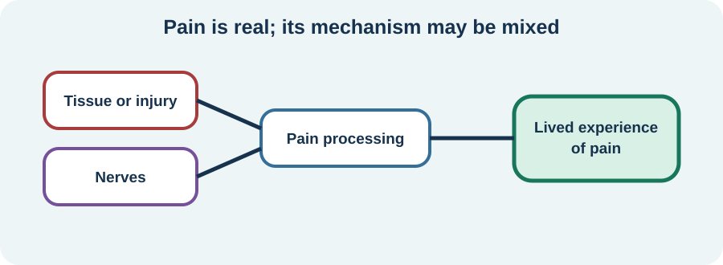

<!-- NAV-BREADCRUMB:START -->
[Home](../../../README.md) › [Course](../../README.md) › Part Three: Common Non-Motor Difficulties › [Module 11](README.md) › **Chronic Pain**
<!-- NAV-BREADCRUMB:END -->

# Chronic Pain

> **Working draft:** This page was automatically generated and is looking for [contributors and reviewers](https://fnd-education-project.github.io/FND-Education/).

Pain can dominate a day even when it is not listed as a core FND symptom. It should be understood and treated, not used as proof for or against FND.

## For the Person With FND

### Definition

**Pain** is an unpleasant sensory and emotional experience. **Chronic pain** lasts or returns beyond the usual healing time, often for more than three months. It may involve tissue injury, nerve changes, altered pain processing or more than one mechanism.

*Illustration: the experience is real, while the mechanism may be mixed and needs assessment.*

### If you read only one thing

Pain is common in FND, but “you have FND” is not a complete pain diagnosis or treatment plan. (*citation* [1](#citation-1))

### One word does not identify the mechanism

Burning or electric pain may suggest a nerve mechanism, but words alone cannot diagnose it. Aching may follow sustained muscle effort, immobility or injury. Widespread pain may fit a separate pain condition. Functional movement can also cause strain or injury.

A useful assessment asks where pain is, what it feels like, how it changes, what function it interrupts and whether there are signs of another condition.

### Treatment needs its own goal

Some FND rehabilitation studies improve movement without improving pain. Pain may need a coordinated plan involving primary care, pain medicine, physiotherapy, occupational therapy, psychology or another specialty. The plan can address sleep, movement, medication, coping, access and meaningful activity without implying that pain is “just psychological.” (*citation* [1](#citation-1))

Seek urgent care for pain with a serious injury, new chest pain, sudden severe headache, new bladder or bowel change with weakness or numbness, fever with severe illness, or another emergency warning.

### Community experiences for review

Medication and procedures have risks; these are experiences, not recommendations.

**Option 1 — more than one source of pain**

> “I have chronic pain both related to and not related to fnd!!”

— The writer distinguished coexisting pain from pain they associated with FND. [Read the public source](https://www.reddit.com/r/FND/comments/1krfvpq/those_of_yall_with_chronic_pain_do_any_meds_help/).

**Option 2 — benefit with an important caution**

> “What has helped me the most is dry needling.”

— The writer also described previous opioid dependence and suggested specialist pain review. [Read the public source](https://www.reddit.com/r/FND/comments/1nd0tc9/does_chronic_pain_deserve_painkillers/).

### Questions

#### What does pain stop you from doing that matters most to you?

#### Which changes tell you this is your usual pain, and which would feel new enough to seek reassessment?

### One small thing you can do

Record one pain episode with only four details: place, quality, activity and effect on function. A lower-demand version is to record place and effect.

Stop tracking if it increases fear or monitoring. Seek help when pain is new, rapidly worsening, causing injury risk or not adequately managed.

***
[For the Person With FND](#for-the-person-with-fnd) 
[For Family, Friends, and Other Supporters](#for-family-friends-and-other-supporters) 
[For Clinicians and the Care Team](#for-clinicians-and-the-care-team) 
[Research and Sources](#research-and-sources)
***

## For Family, Friends, and Other Supporters

Believe the pain without deciding its cause. Ask whether the person wants comfort, practical help, quiet company or help following the agreed plan. Do not push through, force rest or police medication.

Help notice a meaningful change—new location, injury, fever or neurological change—without treating every fluctuation as an emergency.

***
[For the Person With FND](#for-the-person-with-fnd) 
[For Family, Friends, and Other Supporters](#for-family-friends-and-other-supporters) 
[For Clinicians and the Care Team](#for-clinicians-and-the-care-team) 
[Research and Sources](#research-and-sources)
***

## For Clinicians and the Care Team

### Research quotations for review

**Option 1 — Steinruecke et al., 2024**

> “Pain symptoms and pain-related diagnoses are common in FND.”

**Option 2 — Steinruecke et al., 2024**

> “Most interventions for FND did not ameliorate pain”

*Figure 1 — Research quotations offered for editorial selection. (*citation* [1](#citation-1))*

### Phenotype pain separately

Assess nociceptive, neuropathic and nociplastic possibilities; comorbid migraine, fibromyalgia, CRPS, IBS and musculoskeletal disease; injury; medication effect; sleep; mood; trauma when relevant; and activity patterns. Avoid using a functional diagnosis to close the differential.

Set pain-specific outcomes alongside FND outcomes. Explain mechanism as a working formulation, not certainty. Coordinate medication safety, rehabilitation dose, accessibility and self-management. Standard FND treatment may leave pain unchanged, so review it directly. (*citation* [1](#citation-1))

***
[For the Person With FND](#for-the-person-with-fnd) 
[For Family, Friends, and Other Supporters](#for-family-friends-and-other-supporters) 
[For Clinicians and the Care Team](#for-clinicians-and-the-care-team) 
[Research and Sources](#research-and-sources)
***

<!-- NAV-CONTEXT:START -->
**Continue:** [Migraine →](02-migraine.md)

**Navigate:** [Module overview](README.md) · [Course](../../README.md) · [Reference Library](../../../reference/README.md) · [Site Map](../../../SITEMAP.md)
<!-- NAV-CONTEXT:END -->

***

## Research and Sources

The systematic review found frequent pain and pain-related diagnoses, but pooled studies were heterogeneous. It cannot identify one person’s pain mechanism or best treatment. (*citation* [1](#citation-1))

| Citation | Figure | Full citation |
|---|---|---|
| **[1]** | Figure 1 | Steinruecke M, Mason I, Keen M, et al. Pain and functional neurological disorder: a systematic review and meta-analysis. *Journal of Neurology, Neurosurgery & Psychiatry*. 2024;95(9):874–885. [FND-CIT-0015](../../../research/citation-index.md#fnd-cit-0015). [https://doi.org/10.1136/jnnp-2023-332810](https://doi.org/10.1136/jnnp-2023-332810) |

This page still needs review by people with pain and FND, pain specialists, physiotherapists, pharmacists and accessibility reviewers.

*Plain-language draft and research package prepared: September 5, 2026 · Clinical review pending*
