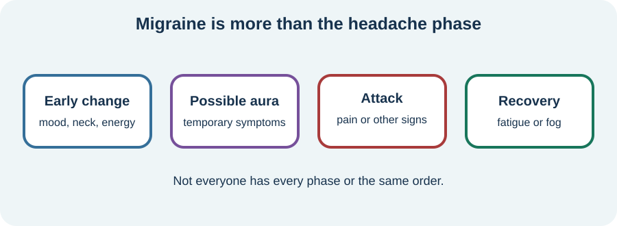

<!-- NAV-BREADCRUMB:START -->
[Home](../../../README.md) › [Course](../../README.md) › Part Three: Common Non-Motor Difficulties › [Module 11](README.md) › **Migraine**
<!-- NAV-BREADCRUMB:END -->

# Migraine

> **Working draft:** This page was automatically generated and is looking for [contributors and reviewers](https://fnd-education-project.github.io/FND-Education/).

Migraine is more than a bad headache. It is a neurological disorder that may coexist with FND and may need its own prevention and attack plan.

## For the Person With FND

### Definition

**Migraine** causes attacks that may include headache, nausea, light or sound sensitivity, dizziness, brain fog and sometimes aura. **Aura** is a temporary neurological symptom such as visual change, tingling or language difficulty, often—but not always—before headache.

*Illustration: migraine can unfold in phases, and headache is only one possible part.*

### If you read only one thing

Migraine and FND are separate diagnoses that can overlap. Treating migraine may reduce one source of symptoms or FND triggering, but it does not prove that every symptom was migraine. (*citation* [1](#citation-1))

### Why overlap becomes confusing

Migraine can cause weakness, speech difficulty, sensory change, dizziness and cognitive fog. FND can involve some of the same experiences. A clinician uses the timing, repeated pattern, examination and diagnostic criteria—not one symptom—to understand the contributions.

The relationship is still poorly studied. Evidence for increased migraine frequency is clearer in functional-seizure samples than across all FND groups. (*citation* [1](#citation-1))

### Keep two plans if needed

A migraine plan may include regular meals and sleep, trigger review, acute treatment and prevention. An FND plan may include episode safety and rehabilitation strategies. One plan should not automatically replace the other.

Seek urgent assessment for a sudden “worst” headache, a new neurological deficit, fever and stiff neck, head injury, a first or very different aura, or another emergency warning. Frequent acute-medicine use also deserves review because medication-overuse headache is possible.

### Community experiences for review

These accounts show overlap and different treatment experiences; they are not medication advice.

**Option 1 — migraine and FND interacting**

> “I do struggle alot with migraines and together with FND it’s not working well together. It triggers my FND alot.”

— The writer described frequent, severe attacks and substantial distress. [Read the public source](https://www.reddit.com/r/FND/comments/1klykcv/migraines/).

**Option 2 — benefit from a migraine-specific plan**

> “My neuro put me on a migraine prophylactic and that’s helped tremendously.”

— A single treatment experience; a migraine clinician should select prevention for the individual. [Read the public source](https://www.reddit.com/r/FND/comments/1pxnpyx/mild_weird_migraines_after_fnd/).

### Questions

#### Which symptoms arrive together in your usual migraine pattern, and in what order?

#### How is a day affected before, during and after an attack—not only during headache?

### One small thing you can do

Write the first sign of your usual attack and the first step in your existing plan. A lower-demand version is to save the plan where another person can find it.

Do not test triggers by provoking symptoms. Seek medical review if the pattern is new, changed, frequent, severe or not controlled.

***
[For the Person With FND](#for-the-person-with-fnd) 
[For Family, Friends, and Other Supporters](#for-family-friends-and-other-supporters) 
[For Clinicians and the Care Team](#for-clinicians-and-the-care-team) 
[Research and Sources](#research-and-sources)
***

## For Family, Friends, and Other Supporters

Reduce light, sound and decision load if the person requests it. Help follow the agreed medication and safety plan without giving extra doses or assuming every changed neurological symptom is their usual migraine.

Ask what is helpful after an attack; recovery may include fatigue and cognitive fog after head pain eases.

***
[For the Person With FND](#for-the-person-with-fnd) 
[For Family, Friends, and Other Supporters](#for-family-friends-and-other-supporters) 
[For Clinicians and the Care Team](#for-clinicians-and-the-care-team) 
[Research and Sources](#research-and-sources)
***

## For Clinicians and the Care Team

### Research quotations for review

**Option 1 — Stone et al., 2025**

> “it can be clinically challenging to disentangle their relative contributions”

**Option 2 — Stone et al., 2025**

> “Robust epidemiological studies ... are lacking.”

*Figure 1 — Research quotations offered for editorial selection. (*citation* [1](#citation-1))*

### Diagnose and measure both conditions

Apply migraine criteria, characterize aura and headache days, review acute-medication frequency, and identify red flags. Separately document positive FND features and phenotype. Avoid counting all sensory, motor, cognitive or vestibular symptoms under one label.

Offer guideline-concordant migraine care and coordinate it with FND rehabilitation. Record migraine days and FND outcomes separately enough to learn what changed. Explain that migraine may predispose, precipitate or perpetuate FND in some cases, while causal and epidemiological evidence remains limited. (*citation* [1](#citation-1))

***
[For the Person With FND](#for-the-person-with-fnd) 
[For Family, Friends, and Other Supporters](#for-family-friends-and-other-supporters) 
[For Clinicians and the Care Team](#for-clinicians-and-the-care-team) 
[Research and Sources](#research-and-sources)
***

<!-- NAV-CONTEXT:START -->
**Continue:** [Fatigue and Post-Activity Worsening →](03-fatigue-and-post-activity-worsening.md)

**Navigate:** [← Previous page](01-chronic-pain.md) · [Module overview](README.md) · [Course](../../README.md) · [Site Map](../../../SITEMAP.md)
<!-- NAV-CONTEXT:END -->

***

## Research and Sources

This focused review maps overlap and gaps; it does not establish a single shared mechanism or prove that migraine treatment changes FND. (*citation* [1](#citation-1))

| Citation | Figure | Full citation |
|---|---|---|
| **[1]** | Figure 1 | Stone J, Coebergh J, Khoja L, Butler M, Nicholson TR, Dodick DW. Migraine and functional neurological disorder (FND)—a review of comorbidity and potential overlap. *Brain Communications*. 2025;7(4):fcaf288. [FND-CIT-0049](../../../research/citation-index.md#fnd-cit-0049). [https://doi.org/10.1093/braincomms/fcaf288](https://doi.org/10.1093/braincomms/fcaf288) |

This page still needs review by people with migraine and FND, headache specialists, neurologists, pharmacists and accessibility reviewers.

*Plain-language draft and research package prepared: September 5, 2026 · Clinical review pending*
