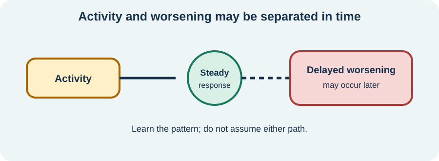

<!-- NAV-BREADCRUMB:START -->
[Home](../../../README.md) › [Course](../../README.md) › Part Three: Common Non-Motor Difficulties › [Module 11](README.md) › **Fatigue and Post-Activity Worsening**
<!-- NAV-BREADCRUMB:END -->

# Fatigue and Post-Activity Worsening

> **Working draft:** This page was automatically generated and is looking for [contributors and reviewers](https://fnd-education-project.github.io/FND-Education/).

Fatigue can make washing, thinking or speaking feel like work. It is not a character flaw, and pushing harder is not always the right answer.

## For the Person With FND

### Definition

**Fatigue** is a felt lack of physical or mental energy that is not the same as ordinary sleepiness. **Post-activity worsening** means symptoms increase during or after physical, cognitive, emotional or sensory activity; the increase may be immediate or delayed.

*Illustration: the response may be delayed, so the activity and the worsening can be easy to disconnect.*

### If you read only one thing

Fatigue and delayed worsening deserve assessment. They can occur with FND, but also with sleep disorders, migraine, pain, medication effects, anaemia, endocrine disease, infection, ME/CFS, long COVID and other conditions.

### Learn the pattern before increasing activity

Ask what kind of activity was involved, how much, and when symptoms changed. Include thinking, conversation, travel and sensory load—not only exercise.

**Pacing** means adjusting the amount, order and timing of activity to make it more sustainable. It can include shorter tasks, planned pauses or alternating kinds of demand. It is not a fixed heart-rate rule or a promise that a flare can always be prevented.

Evidence about pacing is mixed and comes mainly from ME/CFS research, not FND. Avoid automatically applying graded increases when the person has consistent delayed worsening that has not been assessed. (*citations* [1](#citation-1), [2](#citation-2))

### Community experiences for review

These accounts show two personal pacing approaches, not universal doses.

**Option 1 — the good-day trap**

> “I feel good, I’ll do it all—only to crash out later and feel awful.”

— The writer described learning a baseline and resisting the urge to do much more on a good day. [Read the public source](https://www.reddit.com/r/FND/comments/1qlwz51/exercise_and_fnd/).

**Option 2 — very small chunks**

> “I have used pacing for chronic pain and fatigue for many years and manage activity in 10-12 minute chunks. Then I must rest.”

— This person also described ME/CFS and insomnia; their timing is not a prescription for others. [Read the public source](https://www.reddit.com/r/FND/comments/1grqq89/how_do_you_cope_with_having_a_chronic_illness/).

### Questions

#### Which kind of effort—physical, thinking, emotional or sensory—has the longest effect on you?

#### What is the earliest sign that today’s activity may be more than your current capacity?

### One small thing you can do

Choose one regular task and try a planned pause before exhaustion. A lower-demand version is to note when worsening begins.

Stop an activity that creates unsafe weakness, falls, chest pain, fainting or severe or unusual symptoms. Seek reassessment for new or worsening fatigue, weight loss, fever, breathlessness, bleeding, changed sleep, medication changes or another concerning feature.

***
[For the Person With FND](#for-the-person-with-fnd) 
[For Family, Friends, and Other Supporters](#for-family-friends-and-other-supporters) 
[For Clinicians and the Care Team](#for-clinicians-and-the-care-team) 
[Research and Sources](#research-and-sources)
***

## For Family, Friends, and Other Supporters

Do not measure effort only by what you can see. Conversation, noise or decision-making may cost energy. Ask which task to protect and which can wait.

Avoid praising overexertion and blaming rest. Help the person compare plans with outcomes over several days, while leaving medical interpretation to clinicians.

***
[For the Person With FND](#for-the-person-with-fnd) 
[For Family, Friends, and Other Supporters](#for-family-friends-and-other-supporters) 
[For Clinicians and the Care Team](#for-clinicians-and-the-care-team) 
[Research and Sources](#research-and-sources)
***

## For Clinicians and the Care Team

### Research quotations for review

**Option 1 — Sanal-Hayes et al., 2023**

> “Eleven studies reported benefits ... four ... no effect”

**Option 2 — Sanal-Hayes et al., 2023**

> “methodological quality resulted in heterogenous findings”

*Figure 1 — Research quotations offered for editorial selection. (*citation* [2](#citation-2))*

### Separate fatigue, fatigability and post-exertional worsening

Characterize onset, physical versus cognitive fatigue, sleepiness, task-related performance decline, delayed worsening and recovery time. Review sleep, pain, migraine, mood, nutrition, medication, autonomic symptoms and medical differentials.

Co-design a baseline that protects function and avoids boom–bust cycles. If increasing activity, use shared goals, small doses and outcome review rather than a compulsory schedule. ME/CFS pacing evidence cannot be assumed to transfer to FND, and post-exertional malaise should prompt a relevant differential rather than automatic attribution. (*citations* [1](#citation-1), [2](#citation-2), [3](#citation-3))

***
[For the Person With FND](#for-the-person-with-fnd) 
[For Family, Friends, and Other Supporters](#for-family-friends-and-other-supporters) 
[For Clinicians and the Care Team](#for-clinicians-and-the-care-team) 
[Research and Sources](#research-and-sources)
***

<!-- NAV-CONTEXT:START -->
**Continue:** [Sleep Problems and Sleep Disorders →](04-sleep-problems-and-sleep-disorders.md)

**Navigate:** [← Previous page](02-migraine.md) · [Module overview](README.md) · [Course](../../README.md) · [Site Map](../../../SITEMAP.md)
<!-- NAV-CONTEXT:END -->

***

## Research and Sources

The energy-envelope study and pacing review concern ME/CFS and cannot establish an FND treatment. The OT recommendations support individualized activity planning in FND but are consensus, not a fatigue trial. (*citations* [1](#citation-1), [2](#citation-2), [3](#citation-3))

**Related course page:** [Available capacity, spoons, and early action](../../part-1-understanding-fnd/module-01-what-fnd-is/04-available-capacity-spoons-and-early-action.md)

| Citation | Figure | Full citation |
|---|---|---|
| **[1]** | — | Jason LA, Muldowney K, Torres-Harding S. The Energy Envelope Theory and myalgic encephalomyelitis/chronic fatigue syndrome. *AAOHN Journal*. 2008;56(5):189–195. [FND-CIT-0065](../../../research/citation-index.md#fnd-cit-0065). [https://doi.org/10.3928/08910162-20080501-06](https://doi.org/10.3928/08910162-20080501-06) |
| **[2]** | Figure 1 | Sanal-Hayes NEM, McLaughlin M, Hayes LD, et al. A scoping review of “pacing” for management of myalgic encephalomyelitis/chronic fatigue syndrome (ME/CFS): lessons learned for the long COVID pandemic. *Journal of Translational Medicine*. 2023;21:720. [FND-CIT-0066](../../../research/citation-index.md#fnd-cit-0066). [https://doi.org/10.1186/s12967-023-04587-5](https://doi.org/10.1186/s12967-023-04587-5) |
| **[3]** | — | Nicholson C, Edwards MJ, Carson AJ, et al. Occupational therapy consensus recommendations for functional neurological disorder. *Journal of Neurology, Neurosurgery & Psychiatry*. 2020;91(10):1037–1045. [FND-CIT-0011](../../../research/citation-index.md#fnd-cit-0011). [https://doi.org/10.1136/jnnp-2019-322281](https://doi.org/10.1136/jnnp-2019-322281) |

This page still needs review by people with fatigue and delayed worsening, ME/CFS-informed clinicians, rehabilitation professionals and accessibility reviewers.

*Plain-language draft and research package prepared: September 5, 2026 · Clinical review pending*
