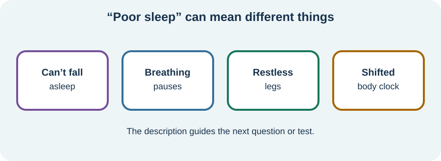

<!-- NAV-BREADCRUMB:START -->
[Home](../../../README.md) › [Course](../../README.md) › Part Three: Common Non-Motor Difficulties › [Module 11](README.md) › **Sleep Problems and Sleep Disorders**
<!-- NAV-BREADCRUMB:END -->

# Sleep Problems and Sleep Disorders

> **Working draft:** This page was automatically generated and is looking for [contributors and reviewers](https://fnd-education-project.github.io/FND-Education/).

Poor sleep can worsen pain, fatigue, thinking and symptom tolerance. It can be part of a loop, but a treatable sleep disorder should not be overlooked.

## For the Person With FND

### Definition

A **sleep problem** is any difficulty with sleep or daytime alertness. A **sleep disorder** is a defined condition such as insomnia, obstructive sleep apnea, restless legs syndrome or a circadian-rhythm disorder.

*Illustration: “poor sleep” is a starting description, not one diagnosis.*

### If you read only one thing

Do not assume all poor sleep is FND. The pattern, breathing, movements, medicines, timing and daytime effects help identify what assessment is needed. (*citation* [1](#citation-1))

### Describe the night and the day

Useful differences include trouble falling asleep, repeated waking, waking too early, a shifted sleep schedule, nightmares, uncomfortable legs, snoring or breathing pauses, and sleepiness versus fatigue during the day.

Pain, migraine, functional episodes, anxiety, low mood, medication, alcohol, caffeine and inactivity may also disturb sleep. Sleep difficulty can then make those problems harder. Both directions can matter.

### Start with a small stable cue

General sleep advice is not a cure for every disorder. A consistent wake time, morning light or a calmer wind-down may help some people. If being in bed awake becomes distressing, or a rigid schedule worsens symptoms, ask for individualized guidance.

Seek assessment for witnessed breathing pauses, choking during sleep, dangerous daytime sleepiness, unusual night-time events, sudden sleep attacks, severe restless legs or persistent insomnia. (*citation* [1](#citation-1))

### Community experiences for review

These medication accounts have different outcomes and are not prescribing advice.

**Option 1 — sleep treatment helped fatigue**

> “Managed the chronic insomnia with medication ... This helps to combat the fatigue.”

— The writer also had ME/CFS and described pacing pain and fatigue. [Read the public source](https://www.reddit.com/r/FND/comments/1grqq89/how_do_you_cope_with_having_a_chronic_illness/).

**Option 2 — sleep medication did not solve sleep**

> “Doc gave me meds to help me sleep. All they do is make me tired/sleepy ... so they rarely work.”

— The same discussion included pain medication and financial barriers. [Read the public source](https://www.reddit.com/r/FND/comments/1grqq89/how_do_you_cope_with_having_a_chronic_illness/).

### Questions

#### Is your hardest problem falling asleep, staying asleep, the timing of sleep, symptoms during sleep, or functioning the next day?

#### What makes you feel safer and less pressured around sleep?

### One small thing you can do

For three days, note only bedtime, wake time and the main daytime effect. A lower-demand version is to note the daytime effect.

Stop tracking if it makes sleep more pressured. Do not change prescribed sleep or pain medicine without the prescriber; seek review for side effects, interactions or inadequate benefit.

***
[For the Person With FND](#for-the-person-with-fnd) 
[For Family, Friends, and Other Supporters](#for-family-friends-and-other-supporters) 
[For Clinicians and the Care Team](#for-clinicians-and-the-care-team) 
[Research and Sources](#research-and-sources)
***

## For Family, Friends, and Other Supporters

Share observations such as snoring, breathing pauses or unusual movements only with consent and without diagnosing. Protect the sleep environment where practical, but do not become the sleep police.

If daytime sleepiness affects driving, cooking or falls, help make a safety plan and seek clinical review.

***
[For the Person With FND](#for-the-person-with-fnd) 
[For Family, Friends, and Other Supporters](#for-family-friends-and-other-supporters) 
[For Clinicians and the Care Team](#for-clinicians-and-the-care-team) 
[Research and Sources](#research-and-sources)
***

## For Clinicians and the Care Team

### Research quotations for review

**Option 1 — Kannan et al., 2025**

> “58% reporting sleep disturbances”

**Option 2 — Kannan et al., 2025**

> “poorer subjective sleep quality and higher insomnia rates”

*Figure 1 — Research quotations offered for editorial selection. (*citation* [1](#citation-1))*

### Investigate the phenotype, not only the score

Take a sleep and circadian history; review snoring, witnessed apneas, restless legs, parasomnias, nocturnal events, medication and substances, pain, mood and daytime sleepiness. Use sleep diaries or screening measures as aids, not diagnoses. Refer for sleep testing when indicated.

Treat identified disorders and coordinate sleep interventions with the person’s fatigue and FND plan. Distinguish subjective sleepiness from objective hypersomnolence. The FND sleep literature remains small and heterogeneous, so avoid claiming that sleep disturbance is one universal mechanism. (*citation* [1](#citation-1))

***
[For the Person With FND](#for-the-person-with-fnd) 
[For Family, Friends, and Other Supporters](#for-family-friends-and-other-supporters) 
[For Clinicians and the Care Team](#for-clinicians-and-the-care-team) 
[Research and Sources](#research-and-sources)
***

<!-- NAV-CONTEXT:START -->
**Continue:** [When Pain, Migraine, Fatigue, and Sleep Interact →](05-when-pain-migraine-fatigue-and-sleep-interact.md)

**Navigate:** [← Previous page](03-fatigue-and-post-activity-worsening.md) · [Module overview](README.md) · [Course](../../README.md) · [Site Map](../../../SITEMAP.md)
<!-- NAV-CONTEXT:END -->

***

## Research and Sources

The systematic review included nine studies and mixed FND subgroups. Its pooled proportion does not diagnose a sleep disorder or predict an individual. (*citation* [1](#citation-1))

| Citation | Figure | Full citation |
|---|---|---|
| **[1]** | Figure 1 | Kannan S, Dutta A, Das A. Sleep disorders in functional neurological disorder—a systematic review and meta-analysis. *Neurological Sciences*. 2025;46(4):1573–1580. [FND-CIT-0073](../../../research/citation-index.md#fnd-cit-0073). [https://doi.org/10.1007/s10072-024-07931-9](https://doi.org/10.1007/s10072-024-07931-9) |

This page still needs review by people with sleep problems and FND, sleep physicians, neurologists, pharmacists and accessibility reviewers.

*Plain-language draft and research package prepared: September 5, 2026 · Clinical review pending*
