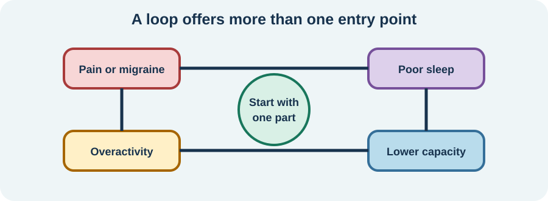

<!-- NAV-BREADCRUMB:START -->
[Home](../../../README.md) › [Course](../../README.md) › Part Three: Common Non-Motor Difficulties › [Module 11](README.md) › **When Pain, Migraine, Fatigue, and Sleep Interact**
<!-- NAV-BREADCRUMB:END -->

# When Pain, Migraine, Fatigue, and Sleep Interact

> **Working draft:** This page was automatically generated and is looking for [contributors and reviewers](https://fnd-education-project.github.io/FND-Education/).

When several symptoms rise together, it can feel as though everything must be fixed at once. A small map can reveal one workable entry point.

## For the Person With FND

### Definition

A **symptom interaction loop** is a pattern in which one difficulty changes another—for example, pain interrupts sleep, poor sleep lowers capacity, and overactivity on the next good day worsens pain.

*Illustration: the loop is not blame. It shows several possible entry points rather than one cause.*

### If you read only one thing

You do not need to solve the whole loop today. Choose the part that is safest, clearest or most treatable.

### Make a four-box map

Write pain, migraine, fatigue and sleep in four boxes. Add one arrow only when you have noticed a repeated connection. Examples:

- a migraine attack is followed by a day of fatigue;
- pain repeatedly wakes you;
- poor sleep comes before more functional episodes; or
- a burst of activity is followed by delayed worsening.

An arrow is an observation, not proof of cause. A loop can include treatable conditions that need separate care. (*citations* [1](#citation-1), [2](#citation-2), [3](#citation-3))

### Pick one entry point

Possible entry points include reviewing migraine prevention, assessing sleep apnea, making medication safer, breaking a task into smaller pieces, treating an injury, or planning a quieter recovery period. The best first step depends on risk, access and what matters to you.

### Community experiences for review

These accounts show how one part of the loop can affect several symptoms.

**Option 1 — sleep as a major trigger**

> “Sleep deprivation is the single biggest trigger for most of my symptoms, not just the FND ones.”

— The writer said their threshold for feeling sleep deprived was low and wondered how much sleep affected average severity. [Read the public source](https://www.reddit.com/r/FND/comments/1vk4k5l/what_flares_up_your_fnd/).

**Option 2 — several small approaches together**

> “Every day is an uphill battle, but these ‘simple’ approaches have helped me significantly.”

— The writer described insomnia treatment, pain management and short activity chunks while also living with ME/CFS. [Read the public source](https://www.reddit.com/r/FND/comments/1grqq89/how_do_you_cope_with_having_a_chronic_illness/).

### Questions

#### Which connection between symptoms repeats often enough that you trust it?

#### Which part of the loop feels most changeable without costing more than you have?

### One small thing you can do

Draw two boxes and one arrow: **___ tends to be followed by ___**. A lower-demand version is to say the sentence aloud or record it as a voice note.

Stop mapping if it becomes constant symptom surveillance. Seek clinical help for concerning changes and for problems—such as migraine or a sleep disorder—that need their own treatment.

***
[For the Person With FND](#for-the-person-with-fnd) 
[For Family, Friends, and Other Supporters](#for-family-friends-and-other-supporters) 
[For Clinicians and the Care Team](#for-clinicians-and-the-care-team) 
[Research and Sources](#research-and-sources)
***

## For Family, Friends, and Other Supporters

Help with the chosen entry point rather than proposing a complete new routine. Ask what support would remove load today. Do not use the loop to blame activity, sleep habits, emotions or motivation.

Notice caregiver capacity too. A sustainable plan may require outside help, equipment or a change in expectations.

***
[For the Person With FND](#for-the-person-with-fnd) 
[For Family, Friends, and Other Supporters](#for-family-friends-and-other-supporters) 
[For Clinicians and the Care Team](#for-clinicians-and-the-care-team) 
[Research and Sources](#research-and-sources)
***

## For Clinicians and the Care Team

### Research quotations for review

**Option 1 — Steinruecke et al., 2024**

> “treatments should routinely consider pain as a comorbidity”

**Option 2 — Stone et al., 2025**

> “Migraine is an established trigger of FND.”

*Figure 1 — Research quotations offered for editorial selection. (*citations* [1](#citation-1), [2](#citation-2))*

### Build a shared formulation without collapsing diagnoses

Map timing and bidirectional effects, then phenotype and treat each problem. Prioritize red flags, high-impact treatable contributors and the patient’s goals. Coordinate medication, sleep, headache, pain and rehabilitation plans so one intervention does not unintentionally worsen another domain.

Use separate outcome measures where possible. Improvement in movement does not guarantee pain relief; better sleep does not prove the cause of FND; and a flare after activity does not establish one diagnosis. Review the map as evidence changes. (*citations* [1](#citation-1), [2](#citation-2), [3](#citation-3), [4](#citation-4))

***
[For the Person With FND](#for-the-person-with-fnd) 
[For Family, Friends, and Other Supporters](#for-family-friends-and-other-supporters) 
[For Clinicians and the Care Team](#for-clinicians-and-the-care-team) 
[Research and Sources](#research-and-sources)
***

<!-- NAV-CONTEXT:START -->
**Continue:** [Module 12: Autonomic and Whole-Body Symptoms →](../module-12-autonomic-and-whole-body-symptoms/README.md)

**Navigate:** [← Previous page](04-sleep-problems-and-sleep-disorders.md) · [Module overview](README.md) · [Course](../../README.md) · [Site Map](../../../SITEMAP.md)
<!-- NAV-CONTEXT:END -->

***

## Research and Sources

These sources show common comorbidity and possible interactions, but they do not test the four-box map or establish one shared mechanism. (*citations* [1](#citation-1), [2](#citation-2), [3](#citation-3), [4](#citation-4))

| Citation | Figure | Full citation |
|---|---|---|
| **[1]** | Figure 1 | Steinruecke M, Mason I, Keen M, et al. Pain and functional neurological disorder: a systematic review and meta-analysis. *Journal of Neurology, Neurosurgery & Psychiatry*. 2024;95(9):874–885. [FND-CIT-0015](../../../research/citation-index.md#fnd-cit-0015). [https://doi.org/10.1136/jnnp-2023-332810](https://doi.org/10.1136/jnnp-2023-332810) |
| **[2]** | Figure 1 | Stone J, Coebergh J, Khoja L, Butler M, Nicholson TR, Dodick DW. Migraine and functional neurological disorder (FND)—a review of comorbidity and potential overlap. *Brain Communications*. 2025;7(4):fcaf288. [FND-CIT-0049](../../../research/citation-index.md#fnd-cit-0049). [https://doi.org/10.1093/braincomms/fcaf288](https://doi.org/10.1093/braincomms/fcaf288) |
| **[3]** | — | Kannan S, Dutta A, Das A. Sleep disorders in functional neurological disorder—a systematic review and meta-analysis. *Neurological Sciences*. 2025;46(4):1573–1580. [FND-CIT-0073](../../../research/citation-index.md#fnd-cit-0073). [https://doi.org/10.1007/s10072-024-07931-9](https://doi.org/10.1007/s10072-024-07931-9) |
| **[4]** | — | Butler M, Shipston-Sharman O, Seynaeve M, et al. International online survey of 1048 individuals with functional neurological disorder. *European Journal of Neurology*. 2021;28(11):3591–3602. [FND-CIT-0014](../../../research/citation-index.md#fnd-cit-0014). [https://doi.org/10.1111/ene.15018](https://doi.org/10.1111/ene.15018) |

This page still needs review by people living with several interacting symptoms, multidisciplinary clinicians, supporters and accessibility reviewers.

*Plain-language draft and research package prepared: September 5, 2026 · Clinical review pending*
