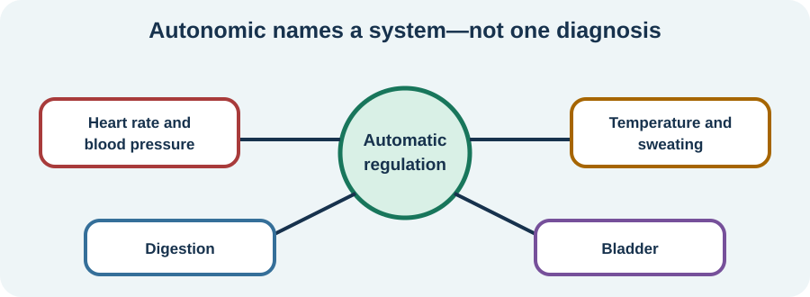

<!-- NAV-BREADCRUMB:START -->
[Home](../../../README.md) › [Course](../../README.md) › Part Three: Common Non-Motor Difficulties › [Module 12](README.md) › **Autonomic Symptoms, Overlap, and Other Causes**
<!-- NAV-BREADCRUMB:END -->

# Autonomic Symptoms, Overlap, and Other Causes

> **Working draft:** This page was automatically generated and is looking for [contributors and reviewers](https://fnd-education-project.github.io/FND-Education/).

Automatic body functions can become noticeable when they are uncomfortable or unreliable. The symptom deserves attention even when its cause is not yet clear.

## For the Person With FND

### Definition

The **autonomic nervous system** helps regulate functions you do not have to consciously direct, including heart rate, blood pressure, sweating, digestion, bladder function and temperature responses.

*Illustration: “autonomic” names a body system, not one disease or one mechanism.*

### If you read only one thing

FND research has found mixed autonomic differences between groups. A pulse, heart-rate-variability value or symptom list cannot diagnose FND or prove that all symptoms share one cause. (*citation* [1](#citation-1))

### Symptoms can overlap

People may describe palpitations, faintness, nausea, bowel changes, sweating, flushing, chills, bladder urgency or trouble tolerating heat. These may occur during FND episodes, migraine, pain, panic or illness. They may also reflect a coexisting autonomic, cardiac, endocrine, gastrointestinal, medication-related or other condition.

POTS, for example, requires chronic symptoms that are worse upright, a sustained heart-rate rise meeting age-based criteria, no substantial orthostatic blood-pressure fall, and exclusion of other explanations. Feeling dizzy or having one high pulse is not enough. (*citation* [2](#citation-2))

### Avoid the one-pedal story

“Fight or flight” and “rest and digest” are useful introductions, but the autonomic system is not a single balance dial. Sympathetic and parasympathetic activity can change reciprocally, independently or together. A simple “vagal tone” story should not be treated as a personal diagnosis. (*citation* [3](#citation-3))

### Community experiences for review

These accounts describe diagnosed or suspected coexisting problems; they do not establish cause.

**Option 1 — balancing two conditions**

> “Trying to balance keeping my neurological symptoms ... from flaring up while simultaneously dealing with the blood pressure drops, dizziness, or tachycardia from dysautonomia is a full-time job.”

— The writer described FND and dysautonomia as interacting burdens. [Read the public source](https://www.reddit.com/r/FND/comments/1swqti0/anyone_else_dealing_with_functional_neurologic/).

**Option 2 — faintness with a coexisting diagnosis**

> “I have POTS alongside FND ... it causes pre syncope (feeling faint/before fainting/dizziness).”

— A commenter described their own coexisting diagnosis; the post cannot confirm diagnostic testing. [Read the public source](https://www.reddit.com/r/FND/comments/1ogxu0u/fnd_and_heart_rate_issues_tw_symptom_talk/).

### Questions

#### Which body function is hardest for you, and what were you doing when it changed?

#### What would respectful care look like if more than one condition contributes?

### One small thing you can do

Write one sentence: **“When I ___, I notice ___, and it affects ___.”** A lower-demand version is to fill only the first two blanks.

Seek urgent care for fainting with injury, chest pain, severe breathlessness, signs of stroke, severe dehydration, blood in vomit or stool, or another emergency concern. A new or substantially changed pattern needs assessment.

***
[For the Person With FND](#for-the-person-with-fnd) 
[For Family, Friends, and Other Supporters](#for-family-friends-and-other-supporters) 
[For Clinicians and the Care Team](#for-clinicians-and-the-care-team) 
[Research and Sources](#research-and-sources)
***

## For Family, Friends, and Other Supporters

Help the person sit or lie safely according to their plan, reduce heat or crowding, and bring needed items. Do not tell them to push through faintness or diagnose the event from a watch.

Know the agreed emergency signs. Support appropriate reassessment while avoiding both panic and automatic attribution to FND.

***
[For the Person With FND](#for-the-person-with-fnd) 
[For Family, Friends, and Other Supporters](#for-family-friends-and-other-supporters) 
[For Clinicians and the Care Team](#for-clinicians-and-the-care-team) 
[Research and Sources](#research-and-sources)
***

## For Clinicians and the Care Team

### Research quotations for review

**Option 1 — Paredes-Echeverri et al., 2022**

> “Autonomic studies in adults with FND yielded mixed results”

**Option 2 — Berntson et al., 1991**

> “the modes of autonomic control”

*Figure 1 — Research quotations offered for editorial selection. (*citations* [1](#citation-1), [3](#citation-3))*

### Keep physiology, symptoms and diagnoses separate

Phenotype the symptom and its temporal context. Check medication, hydration, nutrition and relevant cardiac, autonomic, endocrine, neurological, gastrointestinal and psychiatric differentials. Use orthostatic vitals or specialist testing when clinically indicated.

FND group studies include resting and peri-ictal autonomic findings with heterogeneous directions and methods. They do not validate HRV, resting heart rate or a “polyvagal state” as an FND diagnostic marker. Diagnose coexisting syndromes on their own evidence and explain uncertainty without invalidating symptoms. (*citations* [1](#citation-1), [2](#citation-2), [3](#citation-3))

***
[For the Person With FND](#for-the-person-with-fnd) 
[For Family, Friends, and Other Supporters](#for-family-friends-and-other-supporters) 
[For Clinicians and the Care Team](#for-clinicians-and-the-care-team) 
[Research and Sources](#research-and-sources)
***

<!-- NAV-CONTEXT:START -->
**Continue:** [Useful Tracking, Measurements, and Clinical Assessment →](02-useful-tracking-measurements-and-clinical-assessment.md)

**Navigate:** [Module overview](README.md) · [Course](../../README.md) · [Reference Library](../../../reference/README.md) · [Site Map](../../../SITEMAP.md)
<!-- NAV-CONTEXT:END -->

***

## Research and Sources

The FND review reports mixed group-level physiology. The POTS review provides criteria for a separate syndrome. The older physiology paper is conceptual and should not be treated as a clinical diagnostic standard. (*citations* [1](#citation-1), [2](#citation-2), [3](#citation-3))

| Citation | Figure | Full citation |
|---|---|---|
| **[1]** | Figure 1 | Paredes-Echeverri S, Maggio J, Bègue I, Pick S, Nicholson TR, Perez DL. Autonomic, endocrine, and inflammation profiles in functional neurological disorder: a systematic review and meta-analysis. *Journal of Neuropsychiatry and Clinical Neurosciences*. 2022;34(1):30–43. [FND-CIT-0064](../../../research/citation-index.md#fnd-cit-0064). [https://doi.org/10.1176/appi.neuropsych.21010025](https://doi.org/10.1176/appi.neuropsych.21010025) |
| **[2]** | — | Raj SR, Fedorowski A, Sheldon RS. Diagnosis and management of postural orthostatic tachycardia syndrome. *CMAJ*. 2022;194(10):E378–E385. [FND-CIT-0074](../../../research/citation-index.md#fnd-cit-0074). [https://doi.org/10.1503/cmaj.211373](https://doi.org/10.1503/cmaj.211373) |
| **[3]** | Figure 1 | Berntson GG, Cacioppo JT, Quigley KS. Autonomic determinism: the modes of autonomic control, the doctrine of autonomic space, and the laws of autonomic constraint. *Psychological Review*. 1991;98(4):459–487. [FND-CIT-0063](../../../research/citation-index.md#fnd-cit-0063). [https://doi.org/10.1037/0033-295X.98.4.459](https://doi.org/10.1037/0033-295X.98.4.459) |

This page still needs review by people with autonomic symptoms and FND, autonomic specialists, cardiologists, neurologists and accessibility reviewers.

*Plain-language draft and research package prepared: September 5, 2026 · Clinical review pending*
