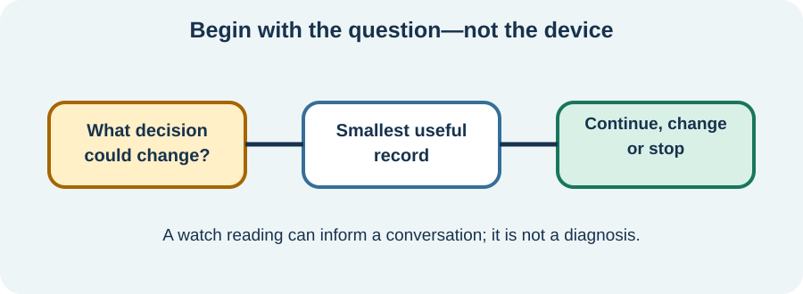

<!-- NAV-BREADCRUMB:START -->
[Home](../../../README.md) › [Course](../../README.md) › Part Three: Common Non-Motor Difficulties › [Module 12](README.md) › **Useful Tracking, Measurements, and Clinical Assessment**
<!-- NAV-BREADCRUMB:END -->

# Useful Tracking, Measurements, and Clinical Assessment

> **Working draft:** This page was automatically generated and is looking for [contributors and reviewers](https://fnd-education-project.github.io/FND-Education/).

A measurement is useful when it helps answer a specific question. More data is not always more understanding.

## For the Person With FND

### Definition

**Symptom tracking** records what you experienced and its context. A **measurement** adds a number such as pulse or blood pressure. A **clinical assessment** combines history, examination and selected measurements to answer a health question.

*Illustration: begin with the question, not the device.*

### If you read only one thing

A wearable can show a pattern worth discussing. It cannot by itself diagnose POTS, an arrhythmia, FND or “nervous-system dysregulation.”

### Ask what the data will change

A clinician may ask for symptoms and pulse or blood pressure when lying and standing. Another question may need an ECG, laboratory tests, a sleep study or specialist autonomic testing. Each method has limits.

Consumer wrist devices estimate pulse using light reflected from blood flow. Accuracy varies with movement, device, fit and skin tone; some studies found reduced accuracy in darker skin. A surprising reading should be checked in context and with appropriate clinical equipment when necessary. (*citations* [1](#citation-1), [2](#citation-2))

### Keep the record small

For a limited period, record time, position or activity, main symptom and only the agreed measurement. Also record what the symptom prevented you from doing. Review the record with the clinician who asked for it.

Stop or scale down if tracking increases checking, fear, skin irritation, sleep disruption or activity avoidance. Emergency symptoms need care, not another watch reading.

### Community experiences for review

These are different personal experiences with tracking, not proof of accuracy or a treatment rule.

**Option 1 — using a daily pattern to adjust activity**

> “I use a heart rate monitor/app ... and adjust my daily activities accordingly.”

— The writer described migraine and FND and found pacing useful; HRV interpretation was personal, not clinically validated here. [Read the public source](https://www.reddit.com/r/FND/comments/1iwcfcl/new_symptoms/).

**Option 2 — stopping when heart rate rose**

> “I track my HR during activity and take breaks when it starts to spike instead of pushing through.”

— The writer described an FND rehabilitation program and perceived benefit; the post does not establish a safe threshold for others. [Read the public source](https://www.reddit.com/r/FND/comments/1o76qrs/temperature_regulation_issues/).

### Questions

#### Which question would you like tracking to answer?

#### How will you know when you have enough information and can stop?

### One small thing you can do

Before recording anything, finish this sentence: **“This number will help me and my clinician decide whether to ___.”** A lower-demand version is to ask whether the number will change anything.

Do not repeatedly stand, restrict fluids, overdrink, change salt, provoke symptoms or alter medicine to create data without individualized clinical guidance.

***
[For the Person With FND](#for-the-person-with-fnd) 
[For Family, Friends, and Other Supporters](#for-family-friends-and-other-supporters) 
[For Clinicians and the Care Team](#for-clinicians-and-the-care-team) 
[Research and Sources](#research-and-sources)
***

## For Family, Friends, and Other Supporters

Help record the agreed observation without interpreting every value. If the device and the person disagree, attend to symptoms and safety rather than arguing with the number.

Do not monitor someone without consent. Help stop tracking when it becomes burdensome, unless a clinician has explained a safety reason to continue.

***
[For the Person With FND](#for-the-person-with-fnd) 
[For Family, Friends, and Other Supporters](#for-family-friends-and-other-supporters) 
[For Clinicians and the Care Team](#for-clinicians-and-the-care-team) 
[Research and Sources](#research-and-sources)
***

## For Clinicians and the Care Team

### Research quotations for review

**Option 1 — Raj et al., 2022**

> “Symptoms must occur after standing”

**Option 2 — Koerber et al., 2023**

> “a significant reduction in accuracy ... in darker-skinned individuals”

*Figure 1 — Research quotations offered for editorial selection. (*citations* [1](#citation-1), [2](#citation-2))*

### Specify the clinical question and protocol

If assessing orthostatic intolerance, document posture, timing, symptoms, heart rate and blood pressure with an appropriate protocol and differential. POTS criteria require more than tachycardia. Investigate anaemia, infection, dehydration, endocrine causes, medication effects and other explanations as relevant.

Explain what consumer data can and cannot show. Consider device validation, missing data, motion artifact and equity across skin tones. Use time-limited measurement when possible and include function. Avoid reinforcing compulsive monitoring or interpreting HRV as an FND biomarker. (*citations* [1](#citation-1), [2](#citation-2), [3](#citation-3))

***
[For the Person With FND](#for-the-person-with-fnd) 
[For Family, Friends, and Other Supporters](#for-family-friends-and-other-supporters) 
[For Clinicians and the Care Team](#for-clinicians-and-the-care-team) 
[Research and Sources](#research-and-sources)
***

<!-- NAV-CONTEXT:START -->
**Continue:** [Build a Personal Autonomic-Symptom Plan →](03-build-a-personal-autonomic-symptom-plan.md)

**Navigate:** [← Previous page](01-autonomic-symptoms-overlap-and-other-causes.md) · [Module overview](README.md) · [Course](../../README.md) · [Site Map](../../../SITEMAP.md)
<!-- NAV-CONTEXT:END -->

***

## Research and Sources

The POTS source is a clinical review, the wearable source is a systematic review focused on skin-tone accuracy, and the FND source reports heterogeneous group findings. None validates a consumer wearable as an FND test. (*citations* [1](#citation-1), [2](#citation-2), [3](#citation-3))

| Citation | Figure | Full citation |
|---|---|---|
| **[1]** | Figure 1 | Raj SR, Fedorowski A, Sheldon RS. Diagnosis and management of postural orthostatic tachycardia syndrome. *CMAJ*. 2022;194(10):E378–E385. [FND-CIT-0074](../../../research/citation-index.md#fnd-cit-0074). [https://doi.org/10.1503/cmaj.211373](https://doi.org/10.1503/cmaj.211373) |
| **[2]** | Figure 1 | Koerber D, Khan S, Shamsheri T, Kirubarajan A, Mehta S. Accuracy of heart rate measurement with wrist-worn wearable devices in various skin tones: a systematic review. *Journal of Racial and Ethnic Health Disparities*. 2023;10(6):2676–2684. [FND-CIT-0075](../../../research/citation-index.md#fnd-cit-0075). [https://doi.org/10.1007/s40615-022-01446-9](https://doi.org/10.1007/s40615-022-01446-9) |
| **[3]** | — | Paredes-Echeverri S, Maggio J, Bègue I, Pick S, Nicholson TR, Perez DL. Autonomic, endocrine, and inflammation profiles in functional neurological disorder: a systematic review and meta-analysis. *Journal of Neuropsychiatry and Clinical Neurosciences*. 2022;34(1):30–43. [FND-CIT-0064](../../../research/citation-index.md#fnd-cit-0064). [https://doi.org/10.1176/appi.neuropsych.21010025](https://doi.org/10.1176/appi.neuropsych.21010025) |

This page still needs review by people who use wearables, autonomic clinicians, cardiologists, primary-care clinicians and accessibility and equity reviewers.

*Plain-language draft and research package prepared: September 5, 2026 · Clinical review pending*
