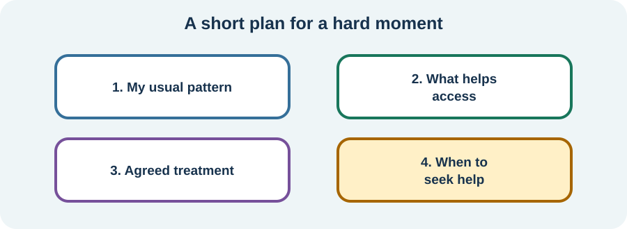

<!-- NAV-BREADCRUMB:START -->
[Home](../../../README.md) › [Course](../../README.md) › Part Three: Common Non-Motor Difficulties › [Module 12](README.md) › **Build a Personal Autonomic-Symptom Plan**
<!-- NAV-BREADCRUMB:END -->

# Build a Personal Autonomic-Symptom Plan

> **Working draft:** This page was automatically generated and is looking for [contributors and reviewers](https://fnd-education-project.github.io/FND-Education/).

A short plan can reduce decisions during dizziness, nausea, heat intolerance or palpitations. It should reflect your assessed conditions rather than a generic internet protocol.

## For the Person With FND

### Definition

A **personal symptom plan** is a short record of your usual pattern, what helps, what has been prescribed, what support you want and which changes need medical care.

*Illustration: daily coping and emergency decisions belong in different boxes.*

### If you read only one thing

Use only strategies that fit your health conditions. Advice about extra salt, fluids, compression, breathing, exercise or medication is not safe or useful for everyone.

### Four boxes are enough

1. **My usual pattern:** what happens and in what setting.
2. **What helps access:** sitting, cooling, a quieter place, help with a task or another agreed support.
3. **My clinical plan:** prescribed treatment and who reviews it.
4. **Get help when:** your individualized warning signs and ordinary emergency signs.

Include what other people should do and what you do not want. Keep the plan short enough to use when thinking is difficult.

### Protect life as well as symptoms

A plan can include a stool for food preparation, a cool pack, seated washing, access to a toilet, flexible travel or another adaptation. These supports are not a diagnosis and do not require waiting for perfect symptom control.

Review the plan after a new diagnosis, medication change, faint or injury. (*citations* [1](#citation-1), [2](#citation-2))

### Community experiences for review

These accounts show both the burden of management and one person’s perceived benefit.

**Option 1 — management itself became heavy**

> “Sometimes, the mental weight of having to micromanage every single aspect of my health is heavier than the physical symptoms themselves.”

— The writer described living with both FND and dysautonomia. [Read the public source](https://www.reddit.com/r/FND/comments/1swqti0/anyone_else_dealing_with_functional_neurologic/).

**Option 2 — pausing rather than pushing through**

> “Slowing my breathing and letting my HR drop before resuming has made my system a little less reactive over time.”

— The writer described an FND rehabilitation program; this is not a safe or effective rule for every heart-rate change. [Read the public source](https://www.reddit.com/r/FND/comments/1o76qrs/temperature_regulation_issues/).

### Questions

#### Which symptom creates the most decisions when it happens?

#### What would help you feel prepared without making health management take over the day?

### One small thing you can do

Complete one box: **“My usual pattern is ...”** A lower-demand version is to write three words.

Do not add salt, restrict or force fluids, use compression, change medicine or begin exercise treatment without checking whether it fits your conditions. Seek reassessment for new, severe or changed symptoms.

***
[For the Person With FND](#for-the-person-with-fnd) 
[For Family, Friends, and Other Supporters](#for-family-friends-and-other-supporters) 
[For Clinicians and the Care Team](#for-clinicians-and-the-care-team) 
[Research and Sources](#research-and-sources)
***

## For Family, Friends, and Other Supporters

Learn where the plan is and follow the person’s chosen support steps. Ask before touching, moving or giving food, drink, salt or medicine. If the pattern differs from the plan, prioritize safety and appropriate assessment.

Help simplify the plan rather than adding more tracking. Your own limits and need for backup belong in the planning conversation.

***
[For the Person With FND](#for-the-person-with-fnd) 
[For Family, Friends, and Other Supporters](#for-family-friends-and-other-supporters) 
[For Clinicians and the Care Team](#for-clinicians-and-the-care-team) 
[Research and Sources](#research-and-sources)
***

## For Clinicians and the Care Team

### Research quotations for review

**Option 1 — Raj et al., 2022**

> “No robust, multicentre randomized controlled trials ... have been conducted”

**Option 2 — Paredes-Echeverri et al., 2022**

> “there is a need for the use of larger sample sizes”

*Figure 1 — Research quotations offered for editorial selection. (*citations* [1](#citation-1), [2](#citation-2))*

### Make the plan diagnosis-aware and usable

Record the symptom phenotype, confirmed diagnoses, relevant differential, contraindications, prescribed strategies and named reviewer. Separate comfort and access steps from condition-specific treatment and escalation.

Avoid a universal “nervous-system regulation” package. Tailor hydration, salt, compression, exercise and medication to the diagnosis and comorbidity. Keep the plan cognitively accessible and test whether the patient and supporter can use it during symptoms. Revisit when the pattern or evidence changes. (*citations* [1](#citation-1), [2](#citation-2), [3](#citation-3))

***
[For the Person With FND](#for-the-person-with-fnd) 
[For Family, Friends, and Other Supporters](#for-family-friends-and-other-supporters) 
[For Clinicians and the Care Team](#for-clinicians-and-the-care-team) 
[Research and Sources](#research-and-sources)
***

<!-- NAV-CONTEXT:START -->
**Continue:** [Part Four: Treatment and Rehabilitation →](../../part-4-treatment-and-rehabilitation/module-13-building-an-individual-treatment-team/README.md)

**Navigate:** [← Previous page](02-useful-tracking-measurements-and-clinical-assessment.md) · [Module overview](README.md) · [Course](../../README.md) · [Site Map](../../../SITEMAP.md)
<!-- NAV-CONTEXT:END -->

***

## Research and Sources

The sources support careful syndrome-specific assessment and substantial uncertainty in FND autonomic research. They do not test this four-box plan as an intervention. (*citations* [1](#citation-1), [2](#citation-2), [3](#citation-3))

| Citation | Figure | Full citation |
|---|---|---|
| **[1]** | Figure 1 | Raj SR, Fedorowski A, Sheldon RS. Diagnosis and management of postural orthostatic tachycardia syndrome. *CMAJ*. 2022;194(10):E378–E385. [FND-CIT-0074](../../../research/citation-index.md#fnd-cit-0074). [https://doi.org/10.1503/cmaj.211373](https://doi.org/10.1503/cmaj.211373) |
| **[2]** | Figure 1 | Paredes-Echeverri S, Maggio J, Bègue I, Pick S, Nicholson TR, Perez DL. Autonomic, endocrine, and inflammation profiles in functional neurological disorder: a systematic review and meta-analysis. *Journal of Neuropsychiatry and Clinical Neurosciences*. 2022;34(1):30–43. [FND-CIT-0064](../../../research/citation-index.md#fnd-cit-0064). [https://doi.org/10.1176/appi.neuropsych.21010025](https://doi.org/10.1176/appi.neuropsych.21010025) |
| **[3]** | — | Nicholson C, Edwards MJ, Carson AJ, et al. Occupational therapy consensus recommendations for functional neurological disorder. *Journal of Neurology, Neurosurgery & Psychiatry*. 2020;91(10):1037–1045. [FND-CIT-0011](../../../research/citation-index.md#fnd-cit-0011). [https://doi.org/10.1136/jnnp-2019-322281](https://doi.org/10.1136/jnnp-2019-322281) |

This page still needs review by people with autonomic symptoms and FND, autonomic and rehabilitation clinicians, supporters and accessibility reviewers.

*Plain-language draft and research package prepared: September 5, 2026 · Clinical review pending*
