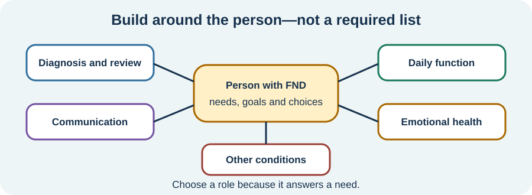

<!-- NAV-BREADCRUMB:START -->
[Home](../../../README.md) › [Course](../../README.md) › Part Four: Treatment and Rehabilitation › [Module 13](README.md) › **Who May Be on the Treatment Team**
<!-- NAV-BREADCRUMB:END -->

# Who May Be on the Treatment Team

> **Working draft:** This page was automatically generated and is looking for [contributors and reviewers](https://fnd-education-project.github.io/FND-Education/).

FND care may involve more than one kind of professional. That does not mean everyone needs a large team.

## For the Person With FND

### Definition

A **treatment team** is the person with FND and the professionals who have agreed roles in their care. The right team depends on the person's symptoms, other conditions, goals and access.

*Illustration: the person is central. Team members are chosen for a need, not added because every person with FND must see them.*

### If you read only one thing

You do not have to collect every specialist. A smaller team with clear jobs may be more useful than many referrals that do not connect.

### Different professionals do different work

- A **neurologist** may make or review the diagnosis, explain positive signs and reconsider important changes.
- A **primary-care clinician** may look after general health, medicines, referrals and ongoing coordination.
- A **physiotherapist** may work on movement, balance or physical activity.
- An **occupational therapist** may work on daily tasks, routines, access, equipment and participation.
- A **speech and language therapist** may assess and treat communication, swallowing, cough or upper-airway problems.
- A **psychologist, psychiatrist or neuropsychologist** may help when their skills match the person's goals, distress, thinking needs or a separate mental-health condition.
- Pain, migraine, sleep, rehabilitation or other specialists may treat a confirmed or suspected condition in their own area.

These are possible roles, not a prescription. One clinician may cover more than one role, and a needed professional may not be locally available. (*citations* [1](#citation-1), [2](#citation-2), [3](#citation-3))

### FND does not own every health problem

Another illness can exist alongside FND. New, severe or substantially changed symptoms still deserve proportionate assessment. A referral should answer a real question or offer relevant treatment—not move responsibility away because the patient has FND.

There is no cure that reliably removes FND for everyone. Treatment may reduce symptoms, improve safety or help a person participate more, but response varies and lack of improvement is not a failure of effort.

### Community experiences for review

These accounts show why both access and useful rehabilitation matter.

**Option 1 — services felt disconnected**

> “I feel like we are on an island and none of these specialists seem to understand this disorder.”

— A parent described trying to help a recently diagnosed daughter. [Read the public source](https://www.reddit.com/r/FND/comments/16iyjst/dad_helping_recently_diagnosed_daughter/).

**Option 2 — two disciplines helped**

> “Physical and occupational therapy helped me a lot.”

— One person described their own experience; it does not predict another person's response. [Read the public source](https://www.reddit.com/r/FND/comments/q3hz2r/im_so_embarrassed/).

### Questions

#### Which health or daily-life problem most needs a named person responsible for it?

#### Does your current care feel like a team, separate appointments, or something else?

### One small thing you can do

Write one line: **“The person I contact about ___ is ___.”** A lower-demand version is to name the gap without solving it.

***
[For the Person With FND](#for-the-person-with-fnd) 
[For Family, Friends, and Other Supporters](#for-family-friends-and-other-supporters) 
[For Clinicians and the Care Team](#for-clinicians-and-the-care-team) 
[Research and Sources](#research-and-sources)
***

## For Family, Friends, and Other Supporters

Ask what role the person wants you to have. You might take notes, help carry information between appointments or notice an access problem. Do not become the treatment supervisor or assume that more appointments must be better.

Help keep other diagnoses and ordinary healthcare visible. If a symptom is new, severe, injured or meaningfully different, follow the person's safety plan and seek appropriate assessment rather than deciding it is “just FND.”

***
[For the Person With FND](#for-the-person-with-fnd) 
[For Family, Friends, and Other Supporters](#for-family-friends-and-other-supporters) 
[For Clinicians and the Care Team](#for-clinicians-and-the-care-team) 
[Research and Sources](#research-and-sources)
***

## For Clinicians and the Care Team

### Research quotations for review

**Option 1 — Lehn et al., 2025**

> “requires a comprehensive, multidisciplinary approach”

**Option 2 — Nicholson et al., 2020**

> “rehabilitation within functional activity”

*Figure 1 — Research quotations offered for editorial selection. (*citations* [1](#citation-1), [2](#citation-2))*

### Build around needs and ownership

Identify the symptom phenotype, comorbidities, disability, risks, patient goals and barriers before assigning disciplines. Record who owns diagnostic review, new-symptom assessment, medication, rehabilitation and communication. The patient should not have to infer this from a referral list.

Recommendations for multidisciplinary care largely combine discipline-specific evidence with expert consensus. Team size, sequence, intensity and duration have not been established for every presentation. Coordinate a workable local plan and retain continuity when a referral is declined or treatment does not help. (*citations* [1](#citation-1), [2](#citation-2), [3](#citation-3), [4](#citation-4))

***
[For the Person With FND](#for-the-person-with-fnd) 
[For Family, Friends, and Other Supporters](#for-family-friends-and-other-supporters) 
[For Clinicians and the Care Team](#for-clinicians-and-the-care-team) 
[Research and Sources](#research-and-sources)
***

<!-- NAV-CONTEXT:START -->
**Continue:** [Next page: Shared Goals and Clear Responsibilities](02-coordination-shared-goals-and-care-without-local-specialists.md)

**Navigate:** [← Module overview](README.md) · [Course](../../README.md) · [Site Map](../../../SITEMAP.md)
<!-- NAV-CONTEXT:END -->

***

## Research and Sources

These sources support need-based multidisciplinary care and distinguish professional roles. Much of the role guidance is consensus rather than comparative evidence for one ideal team. (*citations* [1](#citation-1), [2](#citation-2), [3](#citation-3), [4](#citation-4))

| Citation | Figure | Full citation |
|---|---|---|
| **[1]** | Figure 1 | Lehn A, Petrie D, Palmer D, et al. Managing functional neurological disorder: treatment recommendations for health professionals in Australia. *BMJ Neurology Open*. 2025;7(1):e000970. [FND-CIT-0076](../../../research/citation-index.md#fnd-cit-0076). [https://doi.org/10.1136/bmjno-2024-000970](https://doi.org/10.1136/bmjno-2024-000970) |
| **[2]** | Figure 1 | Nicholson C, Edwards MJ, Carson AJ, et al. Occupational therapy consensus recommendations for functional neurological disorder. *Journal of Neurology, Neurosurgery & Psychiatry*. 2020;91(10):1037–1045. [FND-CIT-0011](../../../research/citation-index.md#fnd-cit-0011). [https://doi.org/10.1136/jnnp-2019-322281](https://doi.org/10.1136/jnnp-2019-322281) |
| **[3]** | — | Baker J, Barnett C, Cavalli L, et al. Management of functional communication, swallowing, cough and related disorders: consensus recommendations for speech and language therapy. *Journal of Neurology, Neurosurgery & Psychiatry*. 2021;92(10):1112–1125. [FND-CIT-0025](../../../research/citation-index.md#fnd-cit-0025). [https://doi.org/10.1136/jnnp-2021-326767](https://doi.org/10.1136/jnnp-2021-326767) |
| **[4]** | — | Dworetzky BA, Baslet G. Functional neurological disorder: Practical management. *Neurotherapeutics*. 2025;22(4):e00612. [FND-CIT-0013](../../../research/citation-index.md#fnd-cit-0013). [https://doi.org/10.1016/j.neurot.2025.e00612](https://doi.org/10.1016/j.neurot.2025.e00612) |

This page still needs review by people with FND, clinicians from different disciplines, supporters and accessibility reviewers.

*Plain-language draft and research package prepared: September 5, 2026 · Clinical review pending*
