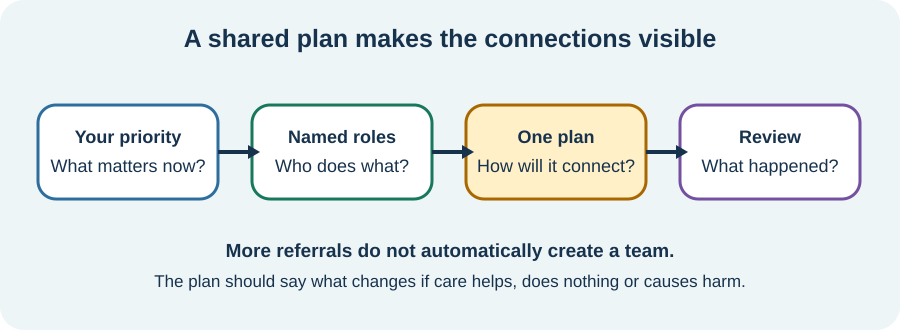

<!-- NAV-BREADCRUMB:START -->
[Home](../../../README.md) › [Course](../../README.md) › Part Four: Treatment and Rehabilitation › [Module 13](README.md) › **Shared Goals and Clear Responsibilities**
<!-- NAV-BREADCRUMB:END -->

# Shared Goals and Clear Responsibilities

> **Working draft:** This page was automatically generated and is looking for [contributors and reviewers](https://fnd-education-project.github.io/FND-Education/).

A team is easier to use when everyone knows what matters now, who is doing what and when the plan will be reviewed.

## For the Person With FND

### Definition

A **shared care plan** is a short agreement about the person's priorities, each professional's job, how information will be shared and what will happen next.

*Illustration: a shared plan connects the person's priority to named responsibilities and a review—not simply to more referrals.*

### If you read only one thing

Your goal does not have to be “make every symptom disappear.” It can be something concrete such as showering more safely, speaking with less strain or returning to one valued activity.

### Start with what matters to you

A goal is more useful when it describes a change you could notice. “Walk to the letterbox with the support we agreed” is clearer than “improve mobility.” “Know whom to contact if the episodes change” is clearer than “manage better.”

The team can then decide which professional has relevant skills, what support is realistic and how progress or harm will be noticed. Patient-centred outcomes may include symptoms, daily activity, independence, wellbeing and quality of life. (*citations* [1](#citation-1), [2](#citation-2))

### Make ownership visible

A short plan can answer:

- Who explains and reviews the FND diagnosis?
- Who assesses new or changed symptoms?
- Who reviews medicines and other conditions?
- Who leads each part of rehabilitation?
- How will clinicians share important changes?
- When will the plan be reviewed if it helps, does nothing or makes things worse?

Shared decision-making means your preferences and the evidence both matter. It does not mean you must agree to every offered treatment. (*citation* [3](#citation-3))

### Community experiences for review

These accounts show why support and clear information can change the experience of care.

**Option 1 — bringing a trusted person**

> “don’t be afraid to have a family member or friend to support you”

— The writer was describing difficult healthcare encounters, not a rule that someone must attend. [Read the public source](https://www.reddit.com/r/FND/comments/1vdyjnt/i_cant_walk_or_take_care_of_basic_needs_and/).

**Option 2 — receiving almost no plan**

> “I was told next to nothing, given no expectations”

— One person described their experience after diagnosis in the UK. [Read the public source](https://www.reddit.com/r/FND/comments/1c35psh/tips_for_navigating_the_nhs/).

### Questions

#### What is one change that would make daily life more workable for you now?

#### Is there a part of your care that currently has no clear owner?

### One small thing you can do

Write one priority and one name beside it. If there is no name, write **“gap to discuss.”**

***
[For the Person With FND](#for-the-person-with-fnd) 
[For Family, Friends, and Other Supporters](#for-family-friends-and-other-supporters) 
[For Clinicians and the Care Team](#for-clinicians-and-the-care-team) 
[Research and Sources](#research-and-sources)
***

## For Family, Friends, and Other Supporters

If invited, help the person keep their own words at the centre. Ask whether they want you to listen, take notes, describe an event or speak when they lose words. Agree this before the appointment when possible.

You can notice conflicting instructions, but do not quietly choose which clinician is “right.” Help the person ask the team to resolve the conflict and name who will follow up.

***
[For the Person With FND](#for-the-person-with-fnd) 
[For Family, Friends, and Other Supporters](#for-family-friends-and-other-supporters) 
[For Clinicians and the Care Team](#for-clinicians-and-the-care-team) 
[Research and Sources](#research-and-sources)
***

## For Clinicians and the Care Team

### Research quotations for review

**Option 1 — Tolchin et al., 2026**

> “engage in shared decision making regarding the treatment plan”

**Option 2 — British Psychological Society, 2024**

> “whole-system care pathway”

*Figure 1 — Research quotations offered for editorial selection. (*citations* [3](#citation-3), [4](#citation-4))*

### Turn parallel referrals into coordinated care

Use a concise, shared formulation that distinguishes confirmed FND symptoms, comorbidities, open diagnostic questions, access needs and chosen goals. Name a lead or key contact. Send referrals with a specific purpose and enough evidence to avoid making the patient retell the entire history.

Agree measures that reflect the patient's priorities, not symptom count alone. Record adverse effects and burden as well as benefit. If professionals disagree, explain the uncertainty and arrange responsibility for the decision rather than leaving the patient to arbitrate. (*citations* [1](#citation-1), [2](#citation-2), [3](#citation-3), [4](#citation-4))

***
[For the Person With FND](#for-the-person-with-fnd) 
[For Family, Friends, and Other Supporters](#for-family-friends-and-other-supporters) 
[For Clinicians and the Care Team](#for-clinicians-and-the-care-team) 
[Research and Sources](#research-and-sources)
***

<!-- NAV-CONTEXT:START -->
**Continue:** [Next page: Care When No Local FND Specialist Is Available](03-care-when-no-local-fnd-specialist-is-available.md)

**Navigate:** [← Previous page](01-who-may-be-on-the-treatment-team.md) · [Module overview](README.md) · [Course](../../README.md) · [Site Map](../../../SITEMAP.md)
<!-- NAV-CONTEXT:END -->

***

## Research and Sources

The sources support shared decisions, patient-centred outcomes and coordinated pathways. They do not establish one universal care-plan format. (*citations* [1](#citation-1), [2](#citation-2), [3](#citation-3), [4](#citation-4))

| Citation | Figure | Full citation |
|---|---|---|
| **[1]** | — | Rutten S, Bradley-Westguard A, Nicholson TR, et al. Outcome measurement in functional neurological disorder: a qualitative study on the views of patients, caregivers and healthcare professionals. *Journal of Neurology*. 2025;272:189. [FND-CIT-0012](../../../research/citation-index.md#fnd-cit-0012). [https://doi.org/10.1007/s00415-025-12912-9](https://doi.org/10.1007/s00415-025-12912-9) |
| **[2]** | — | Lehn A, Petrie D, Palmer D, et al. Managing functional neurological disorder: treatment recommendations for health professionals in Australia. *BMJ Neurology Open*. 2025;7(1):e000970. [FND-CIT-0076](../../../research/citation-index.md#fnd-cit-0076). [https://doi.org/10.1136/bmjno-2024-000970](https://doi.org/10.1136/bmjno-2024-000970) |
| **[3]** | Figure 1 | Tolchin B, Goldstein LH, Reuber M, Stone J, Perez DL, LaFrance WC Jr, et al. Management of Functional Seizures Practice Guideline Executive Summary: Report of the AAN Guidelines Subcommittee. *Neurology*. 2026;106(1):e214466. [FND-CIT-0010](../../../research/citation-index.md#fnd-cit-0010). [https://doi.org/10.1212/WNL.0000000000214466](https://doi.org/10.1212/WNL.0000000000214466) |
| **[4]** | Figure 1 | British Psychological Society. *Functional Neurological Disorder: Neuropsychological and Psychological Management in Children and Adults*. Briefing paper. 2024. [FND-CIT-0078](../../../research/citation-index.md#fnd-cit-0078). [https://doi.org/10.53841/bpsrep.2024.rep181](https://doi.org/10.53841/bpsrep.2024.rep181) |

This page still needs review by people coordinating FND care, people with FND, supporters and accessibility reviewers.

*Plain-language draft and research package prepared: September 5, 2026 · Clinical review pending*
