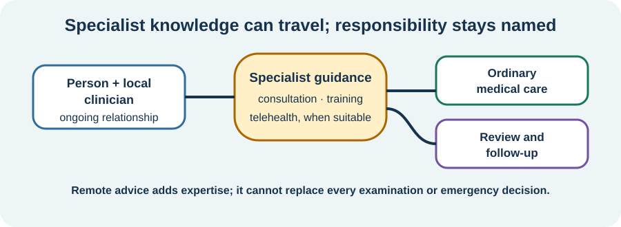

<!-- NAV-BREADCRUMB:START -->
[Home](../../../README.md) › [Course](../../README.md) › Part Four: Treatment and Rehabilitation › [Module 13](README.md) › **Care When No Local FND Specialist Is Available**
<!-- NAV-BREADCRUMB:END -->

# Care When No Local FND Specialist Is Available

> **Working draft:** This page was automatically generated and is looking for [contributors and reviewers](https://fnd-education-project.github.io/FND-Education/).

Specialist FND services are not available everywhere. Lack of a nearby clinic is an access problem—not proof that nothing can be done.

## For the Person With FND

### Definition

A **supported local-care model** means local clinicians provide appropriate care while using specialist advice, training, consultation or telehealth when those are available.

*Illustration: specialist knowledge can support local care. It does not remove the need for a clinician who knows you and follows what happens.*

### If you read only one thing

Useful care may begin with one informed clinician and one clear goal. Remote advice can add expertise, but it cannot replace every examination, emergency decision or ongoing relationship.

### Build from what is available

A local clinician may be able to:

- review the diagnosis and other conditions;
- read current FND guidance or consult a specialist;
- adapt ordinary rehabilitation skills to the person's presentation;
- arrange telehealth where it is suitable and accessible;
- treat pain, migraine, sleep, mood or another coexisting condition;
- provide continuity while referrals are pending.

Ask what a remote service can and cannot do, who will act on its recommendations, and what happens after the consultation. Cost, technology, sensory needs, fatigue, language and privacy can all affect whether telehealth is genuinely accessible. (*citations* [1](#citation-1), [2](#citation-2))

### Keep a route back to assessment

An online program, workbook or peer group is not a substitute for medical assessment. New, severe or substantially changed symptoms may need local or urgent care. A clinician should also review a treatment that causes injury, sustained deterioration or a new problem.

### Community experiences for review

These accounts describe both the gap and one route to individualized care.

**Option 1 — limited specialist availability**

> “there’s not a lot of specialized care or even understanding of FND”

— The writer noted that access depends on location. [Read the public source](https://www.reddit.com/r/FND/comments/1b1az9w/recently_diagnosed/).

**Option 2 — finding care outside a major centre**

> “we worked on an individualized treatment plan.”

— One person described private neuropsychology care; affordability and suitability vary. [Read the public source](https://www.reddit.com/r/FND/comments/11aerci/out_of_curiosity_have_any_of_you_actually_healed/).

### Questions

#### Which part of care could be local if your clinician had suitable guidance?

#### What barrier—distance, cost, technology, energy or something else—most needs a workaround?

### One small thing you can do

Write one sentence for a referral or appointment: **“I am looking for help with ___, and I need the service to be accessible by ___.”**

***
[For the Person With FND](#for-the-person-with-fnd) 
[For Family, Friends, and Other Supporters](#for-family-friends-and-other-supporters) 
[For Clinicians and the Care Team](#for-clinicians-and-the-care-team) 
[Research and Sources](#research-and-sources)
***

## For Family, Friends, and Other Supporters

Practical help may include testing the video setup, writing down the question, arranging transport or helping compare recommendations after the appointment. Ask which task is wanted.

Do not pressure the person to buy an unproven program because local services are scarce. Limited access can make cure claims especially persuasive; check qualifications, evidence, cost, risks and follow-up.

***
[For the Person With FND](#for-the-person-with-fnd) 
[For Family, Friends, and Other Supporters](#for-family-friends-and-other-supporters) 
[For Clinicians and the Care Team](#for-clinicians-and-the-care-team) 
[Research and Sources](#research-and-sources)
***

## For Clinicians and the Care Team

### Research quotations for review

**Option 1 — Lehn et al., 2025**

> “effective management is possible with accurate diagnosis and clear explanations”

**Option 2 — British Psychological Society, 2024**

> “FND services are best located within neurological/neurorehabilitation services”

*Figure 1 — Research quotations offered for editorial selection. (*citations* [1](#citation-1), [2](#citation-2))*

### Make consultation lead to local action

Provide a positive diagnostic explanation, assess comorbidity and translate specialist advice into a named local plan. Clarify who monitors benefit, adverse effects and diagnostic change. Remote input may support capacity building, but suitability depends on phenotype, risk, disability, technology and patient preference.

The evidence does not establish telehealth or a hub-and-spoke model as equivalent to in-person specialist programs for every FND presentation. Do not abandon follow-up because ideal services are absent. (*citations* [1](#citation-1), [2](#citation-2), [3](#citation-3))

***
[For the Person With FND](#for-the-person-with-fnd) 
[For Family, Friends, and Other Supporters](#for-family-friends-and-other-supporters) 
[For Clinicians and the Care Team](#for-clinicians-and-the-care-team) 
[Research and Sources](#research-and-sources)
***

<!-- NAV-CONTEXT:START -->
**Continue:** [Module 14: Rehabilitation and Neuroplastic Change →](../module-14-rehabilitation-and-neuroplastic-change/README.md)

**Navigate:** [← Previous page](02-coordination-shared-goals-and-care-without-local-specialists.md) · [Module overview](README.md) · [Course](../../README.md) · [Site Map](../../../SITEMAP.md)
<!-- NAV-CONTEXT:END -->

***

## Research and Sources

The recommendations discuss specialist-supported local care and telehealth as access strategies. They do not prove that remote care fits every person or replaces hands-on assessment. (*citations* [1](#citation-1), [2](#citation-2), [3](#citation-3))

| Citation | Figure | Full citation |
|---|---|---|
| **[1]** | Figure 1 | Lehn A, Petrie D, Palmer D, et al. Managing functional neurological disorder: treatment recommendations for health professionals in Australia. *BMJ Neurology Open*. 2025;7(1):e000970. [FND-CIT-0076](../../../research/citation-index.md#fnd-cit-0076). [https://doi.org/10.1136/bmjno-2024-000970](https://doi.org/10.1136/bmjno-2024-000970) |
| **[2]** | Figure 1 | British Psychological Society. *Functional Neurological Disorder: Neuropsychological and Psychological Management in Children and Adults*. Briefing paper. 2024. [FND-CIT-0078](../../../research/citation-index.md#fnd-cit-0078). [https://doi.org/10.53841/bpsrep.2024.rep181](https://doi.org/10.53841/bpsrep.2024.rep181) |
| **[3]** | — | Dworetzky BA, Baslet G. Functional neurological disorder: Practical management. *Neurotherapeutics*. 2025;22(4):e00612. [FND-CIT-0013](../../../research/citation-index.md#fnd-cit-0013). [https://doi.org/10.1016/j.neurot.2025.e00612](https://doi.org/10.1016/j.neurot.2025.e00612) |

This page still needs review by people without local specialist access, rural and remote clinicians, telehealth specialists and accessibility reviewers.

*Plain-language draft and research package prepared: September 5, 2026 · Clinical review pending*
