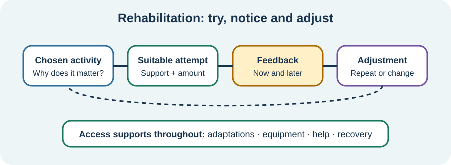

<!-- NAV-BREADCRUMB:START -->
[Home](../../../README.md) › [Course](../../README.md) › Part Four: Treatment and Rehabilitation › [Module 14](README.md) › **How FND Rehabilitation May Work**
<!-- NAV-BREADCRUMB:END -->

# How FND Rehabilitation May Work

> **Working draft:** This page was automatically generated and is looking for [contributors and reviewers](https://fnd-education-project.github.io/FND-Education/).

Rehabilitation tries to make useful actions more available and daily life more workable. It is not a test of willpower.

## For the Person With FND

### Definition

**Rehabilitation** is a planned process of practising, adapting or finding another route to a chosen activity. **Neuroplasticity** means that the nervous system can change with experience.

*Illustration: rehabilitation is a learning-and-adjustment loop. Access supports can be used while learning; the loop is not “try harder.”*

### If you read only one thing

Neuroplasticity is a normal property of the nervous system, not a promise of recovery. A person's response to rehabilitation cannot be known from the word alone.

### Rehabilitation is wider than exercise

Depending on the person, it may include:

- exploring a movement under safer or more automatic conditions;
- practising a real daily task;
- changing how attention is used during movement, speech or another symptom;
- communication strategies or alternative ways to complete a task;
- equipment, environmental changes or help from another person;
- treatment of pain, migraine, sleep or another problem that affects participation.

The aim and method should fit the symptom, diagnosis, other conditions and person's priorities. A technique for functional movement cannot automatically be transferred to swallowing, seizures, fatigue or every other presentation. (*citations* [1](#citation-1), [2](#citation-2), [3](#citation-3))

### Evidence is mixed, not empty

In the large Physio4FMD trial, specialist physiotherapy was not better than usual neurophysiotherapy on the main physical-function measure at 12 months. Some secondary and patient-rated outcomes favoured specialist care. A smaller trial of combined physiotherapy and cognitive behavioural therapy reported benefits but cannot show which part caused change. (*citations* [2](#citation-2), [3](#citation-3))

There is no cure that reliably removes FND for everyone. Improvement, no change and worsening all occur. A limited response does not prove that someone did not believe, practise or want recovery enough.

### Community experiences for review

These accounts deliberately show different responses to physiotherapy.

**Option 1 — major perceived benefit**

> “Neurological physical therapy has given me the ability to walk and function again.”

— One person's experience, not a prediction for all functional symptoms. [Read the public source](https://www.reddit.com/r/FND/comments/18gbf7f/how_did_you_regain_your_ability_to_walk/).

**Option 2 — no perceived progress**

> “In my case PT did not help ... I went for 6 months with no progress.”

— A different account in the same discussion. [Read the public source](https://www.reddit.com/r/FND/comments/18gbf7f/how_did_you_regain_your_ability_to_walk/).

### Questions

#### Is there an activity you want rehabilitation to make easier, safer or less costly?

#### What would count as worthwhile progress for you besides a symptom disappearing?

### One small thing you can do

Name one **activity**, not a body part: for example, “stand to brush my teeth” rather than “fix my legs.” This is a possible discussion point, not an instruction to practise it alone.

***
[For the Person With FND](#for-the-person-with-fnd) 
[For Family, Friends, and Other Supporters](#for-family-friends-and-other-supporters) 
[For Clinicians and the Care Team](#for-clinicians-and-the-care-team) 
[Research and Sources](#research-and-sources)
***

## For Family, Friends, and Other Supporters

Support the chosen goal without counting repetitions, correcting every movement or treating symptoms as a confidence problem. Ask whether the person wants practical help, encouragement, quiet, observation or no involvement.

Equipment and assistance may protect access now while rehabilitation continues. Do not remove them to force learning. Changes should be planned with the person and relevant professional.

***
[For the Person With FND](#for-the-person-with-fnd) 
[For Family, Friends, and Other Supporters](#for-family-friends-and-other-supporters) 
[For Clinicians and the Care Team](#for-clinicians-and-the-care-team) 
[Research and Sources](#research-and-sources)
***

## For Clinicians and the Care Team

### Research quotations for review

**Option 1 — Nielsen et al., 2015**

> “Retraining movement with diverted attention”

**Option 2 — Nielsen et al., 2024**

> “did not result in better self-reported physical functioning at 12 months”

*Figure 1 — Research quotations offered for editorial selection. (*citations* [1](#citation-1), [2](#citation-2))*

### Explain the treatment hypothesis and the evidence

Link each intervention to an assessed problem and patient-chosen activity. Demonstrate any positive movement feature constructively, distinguish automatic from effortful control where relevant and integrate practice into meaningful tasks. Provide access and symptom management alongside restorative work.

Represent trial findings at outcome level. Do not turn secondary benefits into a claim that specialist physiotherapy is universally superior, or a successful response into proof of one mechanism. Measure symptoms, function, participation, quality of life, burden and adverse effects. (*citations* [1](#citation-1), [2](#citation-2), [3](#citation-3))

***
[For the Person With FND](#for-the-person-with-fnd) 
[For Family, Friends, and Other Supporters](#for-family-friends-and-other-supporters) 
[For Clinicians and the Care Team](#for-clinicians-and-the-care-team) 
[Research and Sources](#research-and-sources)
***

<!-- NAV-CONTEXT:START -->
**Continue:** [Next page: Build a Safe Practice Plan](02-building-a-safe-practice-plan-and-evaluating-neuroplasticity-claims.md)

**Navigate:** [← Module overview](README.md) · [Course](../../README.md) · [Site Map](../../../SITEMAP.md)
<!-- NAV-CONTEXT:END -->

***

## Research and Sources

The physiotherapy sources concern functional motor disorder. They do not establish the same approach for every FND presentation or identify one complete mechanism of change. (*citations* [1](#citation-1), [2](#citation-2), [3](#citation-3))

| Citation | Figure | Full citation |
|---|---|---|
| **[1]** | Figure 1 | Nielsen G, Stone J, Matthews A, et al. Physiotherapy for functional motor disorders: a consensus recommendation. *Journal of Neurology, Neurosurgery & Psychiatry*. 2015;86(10):1113–1119. [FND-CIT-0028](../../../research/citation-index.md#fnd-cit-0028). [https://doi.org/10.1136/jnnp-2014-309255](https://doi.org/10.1136/jnnp-2014-309255) |
| **[2]** | Figure 1 | Nielsen G, Stone J, Lee TC, et al.; Physio4FMD study group. Specialist physiotherapy for functional motor disorder in England and Scotland (Physio4FMD): a pragmatic, multicentre, phase 3 randomised controlled trial. *The Lancet Neurology*. 2024;23(7):675–686. [FND-CIT-0029](../../../research/citation-index.md#fnd-cit-0029). [https://doi.org/10.1016/S1474-4422(24)00135-2](https://doi.org/10.1016/S1474-4422(24)00135-2) |
| **[3]** | — | Macías-García D, Méndez-Del Barrio M, Canal-Rivero M, et al. Combined physiotherapy and cognitive behavioral therapy for functional movement disorders: a randomized clinical trial. *JAMA Neurology*. 2024;81(9):966–976. [FND-CIT-0030](../../../research/citation-index.md#fnd-cit-0030). [https://doi.org/10.1001/jamaneurol.2024.2393](https://doi.org/10.1001/jamaneurol.2024.2393) |

This page still needs review by people with different FND presentations, rehabilitation clinicians, trialists and accessibility reviewers.

*Plain-language draft and research package prepared: September 5, 2026 · Clinical review pending*
