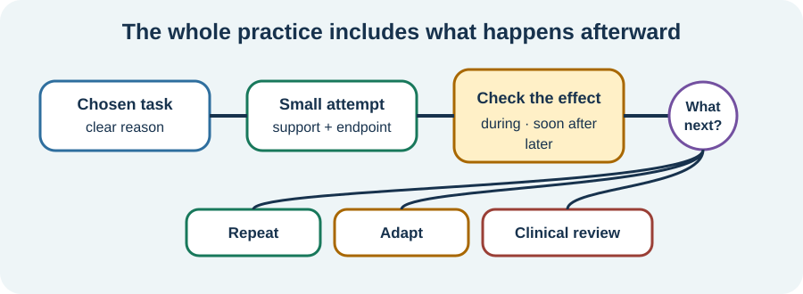

<!-- NAV-BREADCRUMB:START -->
[Home](../../../README.md) › [Course](../../README.md) › Part Four: Treatment and Rehabilitation › [Module 14](README.md) › **Build a Safe Practice Plan**
<!-- NAV-BREADCRUMB:END -->

# Build a Safe Practice Plan

> **Working draft:** This page was automatically generated and is looking for [contributors and reviewers](https://fnd-education-project.github.io/FND-Education/).

Practice is safer and easier to judge when the task, support, amount and review point are agreed in advance.

## For the Person With FND

### Definition

A **practice dose** means what you will try, how much, under what conditions and when you will stop or adjust. It is not a standard medical dose, and more is not automatically better.

*Illustration: the effect may be immediate or delayed. What happens should change the next attempt.*

### If you read only one thing

Do not judge a practice only by what happens during it. Pain, fatigue, episodes or loss of function may rise later, and that information belongs in the plan.

### Name the whole practice

A useful plan can include:

1. the activity and reason for it;
2. the starting support or adaptation;
3. a small amount or endpoint;
4. ordinary discomfort that has been discussed;
5. signs to pause, stop or seek advice;
6. when immediate and delayed effects will be reviewed.

The starting amount should come from the person's current pattern and relevant clinical advice—not from their best-ever day, age, appearance or what another patient can do. (*citations* [1](#citation-1), [2](#citation-2))

### Worsening is information, not disobedience

Stop for urgent medical warning signs and follow the person's safety plan. Pause and contact the relevant clinician for injury, sustained or marked deterioration, a new symptom, repeated episodes triggered by the plan or loss of an essential function.

A brief, agreed symptom change may sometimes occur during rehabilitation, but that does not make every worsening safe or useful. The response may be to reduce, adapt, recover, reassess another condition or choose a different goal.

### Community experiences for review

These accounts show why both the moment and the aftermath matter.

**Option 1 — short control followed by worsening**

> “helped me to control my body jerks for short bursts ... but the electricity builds ... and bursts out in violent jerks afterwards.”

— One person's report of neurophysiotherapy; the metaphor is theirs and not a proven mechanism. [Read the public source](https://www.reddit.com/r/FND/comments/1mj4eqs/uk_fnd_treatment_and_if_people_find_it_helpful/).

**Option 2 — explore, but listen**

> “It’s good to test out boundaries but listen to your body!!”

— Lived-experience advice, not a substitute for an individualized safety plan. [Read the public source](https://www.reddit.com/r/FND/comments/1ipf4gt/is_this_really_the_only_way/).

### Questions

#### How do you know later that an activity took more from you than it seemed to at the time?

#### What support would make one chosen activity feel safer or more possible?

### One small thing you can do

Before one planned activity, finish this sentence: **“I will check how I am ___ later.”** Do not deliberately trigger a symptom to test yourself.

***
[For the Person With FND](#for-the-person-with-fnd) 
[For Family, Friends, and Other Supporters](#for-family-friends-and-other-supporters) 
[For Clinicians and the Care Team](#for-clinicians-and-the-care-team) 
[Research and Sources](#research-and-sources)
***

## For Family, Friends, and Other Supporters

Support the agreed endpoint. Do not add “just one more,” take away an aid or interpret stopping as fear or refusal. Help record delayed effects if the person wants that and memory is difficult.

If the person cannot speak or decide during an episode, follow their agreed plan. Use ordinary emergency help for injury, breathing difficulty, a new pattern or other warning signs.

***
[For the Person With FND](#for-the-person-with-fnd) 
[For Family, Friends, and Other Supporters](#for-family-friends-and-other-supporters) 
[For Clinicians and the Care Team](#for-clinicians-and-the-care-team) 
[Research and Sources](#research-and-sources)
***

## For Clinicians and the Care Team

### Research quotations for review

**Option 1 — Lehn et al., 2025**

> “Movement retraining as treatment should be goal-oriented and focused on facilitating self-management.”

**Option 2 — Tolchin et al., 2026**

> “potential benefits and risks”

*Figure 1 — Research quotations offered for editorial selection. (*citations* [1](#citation-1), [3](#citation-3))*

### Prescribe a testable, revisable plan

Define the target, task conditions, initial volume, support, expected range of response, stop criteria and review interval. Ask about immediate and delayed effects. Account for pain, fatigue, falls, functional seizures, autonomic symptoms, other diagnoses and medication.

Avoid treating adherence as the only explanation for a poor outcome. Reassess formulation, diagnosis, dose, accessibility and treatment fit. Document benefit and harm in domains the patient values. (*citations* [1](#citation-1), [2](#citation-2), [3](#citation-3))

***
[For the Person With FND](#for-the-person-with-fnd) 
[For Family, Friends, and Other Supporters](#for-family-friends-and-other-supporters) 
[For Clinicians and the Care Team](#for-clinicians-and-the-care-team) 
[Research and Sources](#research-and-sources)
***

<!-- NAV-CONTEXT:START -->
**Continue:** [Next page: Evaluate Neuroplasticity and “Rewiring” Claims](03-evaluating-neuroplasticity-and-rewiring-claims.md)

**Navigate:** [← Previous page](01-how-fnd-rehabilitation-may-work.md) · [Module overview](README.md) · [Course](../../README.md) · [Site Map](../../../SITEMAP.md)
<!-- NAV-CONTEXT:END -->

***

## Research and Sources

The sources support individualized goals, self-management and discussion of benefits and risks. They do not validate this page's planning format as a tested intervention. (*citations* [1](#citation-1), [2](#citation-2), [3](#citation-3))

| Citation | Figure | Full citation |
|---|---|---|
| **[1]** | Figure 1 | Lehn A, Petrie D, Palmer D, et al. Managing functional neurological disorder: treatment recommendations for health professionals in Australia. *BMJ Neurology Open*. 2025;7(1):e000970. [FND-CIT-0076](../../../research/citation-index.md#fnd-cit-0076). [https://doi.org/10.1136/bmjno-2024-000970](https://doi.org/10.1136/bmjno-2024-000970) |
| **[2]** | — | Nicholson C, Edwards MJ, Carson AJ, et al. Occupational therapy consensus recommendations for functional neurological disorder. *Journal of Neurology, Neurosurgery & Psychiatry*. 2020;91(10):1037–1045. [FND-CIT-0011](../../../research/citation-index.md#fnd-cit-0011). [https://doi.org/10.1136/jnnp-2019-322281](https://doi.org/10.1136/jnnp-2019-322281) |
| **[3]** | Figure 1 | Tolchin B, Goldstein LH, Reuber M, Stone J, Perez DL, LaFrance WC Jr, et al. Management of Functional Seizures Practice Guideline Executive Summary: Report of the AAN Guidelines Subcommittee. *Neurology*. 2026;106(1):e214466. [FND-CIT-0010](../../../research/citation-index.md#fnd-cit-0010). [https://doi.org/10.1212/WNL.0000000000214466](https://doi.org/10.1212/WNL.0000000000214466) |

This page still needs review by people who have tried FND rehabilitation, rehabilitation clinicians and safety reviewers.

*Plain-language draft and research package prepared: September 5, 2026 · Clinical review pending*
