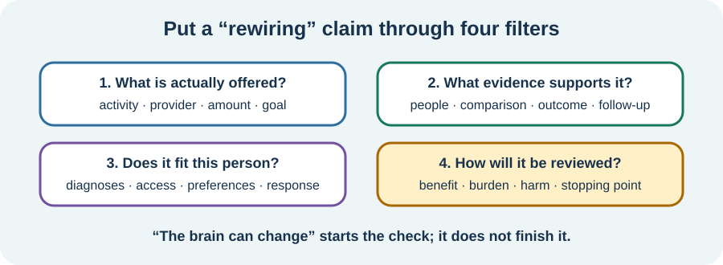

<!-- NAV-BREADCRUMB:START -->
[Home](../../../README.md) › [Course](../../README.md) › Part Four: Treatment and Rehabilitation › [Module 14](README.md) › **Evaluate Neuroplasticity and “Rewiring” Claims**
<!-- NAV-BREADCRUMB:END -->

# Evaluate Neuroplasticity and “Rewiring” Claims

> **Working draft:** This page was automatically generated and is looking for [contributors and reviewers](https://fnd-education-project.github.io/FND-Education/).

Words such as “rewire,” “reset” and “retrain” can describe a treatment idea. They can also be used to make promises that research does not support.

## For the Person With FND

### Definition

A **neuroplasticity claim** says that an activity will change the nervous system in a way that improves health. The claim needs evidence for the treatment, the condition and the outcome—not only proof that nervous systems can change.

*Illustration: “the brain can change” is the beginning of a claim check, not the end.*

### If you read only one thing

Neuroplasticity can occur with helpful learning, ordinary experience and harmful processes. The word does not show that a program works or that a person can control the outcome.

### Ask four plain questions

1. **What is the actual treatment?** Look for a clear activity, dose, provider and goal.
2. **What was studied?** Check the FND presentation, comparison group, outcome and follow-up—not just testimonials.
3. **Does it fit me?** Consider diagnosis, other conditions, disability, access, preferences and prior response.
4. **How will we review it?** Name benefit, burden, cost, adverse effects and a stopping point.

A treatment can be reasonable even when evidence is incomplete, but the uncertainty should be stated. A small study, professional consensus and a large randomized trial answer different questions. (*citations* [1](#citation-1), [2](#citation-2), [3](#citation-3))

### Notice pressure and blame

Be cautious when a seller or practitioner:

- promises a cure or nearly guaranteed recovery;
- says failure proves you did not believe or practise enough;
- asks you to ignore sustained worsening;
- says their theory explains everyone with FND;
- discourages suitable medical care or prescribed treatment;
- relies only on dramatic stories while hiding cost, dropouts or harms.

There is no cure that reliably works for every person with FND. That fact can coexist with real, meaningful improvement for some people. (*citation* [3](#citation-3))

### Community experiences for review

These accounts show why wording and blame matter.

**Option 1 — cure language became blame**

> “I do mind the near guarantee of a cure and when it doesn’t work they blame you.”

— One person's response to “retraining” language. [Read the public source](https://www.reddit.com/r/FND/comments/1skxv3t/am_i_the_only_one_who_hates_the_phrase_retraining/).

**Option 2 — understanding rather than fighting**

> “listening to and understanding my body rather than fighting it to work seems to improve my symptoms the best.”

— A personal experience, not evidence that the same approach treats everyone. [Read the public source](https://www.reddit.com/r/FND/comments/1sedrnt/does_anyone_actually_get_better/).

### Questions

#### When you hear “rewire your brain,” do you feel hope, pressure, confusion or something else?

#### What evidence or safeguard would you need before trying a program?

### One small thing you can do

Choose one treatment claim and write its promised outcome in plain words. If the promise is still unclear, that is a useful answer.

***
[For the Person With FND](#for-the-person-with-fnd) 
[For Family, Friends, and Other Supporters](#for-family-friends-and-other-supporters) 
[For Clinicians and the Care Team](#for-clinicians-and-the-care-team) 
[Research and Sources](#research-and-sources)
***

## For Family, Friends, and Other Supporters

Do not purchase, praise or enforce a program on the person's behalf without their informed agreement. Hope does not require certainty, and scepticism does not mean someone has chosen illness.

Help compare the claim with the person's priorities, other conditions, finances and actual response. Take sustained worsening seriously and support review rather than adding pressure.

***
[For the Person With FND](#for-the-person-with-fnd) 
[For Family, Friends, and Other Supporters](#for-family-friends-and-other-supporters) 
[For Clinicians and the Care Team](#for-clinicians-and-the-care-team) 
[Research and Sources](#research-and-sources)
***

## For Clinicians and the Care Team

### Research quotations for review

**Option 1 — Nielsen et al., 2015**

> “there are insufficient data to produce evidence-based guidelines”

**Option 2 — Thomas et al., 2025**

> “did not negate meaningful gains”

*Figure 1 — Research quotations offered for editorial selection. (*citations* [1](#citation-1), [3](#citation-3))*

### Calibrate mechanism and prognosis claims

Explain whether a recommendation rests on randomized evidence, uncontrolled studies, consensus or extrapolation. Do not use neuroplasticity as a biological-sounding substitute for treatment evidence. A response to treatment does not confirm the proposed cause or mechanism.

Discuss chronicity without therapeutic nihilism or urgency-based blame. The 2025 meta-analysis found modestly smaller gains in some domains with longer duration while meaningful group-level gains remained possible. It cannot predict one person's outcome. (*citations* [2](#citation-2), [3](#citation-3))

***
[For the Person With FND](#for-the-person-with-fnd) 
[For Family, Friends, and Other Supporters](#for-family-friends-and-other-supporters) 
[For Clinicians and the Care Team](#for-clinicians-and-the-care-team) 
[Research and Sources](#research-and-sources)
***

<!-- NAV-CONTEXT:START -->
**Continue:** [Module 15: Pacing, Activity, and the Boom-and-Bust Cycle →](../module-15-pacing-activity-and-the-boom-and-bust-cycle/README.md)

**Navigate:** [← Previous page](02-building-a-safe-practice-plan-and-evaluating-neuroplasticity-claims.md) · [Module overview](README.md) · [Course](../../README.md) · [Site Map](../../../SITEMAP.md)
<!-- NAV-CONTEXT:END -->

***

## Research and Sources

The sources show both treatment possibilities and substantial limits. No source supports a universal neuroplasticity program or guaranteed individual outcome. (*citations* [1](#citation-1), [2](#citation-2), [3](#citation-3))

| Citation | Figure | Full citation |
|---|---|---|
| **[1]** | Figure 1 | Nielsen G, Stone J, Matthews A, et al. Physiotherapy for functional motor disorders: a consensus recommendation. *Journal of Neurology, Neurosurgery & Psychiatry*. 2015;86(10):1113–1119. [FND-CIT-0028](../../../research/citation-index.md#fnd-cit-0028). [https://doi.org/10.1136/jnnp-2014-309255](https://doi.org/10.1136/jnnp-2014-309255) |
| **[2]** | — | Nielsen G, Stone J, Lee TC, et al.; Physio4FMD study group. Specialist physiotherapy for functional motor disorder in England and Scotland (Physio4FMD): a pragmatic, multicentre, phase 3 randomised controlled trial. *The Lancet Neurology*. 2024;23(7):675–686. [FND-CIT-0029](../../../research/citation-index.md#fnd-cit-0029). [https://doi.org/10.1016/S1474-4422(24)00135-2](https://doi.org/10.1016/S1474-4422(24)00135-2) |
| **[3]** | Figure 1 | Thomas ST, Thomas ET, Schembri E, Lehn AC, Palmer DDG. Treatment outcomes in functional neurological disorder: a systematic review and meta-analysis exploring the influence of symptom chronicity. *BMJ Neurology Open*. 2025;7(2):e001150. [FND-CIT-0051](../../../research/citation-index.md#fnd-cit-0051). [https://doi.org/10.1136/bmjno-2025-001150](https://doi.org/10.1136/bmjno-2025-001150) |

This page still needs review by people offered “rewiring” programs, rehabilitation researchers, clinicians and consumer-protection reviewers.

*Plain-language draft and research package prepared: September 5, 2026 · Clinical review pending*
