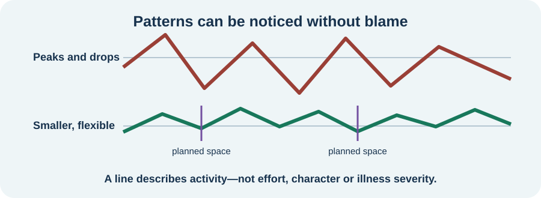

<!-- NAV-BREADCRUMB:START -->
[Home](../../../README.md) › [Course](../../README.md) › Part Four: Treatment and Rehabilitation › [Module 15](README.md) › **Understanding Load, Baselines, and Boom-and-Bust**
<!-- NAV-BREADCRUMB:END -->

# Understanding Load, Baselines, and Boom-and-Bust

> **Working draft:** This page was automatically generated and is looking for [contributors and reviewers](https://fnd-education-project.github.io/FND-Education/).

Activity is not only exercise. Thinking, speaking, sensory input, appointments, emotions, pain and ordinary care can all take effort.

## For the Person With FND

### Definition

**Load** is the combined demand of an activity and its setting. A **baseline** is a practical estimate of what is usually manageable now. **Boom-and-bust** describes doing much more on a better day and then losing activity during a flare or recovery period.

*Illustration: the lines describe patterns to investigate. They do not measure effort, character or how ill someone “should” be.*

### If you read only one thing

A baseline is not your maximum and not a life sentence. It is a temporary starting estimate that can change with symptoms, sleep, illness, support and the kind of task.

### The same task can carry different load

A shower may include standing, heat, balance, arm movement, sensory input, decisions and dressing afterward. A conversation may include listening, finding words, emotion and background noise. Naming the parts can reveal an adaptation that a simple “do less” instruction misses.

Different conditions also matter. Post-exertional malaise in ME/CFS, migraine, pain, orthostatic intolerance and FND symptoms may need different assessment and planning. Research on pacing in ME/CFS cannot automatically be treated as FND treatment evidence. (*citations* [1](#citation-1), [2](#citation-2))

### “Boom-and-bust” is not blame

People may use a better day to meet essential needs, care for someone, earn income or do something meaningful. The later worsening may be delayed and was not necessarily predictable. The phrase is only useful if it helps reveal choices or supports; it should not turn a constrained decision into personal fault.

### Community experiences for review

These accounts describe the attraction of a good day and the fact that symptoms are not simply switched off by attention.

**Option 1 — the later crash**

> “I feel good, I’ll do it all—only to crash out later and feel awful.”

— One person's account of exercise and FND. [Read the public source](https://www.reddit.com/r/FND/comments/1qlwz51/exercise_and_fnd/).

**Option 2 — symptoms and attention are not an on-off switch**

> “Thinking about my symptoms can trigger or worsen them, but they don’t just go away if I ignore them.”

— One person's explanation of their experience. [Read the public source](https://www.reddit.com/r/FND/comments/1hypc8n/how_i_explain_fnd_to_others_and_how_i_wish_it_was/).

### Questions

#### Which ordinary activity contains more kinds of effort than other people may see?

#### When you have a better spell, what feels most important to use it for?

### One small thing you can do

Choose one task and name two kinds of load inside it. Stop there; this is not a request to track your whole day.

***
[For the Person With FND](#for-the-person-with-fnd) 
[For Family, Friends, and Other Supporters](#for-family-friends-and-other-supporters) 
[For Clinicians and the Care Team](#for-clinicians-and-the-care-team) 
[Research and Sources](#research-and-sources)
***

## For Family, Friends, and Other Supporters

Ask what part of a task costs the most rather than judging it by distance or time. Driving, noise, decision-making or recovery afterward may matter more than the visible action.

Do not use “boom-and-bust” to scold someone for enjoying a better day. Help create choices: split a task, remove one demand, provide transport, protect recovery time or accept that a valued activity may still be worth a cost the person understands.

***
[For the Person With FND](#for-the-person-with-fnd) 
[For Family, Friends, and Other Supporters](#for-family-friends-and-other-supporters) 
[For Clinicians and the Care Team](#for-clinicians-and-the-care-team) 
[Research and Sources](#research-and-sources)
***

## For Clinicians and the Care Team

### Research quotations for review

**Option 1 — Nicholson et al., 2020**

> “physical rehabilitation through guided activity practise”

**Option 2 — Sanal-Hayes et al., 2023**

> “a definitive definition of pacing is not unanimous”

*Figure 1 — Research quotations offered for editorial selection. (*citations* [1](#citation-1), [2](#citation-2))*

### Form a description before prescribing change

Clarify the phenotype, comorbidities, task demands, immediate and delayed response, supports and reasons an activity matters. Do not infer capacity from one clinic observation or a better day. Separate FND rehabilitation principles from disease-specific energy management.

Pacing language and evidence are heterogeneous. The ME/CFS review included varied designs and outcomes and is not FND-specific. Use baseline and boom-and-bust as collaborative working descriptions, not validated measurements or explanations of cause. (*citations* [1](#citation-1), [2](#citation-2), [3](#citation-3))

***
[For the Person With FND](#for-the-person-with-fnd) 
[For Family, Friends, and Other Supporters](#for-family-friends-and-other-supporters) 
[For Clinicians and the Care Team](#for-clinicians-and-the-care-team) 
[Research and Sources](#research-and-sources)
***

<!-- NAV-CONTEXT:START -->
**Continue:** [Next page: Plan Activity, Rest, and Capacity Changes](02-planning-activity-rest-and-capacity-changes.md)

**Navigate:** [← Module overview](README.md) · [Course](../../README.md) · [Site Map](../../../SITEMAP.md)
<!-- NAV-CONTEXT:END -->

***

## Research and Sources

The sources support individualized activity planning and show that pacing is inconsistently defined and studied. The pacing review concerns ME/CFS, not FND. (*citations* [1](#citation-1), [2](#citation-2), [3](#citation-3))

| Citation | Figure | Full citation |
|---|---|---|
| **[1]** | Figure 1 | Nicholson C, Edwards MJ, Carson AJ, et al. Occupational therapy consensus recommendations for functional neurological disorder. *Journal of Neurology, Neurosurgery & Psychiatry*. 2020;91(10):1037–1045. [FND-CIT-0011](../../../research/citation-index.md#fnd-cit-0011). [https://doi.org/10.1136/jnnp-2019-322281](https://doi.org/10.1136/jnnp-2019-322281) |
| **[2]** | Figure 1 | Sanal-Hayes NEM, McLaughlin M, Hayes LD, et al. A scoping review of “pacing” for management of myalgic encephalomyelitis/chronic fatigue syndrome (ME/CFS): lessons learned for the long COVID pandemic. *Journal of Translational Medicine*. 2023;21:720. [FND-CIT-0066](../../../research/citation-index.md#fnd-cit-0066). [https://doi.org/10.1186/s12967-023-04587-5](https://doi.org/10.1186/s12967-023-04587-5) |
| **[3]** | — | Thomas ST, Thomas ET, Schembri E, Lehn AC, Palmer DDG. Treatment outcomes in functional neurological disorder: a systematic review and meta-analysis exploring the influence of symptom chronicity. *BMJ Neurology Open*. 2025;7(2):e001150. [FND-CIT-0051](../../../research/citation-index.md#fnd-cit-0051). [https://doi.org/10.1136/bmjno-2025-001150](https://doi.org/10.1136/bmjno-2025-001150) |

This page still needs review by people with variable capacity, occupational therapists, clinicians in FND and coexisting conditions, and accessibility reviewers.

*Plain-language draft and research package prepared: September 5, 2026 · Clinical review pending*
