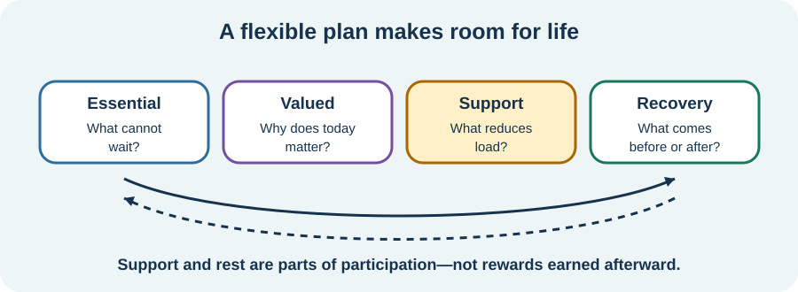

<!-- NAV-BREADCRUMB:START -->
[Home](../../../README.md) › [Course](../../README.md) › Part Four: Treatment and Rehabilitation › [Module 15](README.md) › **Plan Activity, Rest, and Capacity Changes**
<!-- NAV-BREADCRUMB:END -->

# Plan Activity, Rest, and Capacity Changes

> **Working draft:** This page was automatically generated and is looking for [contributors and reviewers](https://fnd-education-project.github.io/FND-Education/).

Pacing can protect access to essentials and valued life. It should not become a rigid timetable or an order to avoid everything difficult.

## For the Person With FND

### Definition

**Pacing** is an individualized way of arranging activity, rest, support and recovery. A **flexible plan** changes when health, demands or priorities change.

*Illustration: a plan makes room for what is necessary and what matters. Support and rest are parts of participation, not prizes earned afterward.*

### If you read only one thing

Pacing is not a cure for FND. Its value is practical: helping you make choices with the capacity and information available today.

### Build a plan around a life

Consider four areas:

- **Essential:** food, medicine, hygiene, care, work or another need that cannot simply vanish.
- **Valued:** connection, creativity, faith, nature, learning, pleasure or another reason the day matters.
- **Support:** sitting, equipment, help, transport, a quieter setting, shorter steps or another adaptation.
- **Recovery:** lower-demand time before, between or after activities.

The aim is not to divide every minute correctly. It is to notice where one support could preserve something important. A plan may change across the day and may include choosing a meaningful activity despite knowing it could have a cost.

### Change one thing at a time when possible

If you change amount, speed, environment, support and timing together, it may be hard to learn what mattered. A small change can be easier to judge. But detailed tracking can itself become exhausting or increase symptom focus, so use the least information that helps.

New, severe or substantially changed symptoms need appropriate assessment rather than automatic pacing. (*citations* [1](#citation-1), [2](#citation-2), [3](#citation-3))

### Community experiences for review

These accounts show that useful pacing can look very different.

**Option 1 — short chunks**

> “I have used pacing for chronic pain and fatigue for many years and manage activity in 10-12 minute chunks. Then I must rest.”

— This person also reported ME/CFS; their timing is an individual example, not a prescription for FND. [Read the public source](https://www.reddit.com/r/FND/comments/1grqq89/how_do_you_cope_with_having_a_chronic_illness/).

**Option 2 — acceptance changed pushing**

> “ACT therapy ... helped me to accept my diagnosis and not push myself too hard.”

— One person's account of what helped them. [Read the public source](https://www.reddit.com/r/FND/comments/1hsfay6/when_to_stop_looking/).

### Questions

#### What is one valued activity you want the plan to protect, not postpone indefinitely?

#### Which support would reduce the load of an essential task without taking away its purpose?

### One small thing you can do

Put one essential task and one valued activity on tomorrow's page. Add only one possible support or recovery space.

***
[For the Person With FND](#for-the-person-with-fnd) 
[For Family, Friends, and Other Supporters](#for-family-friends-and-other-supporters) 
[For Clinicians and the Care Team](#for-clinicians-and-the-care-team) 
[Research and Sources](#research-and-sources)
***

## For Family, Friends, and Other Supporters

Do not fill the person's available time only with treatment and essential tasks. Ask what they want to preserve. Offer a specific form of help and make it easy to decline.

Rest may not look like sleep, and using an aid may make activity possible rather than represent “giving in.” Avoid policing either activity or rest.

***
[For the Person With FND](#for-the-person-with-fnd) 
[For Family, Friends, and Other Supporters](#for-family-friends-and-other-supporters) 
[For Clinicians and the Care Team](#for-clinicians-and-the-care-team) 
[Research and Sources](#research-and-sources)
***

## For Clinicians and the Care Team

### Research quotations for review

**Option 1 — Pick et al., 2020**

> “few well-validated FND-specific outcome measures”

**Option 2 — Thomas et al., 2025**

> “meaningful gains across a range of outcomes”

*Figure 1 — Research quotations offered for editorial selection. (*citations* [2](#citation-2), [3](#citation-3))*

### Make pacing functional and reviewable

Define the purpose: prevent injury, manage delayed worsening, protect essentials, increase consistency, support graded rehabilitation or make space for a valued role. Those aims may require different plans. Address comorbid conditions and avoid assuming all fatigue or post-activity symptoms share one mechanism.

Choose outcomes with the patient and include participation, quality of life, symptom burden and adverse effects. Increase, hold, reduce or adapt activity from the observed pattern—not a predetermined ladder. (*citations* [1](#citation-1), [2](#citation-2), [3](#citation-3))

***
[For the Person With FND](#for-the-person-with-fnd) 
[For Family, Friends, and Other Supporters](#for-family-friends-and-other-supporters) 
[For Clinicians and the Care Team](#for-clinicians-and-the-care-team) 
[Research and Sources](#research-and-sources)
***

<!-- NAV-CONTEXT:START -->
**Continue:** [Next page: Review Delayed Worsening and Change the Plan](03-reviewing-delayed-worsening-and-changing-the-plan.md)

**Navigate:** [← Previous page](01-understanding-load-baselines-and-boom-and-bust.md) · [Module overview](README.md) · [Course](../../README.md) · [Site Map](../../../SITEMAP.md)
<!-- NAV-CONTEXT:END -->

***

## Research and Sources

These sources support multiple outcome domains and flexible occupational planning. They do not validate one pacing schedule or show that pacing cures FND. (*citations* [1](#citation-1), [2](#citation-2), [3](#citation-3))

| Citation | Figure | Full citation |
|---|---|---|
| **[1]** | — | Nicholson C, Edwards MJ, Carson AJ, et al. Occupational therapy consensus recommendations for functional neurological disorder. *Journal of Neurology, Neurosurgery & Psychiatry*. 2020;91(10):1037–1045. [FND-CIT-0011](../../../research/citation-index.md#fnd-cit-0011). [https://doi.org/10.1136/jnnp-2019-322281](https://doi.org/10.1136/jnnp-2019-322281) |
| **[2]** | Figure 1 | Pick S, Anderson DG, Asadi-Pooya AA, et al. Outcome measurement in functional neurological disorder: a systematic review and recommendations. *Journal of Neurology, Neurosurgery & Psychiatry*. 2020;91(6):638–649. [FND-CIT-0067](../../../research/citation-index.md#fnd-cit-0067). [https://doi.org/10.1136/jnnp-2019-322180](https://doi.org/10.1136/jnnp-2019-322180) |
| **[3]** | Figure 1 | Thomas ST, Thomas ET, Schembri E, Lehn AC, Palmer DDG. Treatment outcomes in functional neurological disorder: a systematic review and meta-analysis exploring the influence of symptom chronicity. *BMJ Neurology Open*. 2025;7(2):e001150. [FND-CIT-0051](../../../research/citation-index.md#fnd-cit-0051). [https://doi.org/10.1136/bmjno-2025-001150](https://doi.org/10.1136/bmjno-2025-001150) |

This page still needs review by people using different forms of pacing, occupational therapists, rehabilitation clinicians and accessibility reviewers.

*Plain-language draft and research package prepared: September 5, 2026 · Clinical review pending*
