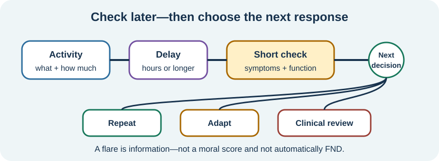

<!-- NAV-BREADCRUMB:START -->
[Home](../../../README.md) › [Course](../../README.md) › Part Four: Treatment and Rehabilitation › [Module 15](README.md) › **Review Delayed Worsening and Change the Plan**
<!-- NAV-BREADCRUMB:END -->

# Review Delayed Worsening and Change the Plan

> **Working draft:** This page was automatically generated and is looking for [contributors and reviewers](https://fnd-education-project.github.io/FND-Education/).

Sometimes the cost of an activity appears hours later or the next day. A brief review can help without turning life into continuous monitoring.

## For the Person With FND

### Definition

**Delayed worsening** means symptoms or function change after a gap following activity. A **flare** is a period when symptoms are worse than the person's usual pattern; it does not by itself explain why.

*Illustration: the later response is one piece of information. It can lead to repeating, adapting or getting clinical advice.*

### If you read only one thing

A flare is not a moral failure and does not erase earlier progress. Review what changed, protect safety, and make the next decision from the information you have now.

### Use the smallest useful record

You might note only:

- the activity or unusual demand;
- when the change appeared;
- what changed enough to matter;
- how long it affected an important function;
- what you will repeat, adapt or ask about.

One note after a meaningful event may be more useful than hourly scores. If tracking increases distress, symptom focus or workload without changing decisions, reduce it or stop.

### Know when this is not just plan adjustment

Seek appropriate assessment for a new, severe or substantially changed symptom, injury, loss of consciousness with concerning features, breathing difficulty or another ordinary warning sign. A delayed response can have more than one cause; do not assume every change is FND or caused by activity.

When the pattern is familiar and safe, possible responses include a smaller amount, more support, different timing, added recovery, a different activity or professional review. The answer is not always to do less, and it is not always to push through. (*citations* [1](#citation-1), [2](#citation-2), [3](#citation-3))

### Community experiences for review

These accounts describe both worsening with pressure and a way of preserving safer activity.

**Option 1 — pressure made symptoms worse**

> “my body doesn’t respond well to being pushed too hard—it actually makes my symptoms worse”

— One person's account of family pressure. [Read the public source](https://www.reddit.com/r/FND/comments/1hehzrg/my_parents_refuse_to_stop_pushing_me_past_my/).

**Option 2 — adapting to safer settings**

> “I still do PT and walk without them in safe environments/when I feel good.”

— The writer described using mobility aids at other times; this is their balance, not a rule for aid use. [Read the public source](https://www.reddit.com/r/FND/comments/1hypc8n/how_i_explain_fnd_to_others_and_how_i_wish_it_was/).

### Questions

#### What delayed change is important enough to affect your next decision?

#### After a flare, what helps you treat yourself as someone needing care rather than judgment?

### One small thing you can do

After one planned activity, write only **same, better or worse** at the agreed review time. Add detail only if it will change the plan.

***
[For the Person With FND](#for-the-person-with-fnd) 
[For Family, Friends, and Other Supporters](#for-family-friends-and-other-supporters) 
[For Clinicians and the Care Team](#for-clinicians-and-the-care-team) 
[Research and Sources](#research-and-sources)
***

## For Family, Friends, and Other Supporters

Believe the later effect even if the activity looked easy at the time. Ask what help is wanted now. Do not use the flare to forbid all future activity or to demand that the person repeat the same plan unchanged.

Help distinguish the familiar pattern from a medical change. Follow the person's safety plan and ordinary emergency guidance.

***
[For the Person With FND](#for-the-person-with-fnd) 
[For Family, Friends, and Other Supporters](#for-family-friends-and-other-supporters) 
[For Clinicians and the Care Team](#for-clinicians-and-the-care-team) 
[Research and Sources](#research-and-sources)
***

## For Clinicians and the Care Team

### Research quotations for review

**Option 1 — Sanal-Hayes et al., 2023**

> “Eleven studies reported benefits of pacing, four studies reported no effect, and two studies reported a detrimental effect”

**Option 2 — Tolchin et al., 2026**

> “provide continuity of care”

*Figure 1 — Research quotations offered for editorial selection. (*citations* [2](#citation-2), [3](#citation-3))*

### Review the event without assuming its mechanism

Establish timing, symptom and functional change, recovery, safety features, competing explanations and the patient's interpretation. Reassess comorbidity, medication, sleep, pain, infection, orthostatic symptoms or another relevant factor. Delayed worsening is not specific to one diagnosis.

Use the review to adjust the plan and preserve continuity, not to grade motivation. The cited pacing findings are heterogeneous ME/CFS evidence and should not be relabelled as an FND trial result. (*citations* [1](#citation-1), [2](#citation-2), [3](#citation-3))

***
[For the Person With FND](#for-the-person-with-fnd) 
[For Family, Friends, and Other Supporters](#for-family-friends-and-other-supporters) 
[For Clinicians and the Care Team](#for-clinicians-and-the-care-team) 
[Research and Sources](#research-and-sources)
***

<!-- NAV-CONTEXT:START -->
**Continue:** [Module 16: Psychological Treatment Without Blame →](../module-16-psychological-treatment-without-blame/README.md)

**Navigate:** [← Previous page](02-planning-activity-rest-and-capacity-changes.md) · [Module overview](README.md) · [Course](../../README.md) · [Site Map](../../../SITEMAP.md)
<!-- NAV-CONTEXT:END -->

***

## Research and Sources

The sources support individualized occupational planning, cautious outcome measurement and continuity. The pacing review is not FND-specific and reports mixed findings. (*citations* [1](#citation-1), [2](#citation-2), [3](#citation-3))

| Citation | Figure | Full citation |
|---|---|---|
| **[1]** | — | Nicholson C, Edwards MJ, Carson AJ, et al. Occupational therapy consensus recommendations for functional neurological disorder. *Journal of Neurology, Neurosurgery & Psychiatry*. 2020;91(10):1037–1045. [FND-CIT-0011](../../../research/citation-index.md#fnd-cit-0011). [https://doi.org/10.1136/jnnp-2019-322281](https://doi.org/10.1136/jnnp-2019-322281) |
| **[2]** | Figure 1 | Sanal-Hayes NEM, McLaughlin M, Hayes LD, et al. A scoping review of “pacing” for management of myalgic encephalomyelitis/chronic fatigue syndrome (ME/CFS): lessons learned for the long COVID pandemic. *Journal of Translational Medicine*. 2023;21:720. [FND-CIT-0066](../../../research/citation-index.md#fnd-cit-0066). [https://doi.org/10.1186/s12967-023-04587-5](https://doi.org/10.1186/s12967-023-04587-5) |
| **[3]** | Figure 1 | Tolchin B, Goldstein LH, Reuber M, Stone J, Perez DL, LaFrance WC Jr, et al. Management of Functional Seizures Practice Guideline Executive Summary: Report of the AAN Guidelines Subcommittee. *Neurology*. 2026;106(1):e214466. [FND-CIT-0010](../../../research/citation-index.md#fnd-cit-0010). [https://doi.org/10.1212/WNL.0000000000214466](https://doi.org/10.1212/WNL.0000000000214466) |

This page still needs review by people who experience delayed worsening, clinicians in FND and coexisting conditions, supporters and accessibility reviewers.

*Plain-language draft and research package prepared: September 5, 2026 · Clinical review pending*
