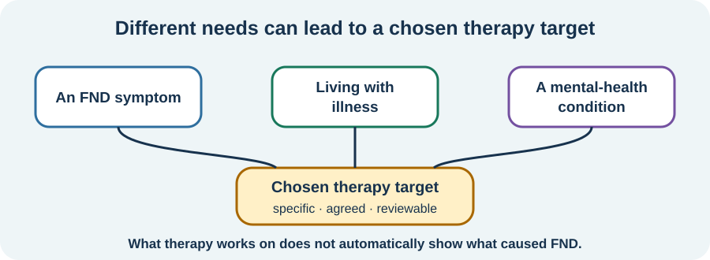

<!-- NAV-BREADCRUMB:START -->
[Home](../../../README.md) › [Course](../../README.md) › Part Four: Treatment and Rehabilitation › [Module 16](README.md) › **Why Psychological Treatment Does Not Mean Imaginary**
<!-- NAV-BREADCRUMB:END -->

# Why Psychological Treatment Does Not Mean Imaginary

> **Working draft:** This page was automatically generated and is looking for [contributors and reviewers](https://fnd-education-project.github.io/FND-Education/).

Psychological treatment is one possible part of care. Being offered it should never mean that symptoms are imagined, chosen or “only stress.”

## For the Person With FND

### Definition

**Psychological treatment** uses conversation, skills, observation and a therapeutic relationship to work on an agreed problem. The target might be an FND symptom, the impact of illness or a separate mental-health condition.

*Illustration: what therapy works on is not automatically what caused FND.*

### If you read only one thing

FND is real and involuntary. A psychological stressor or psychiatric diagnosis is not required for FND, and therapy helping would not prove that one caused it.

### Therapy can have different jobs

Depending on the person, therapy might address:

- fear before or after an episode;
- avoiding activities because they feel unsafe;
- coping with uncertainty, disability, stigma or loss;
- attention, symptom expectations or dissociation;
- relationships changed by illness;
- depression, anxiety, PTSD or another condition that deserves care in its own right.

A person may want one of these and not another. They may prefer rehabilitation, medical treatment or practical support first or instead. Care should be matched to the individual rather than using psychology as the default destination for everyone with FND. (*citations* [1](#citation-1), [2](#citation-2))

### The evidence depends on the symptom and outcome

Psychotherapy studies combine different FND presentations and approaches. Functional-seizure-specific CBT has some of the strongest trial research. In the large CODES trial, the main seizure-frequency outcome did not differ significantly, while several secondary outcomes favoured CBT plus standardized medical care. That is a mixed result, not “therapy works” or “therapy does nothing.” (*citations* [1](#citation-1), [3](#citation-3))

There is no cure that reliably removes FND for everyone. Therapy may still improve a symptom, coping, safety, participation or quality of life for some people.

### Community experiences for review

These accounts show both a useful role and the need to feel understood.

**Option 1 — quality of life rather than cure**

> “Therapy will not cure FND. Therapy can massively improve the quality of life for people like us.”

— One person's view; the degree of benefit varies. [Read the public source](https://www.reddit.com/r/FND/comments/1eskwez/doctors_think_it_is_all_caused_by_stress_and/).

**Option 2 — not feeling safe or heard**

> “I did not feel safe or heard or understood at all.”

— One person described a harmful healthcare and therapy experience. [Read the public source](https://www.reddit.com/r/FND/comments/1il1abc/it_hard_for_me_to_accept_that_fnd_is/).

### Questions

#### What problem, if any, would you actually want therapy to help you with?

#### What explanation of therapy would help you feel respected rather than blamed?

### One small thing you can do

Finish this sentence: **“If I tried therapy, I would want it to help with ___.”** “Nothing right now” is a valid answer.

***
[For the Person With FND](#for-the-person-with-fnd) 
[For Family, Friends, and Other Supporters](#for-family-friends-and-other-supporters) 
[For Clinicians and the Care Team](#for-clinicians-and-the-care-team) 
[Research and Sources](#research-and-sources)
***

## For Family, Friends, and Other Supporters

Do not treat therapy as a confession or ask what hidden event “really caused” FND. The person can find therapy useful without accepting that story, and can decline it without rejecting their diagnosis.

Support access if wanted: transport, privacy, technology, childcare or quiet recovery time. Do not ask for details of sessions unless the person offers them.

***
[For the Person With FND](#for-the-person-with-fnd) 
[For Family, Friends, and Other Supporters](#for-family-friends-and-other-supporters) 
[For Clinicians and the Care Team](#for-clinicians-and-the-care-team) 
[Research and Sources](#research-and-sources)
***

## For Clinicians and the Care Team

### Research quotations for review

**Option 1 — Gutkin et al., 2021**

> “both CBT and PDT appear to potentially offer some benefit for FND”

**Option 2 — British Psychological Society, 2024**

> “the purely psychological view is now widely considered to be unsustainable”

*Figure 1 — Research quotations offered for editorial selection. (*citations* [1](#citation-1), [2](#citation-2))*

### Explain target, rationale and limits

State whether the referral concerns a specific FND presentation, adjustment to illness, cognitive or emotional processes relevant to rehabilitation, or a comorbid psychiatric condition. Do not use the referral as retrospective proof of causation.

Evidence varies by modality, phenotype and outcome. Discuss mixed trial findings, alternatives, burden and patient preference. Psychological care should sit within continuing neurological and general healthcare, with reassessment of new or changed symptoms. (*citations* [1](#citation-1), [2](#citation-2), [3](#citation-3))

***
[For the Person With FND](#for-the-person-with-fnd) 
[For Family, Friends, and Other Supporters](#for-family-friends-and-other-supporters) 
[For Clinicians and the Care Team](#for-clinicians-and-the-care-team) 
[Research and Sources](#research-and-sources)
***

<!-- NAV-CONTEXT:START -->
**Continue:** [Next page: Choose a Therapy and Set Goals](02-choosing-a-therapy-setting-goals-and-recognizing-harm.md)

**Navigate:** [← Module overview](README.md) · [Course](../../README.md) · [Site Map](../../../SITEMAP.md)
<!-- NAV-CONTEXT:END -->

***

## Research and Sources

The psychotherapy review and briefing cover varied therapies and FND presentations. The CODES findings apply to adults with dissociative seizures in that trial, not all people with FND. (*citations* [1](#citation-1), [2](#citation-2), [3](#citation-3))

| Citation | Figure | Full citation |
|---|---|---|
| **[1]** | Figure 1 | Gutkin M, McLean L, Brown R, Kanaan RA. Systematic review of psychotherapy for adults with functional neurological disorder. *Journal of Neurology, Neurosurgery & Psychiatry*. 2021;92(1):36–44. [FND-CIT-0077](../../../research/citation-index.md#fnd-cit-0077). [https://doi.org/10.1136/jnnp-2019-321926](https://doi.org/10.1136/jnnp-2019-321926) |
| **[2]** | Figure 1 | British Psychological Society. *Functional Neurological Disorder: Neuropsychological and Psychological Management in Children and Adults*. Briefing paper. 2024. [FND-CIT-0078](../../../research/citation-index.md#fnd-cit-0078). [https://doi.org/10.53841/bpsrep.2024.rep181](https://doi.org/10.53841/bpsrep.2024.rep181) |
| **[3]** | — | Goldstein LH, Robinson EJ, Mellers JDC, et al.; CODES study group. Cognitive behavioural therapy for adults with dissociative seizures (CODES): a pragmatic, multicentre, randomised controlled trial. *The Lancet Psychiatry*. 2020;7(6):491–505. [FND-CIT-0033](../../../research/citation-index.md#fnd-cit-0033). [https://doi.org/10.1016/S2215-0366(20)30128-0](https://doi.org/10.1016/S2215-0366(20)30128-0) |

This page still needs review by people with helpful, neutral and harmful therapy experiences, psychologists, neurologists and accessibility reviewers.

*Plain-language draft and research package prepared: September 5, 2026 · Clinical review pending*
