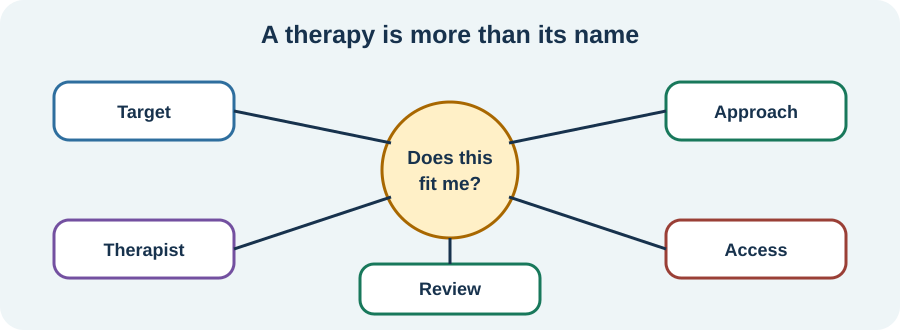

<!-- NAV-BREADCRUMB:START -->
[Home](../../../README.md) › [Course](../../README.md) › Part Four: Treatment and Rehabilitation › [Module 16](README.md) › **Choose a Therapy and Set Goals**
<!-- NAV-BREADCRUMB:END -->

# Choose a Therapy and Set Goals

> **Working draft:** This page was automatically generated and is looking for [contributors and reviewers](https://fnd-education-project.github.io/FND-Education/).

Therapy names describe broad families of treatment. The individual therapist, goal, adaptation and relationship also matter.

## For the Person With FND

### Definition

**Therapy fit** means that the approach, therapist, setting, goals and access needs are a reasonable match for you. A **shared therapy goal** states what you want to change and how you will review benefit or harm together.

*Illustration: a therapy is more than its three-letter name. Fit includes the actual target, person, setting, access and review.*

### If you read only one thing

Ask what this therapy is meant to help **you** with. “You have FND” is not a complete treatment goal.

### Translate the labels

- **CBT** often explores links among situations, thoughts, feelings, body responses and actions, then tests practical changes.
- **ACT** often works on making room for difficult experiences while moving toward chosen values.
- **Mindfulness-based approaches** practise noticing present experience in a particular way; they are not suitable or calming for everyone.
- **Psychodynamic or relational therapies** may explore emotions, relationships and recurring patterns.
- **Trauma-focused therapy** treats trauma-related difficulties when trauma is relevant, the person wants this work and suitable safeguards are in place.

These descriptions are broad. Ask the therapist what they actually do, what evidence applies to your symptoms and what alternatives exist. (*citations* [1](#citation-1), [2](#citation-2), [3](#citation-3))

### Agree how you will know

A goal might be fewer injuries during episodes, less fear, better sleep, returning to one relationship or activity, treating PTSD, or coping with continuing symptoms. Decide when you will review it and what would count as no benefit or harm.

Fit also includes disability access, communication, culture, language, cost, privacy and timing alongside other treatments. You can ask for adaptations, a different therapist or a different approach.

### Community experiences for review

These accounts show strongly different experiences of therapy.

**Option 1 — trauma treatment felt life-changing**

> “Finally, I tried EMDR. It saved me—not just FND.”

— One person's description; it does not establish that EMDR treats FND generally or that trauma causes every case. [Read the public source](https://www.reddit.com/r/FND/comments/1h3hzmp/did_healing_your_trauma_resolve_your_fnd_symptoms/).

**Option 2 — therapy felt harmful**

> “I have tried psychological therapy and it was the worst experience I have ever had.”

— One person's experience; “therapy” is not one uniform intervention. [Read the public source](https://www.reddit.com/r/FND/comments/1il1abc/it_hard_for_me_to_accept_that_fnd_is/).

### Questions

#### What would a therapist need to understand about you for the work to feel like a fit?

#### Which change would tell you the therapy is useful in your actual life?

### One small thing you can do

Write one question for a therapist: **“What would we work on first, and how would we know if it helps?”**

***
[For the Person With FND](#for-the-person-with-fnd) 
[For Family, Friends, and Other Supporters](#for-family-friends-and-other-supporters) 
[For Clinicians and the Care Team](#for-clinicians-and-the-care-team) 
[Research and Sources](#research-and-sources)
***

## For Family, Friends, and Other Supporters

The person's therapy goals belong to them. Do not demand disclosure, ask the therapist for private details or treat a difficult session as proof that the therapy is working.

You can help with access or notice changes the person wants tracked. If you are affected by illness and caregiving, your own support should not depend on entering the person's treatment.

***
[For the Person With FND](#for-the-person-with-fnd) 
[For Family, Friends, and Other Supporters](#for-family-friends-and-other-supporters) 
[For Clinicians and the Care Team](#for-clinicians-and-the-care-team) 
[Research and Sources](#research-and-sources)
***

## For Clinicians and the Care Team

### Research quotations for review

**Option 1 — Gutkin et al., 2021**

> “better quality studies are needed”

**Option 2 — Goldstein et al., 2020**

> “no significant difference in monthly dissociative seizure frequency”

*Figure 1 — Research quotations offered for editorial selection. (*citations* [1](#citation-1), [3](#citation-3))*

### Match rather than route by diagnosis alone

Formulate the target with the patient. Discuss modality-specific evidence, therapist competence, dose, setting, accessibility, alternatives and how benefit and harm will be reviewed. Treat comorbid psychiatric illness without using it as proof of FND causation.

In CODES, several secondary outcomes favoured seizure-specific CBT plus standardized care while the primary seizure-frequency outcome did not. Preserve both findings. Broader psychotherapy evidence is heterogeneous and does not identify one best approach for all FND. (*citations* [1](#citation-1), [2](#citation-2), [3](#citation-3), [4](#citation-4))

***
[For the Person With FND](#for-the-person-with-fnd) 
[For Family, Friends, and Other Supporters](#for-family-friends-and-other-supporters) 
[For Clinicians and the Care Team](#for-clinicians-and-the-care-team) 
[Research and Sources](#research-and-sources)
***

<!-- NAV-CONTEXT:START -->
**Continue:** [Next page: Consent, Trauma, and Recognizing Harm](03-consent-trauma-and-recognizing-harm.md)

**Navigate:** [← Previous page](01-why-psychological-treatment-does-not-mean-imaginary.md) · [Module overview](README.md) · [Course](../../README.md) · [Site Map](../../../SITEMAP.md)
<!-- NAV-CONTEXT:END -->

***

## Research and Sources

The psychotherapy review found possible benefits but important quality and follow-up limits. Functional-seizure trials cannot be generalized to every FND symptom or therapy. (*citations* [1](#citation-1), [2](#citation-2), [3](#citation-3), [4](#citation-4))

| Citation | Figure | Full citation |
|---|---|---|
| **[1]** | Figure 1 | Gutkin M, McLean L, Brown R, Kanaan RA. Systematic review of psychotherapy for adults with functional neurological disorder. *Journal of Neurology, Neurosurgery & Psychiatry*. 2021;92(1):36–44. [FND-CIT-0077](../../../research/citation-index.md#fnd-cit-0077). [https://doi.org/10.1136/jnnp-2019-321926](https://doi.org/10.1136/jnnp-2019-321926) |
| **[2]** | — | British Psychological Society. *Functional Neurological Disorder: Neuropsychological and Psychological Management in Children and Adults*. Briefing paper. 2024. [FND-CIT-0078](../../../research/citation-index.md#fnd-cit-0078). [https://doi.org/10.53841/bpsrep.2024.rep181](https://doi.org/10.53841/bpsrep.2024.rep181) |
| **[3]** | Figure 1 | Goldstein LH, Robinson EJ, Mellers JDC, et al.; CODES study group. Cognitive behavioural therapy for adults with dissociative seizures (CODES): a pragmatic, multicentre, randomised controlled trial. *The Lancet Psychiatry*. 2020;7(6):491–505. [FND-CIT-0033](../../../research/citation-index.md#fnd-cit-0033). [https://doi.org/10.1016/S2215-0366(20)30128-0](https://doi.org/10.1016/S2215-0366(20)30128-0) |
| **[4]** | — | LaFrance WC Jr, Baird GL, Barry JJ, et al. Multicenter pilot treatment trial for psychogenic nonepileptic seizures: a randomized clinical trial. *JAMA Psychiatry*. 2014;71(9):997–1005. [FND-CIT-0032](../../../research/citation-index.md#fnd-cit-0032). [https://doi.org/10.1001/jamapsychiatry.2014.817](https://doi.org/10.1001/jamapsychiatry.2014.817) |

This page still needs review by people with varied therapy experiences, therapists from different modalities, functional-seizure specialists and accessibility reviewers.

*Plain-language draft and research package prepared: September 5, 2026 · Clinical review pending*
