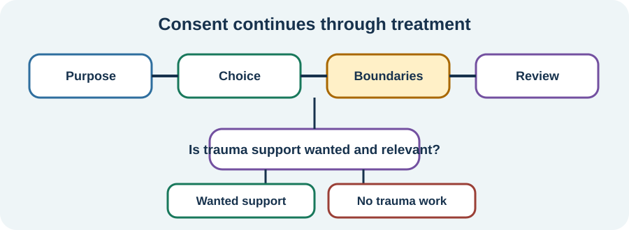

<!-- NAV-BREADCRUMB:START -->
[Home](../../../README.md) › [Course](../../README.md) › Part Four: Treatment and Rehabilitation › [Module 16](README.md) › **Consent, Trauma, and Recognizing Harm**
<!-- NAV-BREADCRUMB:END -->

# Consent, Trauma, and Recognizing Harm

> **Working draft:** This page was automatically generated and is looking for [contributors and reviewers](https://fnd-education-project.github.io/FND-Education/).

Trauma can matter deeply for some people with FND. It is not present, relevant to treatment or explanatory in the same way for everyone.

## For the Person With FND

### Definition

**Informed consent** means you receive understandable information about the purpose, approach, possible benefits, risks and alternatives, then choose freely. **Trauma-informed care** aims to support safety, choice and control without requiring a trauma story.

*Illustration: consent continues through treatment. Trauma work is one possible branch, not a required route for FND.*

### If you read only one thing

You do not have to discover, disclose or treat trauma to prove that you have FND. You may choose trauma treatment when it is relevant to you, whether or not it caused any FND symptom.

### Trauma is neither universal nor irrelevant

Research finds stressful events and maltreatment more often in studied FND groups than in comparison groups, but many people in the included studies reported no such stressor. A group association cannot tell what caused one person's condition. (*citation* [1](#citation-1))

PTSD, trauma symptoms, depression, anxiety or dissociation deserve suitable care when present. Treating them can matter even if FND symptoms remain. The person should decide the goal and pace with a qualified professional.

### Know what may be harmful

Pause and seek advice or another provider if a practitioner:

- says hidden trauma must exist because you have FND;
- pressures you to disclose or recover memories;
- treats disagreement, distress or worsening as proof of “resistance”;
- repeatedly crosses boundaries or continues without consent;
- dismisses new medical symptoms as psychological;
- makes you less safe, severely worsens mental health or blocks other appropriate care.

Stopping or declining a treatment is not the same as refusing all help. If you are in immediate danger or at risk of harming yourself, use local emergency or crisis support. Safeguarding concerns need the ordinary local safeguarding route.

### Community experiences for review

These accounts show why trauma must not become a required explanation.

**Option 1 — a trauma-only belief**

> “This therapist tends to believe that trauma is the only cause for a FND diagnosis”

— The writer was considering EMDR and questioning the therapist's explanation. [Read the public source](https://www.reddit.com/r/FND/comments/1dlibdr/emdr/).

**Option 2 — recovery without trauma therapy**

> “I was diagnosed with FND and made a recovery without trauma therapy”

— One person's experience; later in the same account they described choosing EMDR for other reasons. [Read the public source](https://www.reddit.com/r/FND/comments/1h3hzmp/did_healing_your_trauma_resolve_your_fnd_symptoms/).

### Questions

#### What helps you know that you still have choice and control in a healthcare relationship?

#### Is there a boundary you would want to state before beginning therapy?

### One small thing you can do

Write one boundary: **“I do not consent to ___”** or **“Please ask before ___.”** You do not need to explain why.

***
[For the Person With FND](#for-the-person-with-fnd) 
[For Family, Friends, and Other Supporters](#for-family-friends-and-other-supporters) 
[For Clinicians and the Care Team](#for-clinicians-and-the-care-team) 
[Research and Sources](#research-and-sources)
***

## For Family, Friends, and Other Supporters

Do not search for a hidden cause, question the person's memory or press for session details. Believe their report of a boundary or harmful interaction. Ask what support they want before contacting a provider.

Therapy can bring temporary discomfort, but that phrase must not excuse coercion, retraumatization, unsafe deterioration or loss of consent. Help the person reach independent clinical, safeguarding or crisis support when needed.

***
[For the Person With FND](#for-the-person-with-fnd) 
[For Family, Friends, and Other Supporters](#for-family-friends-and-other-supporters) 
[For Clinicians and the Care Team](#for-clinicians-and-the-care-team) 
[Research and Sources](#research-and-sources)
***

## For Clinicians and the Care Team

### Research quotations for review

**Option 1 — Ludwig et al., 2018**

> “many cases report no stressors”

**Option 2 — Ludwig et al., 2018**

> “stressors ... are not a core diagnostic feature”

*Figure 1 — Research quotations offered for editorial selection. (*citation* [1](#citation-1))*

### Keep formulation tentative and consent active

Ask about trauma only when clinically relevant, with permission and a clear reason. Distinguish association, individual formulation and proven cause. Do not infer undisclosed adversity from the diagnosis or make trauma disclosure a condition of treatment.

Explain the proposed method, alternatives, confidentiality limits and how distress or worsening will be handled. Revisit consent, especially before exposure or trauma processing. Maintain medical review and act on safeguarding or acute mental-health risk through appropriate pathways. Diagnostic overshadowing, stigma and inappropriate treatment are recognized sources of iatrogenic harm in FND care. (*citations* [1](#citation-1), [2](#citation-2), [3](#citation-3), [4](#citation-4))

***
[For the Person With FND](#for-the-person-with-fnd) 
[For Family, Friends, and Other Supporters](#for-family-friends-and-other-supporters) 
[For Clinicians and the Care Team](#for-clinicians-and-the-care-team) 
[Research and Sources](#research-and-sources)
***

<!-- NAV-CONTEXT:START -->
**Continue:** [Part Five: Living With FND →](../../part-5-living-with-fnd/module-17-daily-living-accessibility-and-equipment/README.md)

**Navigate:** [← Previous page](02-choosing-a-therapy-setting-goals-and-recognizing-harm.md) · [Module overview](README.md) · [Course](../../README.md) · [Site Map](../../../SITEMAP.md)
<!-- NAV-CONTEXT:END -->

***

## Research and Sources

The meta-analysis supports an association between adversity and FND at group level while explicitly finding people without reported stressors. It cannot identify an individual's cause or indicate trauma therapy. (*citations* [1](#citation-1), [2](#citation-2), [3](#citation-3), [4](#citation-4))

| Citation | Figure | Full citation |
|---|---|---|
| **[1]** | Figure 1 | Ludwig L, Pasman JA, Nicholson T, et al. Stressful life events and maltreatment in conversion (functional neurological) disorder: systematic review and meta-analysis of case-control studies. *The Lancet Psychiatry*. 2018;5(4):307–320. [FND-CIT-0079](../../../research/citation-index.md#fnd-cit-0079). [https://doi.org/10.1016/S2215-0366(18)30051-8](https://doi.org/10.1016/S2215-0366(18)30051-8) |
| **[2]** | — | British Psychological Society. *Functional Neurological Disorder: Neuropsychological and Psychological Management in Children and Adults*. Briefing paper. 2024. [FND-CIT-0078](../../../research/citation-index.md#fnd-cit-0078). [https://doi.org/10.53841/bpsrep.2024.rep181](https://doi.org/10.53841/bpsrep.2024.rep181) |
| **[3]** | — | Mcloughlin C, Lee WH, Carson A, Stone J. Iatrogenic harm in functional neurological disorder. *Brain*. 2025;148(1):27–38. [FND-CIT-0069](../../../research/citation-index.md#fnd-cit-0069). [https://doi.org/10.1093/brain/awae283](https://doi.org/10.1093/brain/awae283) |
| **[4]** | — | Tolchin B, Goldstein LH, Reuber M, Stone J, Perez DL, LaFrance WC Jr, et al. Management of Functional Seizures Practice Guideline Executive Summary: Report of the AAN Guidelines Subcommittee. *Neurology*. 2026;106(1):e214466. [FND-CIT-0010](../../../research/citation-index.md#fnd-cit-0010). [https://doi.org/10.1212/WNL.0000000000214466](https://doi.org/10.1212/WNL.0000000000214466) |

This page still needs review by trauma survivors with and without FND, people who do not identify trauma, trauma therapists, safeguarding clinicians and accessibility reviewers.

*Plain-language draft and research package prepared: September 5, 2026 · Clinical review pending*
