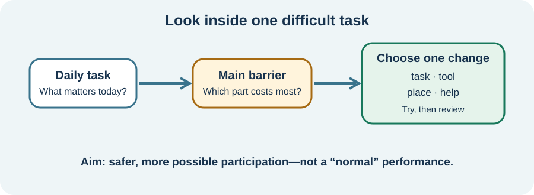

<!-- NAV-BREADCRUMB:START -->
[Home](../../../README.md) › [Course](../../README.md) › Part Five: Living With FND › [Module 17](README.md) › **Adapt Personal Care and Household Tasks**
<!-- NAV-BREADCRUMB:END -->

# Adapt Personal Care and Household Tasks

> **Working draft:** This page was automatically generated and is looking for [contributors and reviewers](https://fnd-education-project.github.io/FND-Education/).

A task can be hard for several reasons at once. Finding the hardest part often gives you more choices than trying harder at the whole task.

## For the Person With FND

### Definition

**Task adaptation** means changing the task, the tool, the place or the help so that an activity is safer or takes less effort.

*Illustration: start with one real barrier. You do not have to change everything or prove how hard the task is.*

### If you read only one thing

Needing help with washing, dressing, food or cleaning is not a failure. The aim is not to perform a task in the most “normal” way. The aim is safety, dignity and enough capacity for what matters.

### Look inside the task

A shower can involve standing, heat, balance, lifting your arms, remembering steps and dressing afterward. Cooking can involve knives, heat, timing, reaching, smells and several decisions. An occupational therapist may call this **activity analysis**: looking at the parts of an activity and the setting around it. (*citations* [1](#citation-1), [2](#citation-2))

One useful question is: **Which single part creates the biggest barrier today?** A chair, prepared ingredients, a cooler room, written steps or another person's help may solve different problems.

### Keep choice and dignity

Help should be offered, not imposed. You can ask someone to do one part while you do another. An adaptation can support life now and sit alongside rehabilitation goals. It does not prove that improvement will or will not happen.

### Community experiences for review

**Option 1 — cognitive help can be daily help**

> “Currently I can barely take care of myself ... My partner has to remind me.”

— One person's account of memory problems. [Read the public source](https://www.reddit.com/r/FND/comments/13rzn9o/memory_issues/).

**Option 2 — occupational therapy and overload**

> “My OT helped me ... learn exercises to calm myself and avoid sensory overwhelm.”

— One person's account of occupational therapy. [Read the public source](https://www.reddit.com/r/FND/comments/1j0nopp/tell_me_how_ot_will_help_my_fnd/).

### Questions

#### Which daily task costs you more than other people can see?

#### If one part became easier, what would you want to keep doing for yourself?

### One small thing you can do

Choose one task. Write four words: **barrier — risk — current workaround — possible change**. Stop there. Ask for professional assessment if transfers, falls, burns, choking, injury or another person's safety may be involved.

***
[For the Person With FND](#for-the-person-with-fnd) 
[For Family, Friends, and Other Supporters](#for-family-friends-and-other-supporters) 
[For Clinicians and the Care Team](#for-clinicians-and-the-care-team) 
[Research and Sources](#research-and-sources)
***

## For Family, Friends, and Other Supporters

Ask, “Which part would you like help with?” before taking over. A person may want practical help without being watched, corrected or hurried.

Notice your own safety too. Get advice for lifting and transfers; do not improvise a carry. If the task is unsafe today, help find another way without turning that decision into a judgement about effort.

***
[For the Person With FND](#for-the-person-with-fnd) 
[For Family, Friends, and Other Supporters](#for-family-friends-and-other-supporters) 
[For Clinicians and the Care Team](#for-clinicians-and-the-care-team) 
[Research and Sources](#research-and-sources)
***

## For Clinicians and the Care Team

### Research quotations for review

**Option 1 — Nicholson et al., 2020**

> “rehabilitation within functional activity”

**Option 2 — Rezaei and Stanley, 2025**

> “disruptions in daily life due to symptoms”

*Figure 1 — Research quotations offered for editorial selection. (*citations* [1](#citation-1), [2](#citation-2))*

### Begin with the person's activity

Assess what the person needs or wants to do, the task sequence, symptom variability, cognition, sensory load, pain, fatigue, strength, the environment and available help. Separate FND-related difficulty from injury, joint problems, cardiopulmonary limits, visual or vestibular conditions and other coexisting causes. More than one can be present.

Agree the goal before suggesting equipment. Trial the smallest useful change, teach safe use and record what changed: safety, assistance, time, effort, participation or recovery afterward. Consensus guidance is useful, but strong comparative evidence for specific daily-living adaptations in FND is limited. (*citation* [1](#citation-1))

When improvement is limited, accessibility and continuing care remain valid goals. Review after falls, skin problems, pain, unsafe transfers, caregiver injury, a major functional change or equipment no longer fitting.

***
[For the Person With FND](#for-the-person-with-fnd) 
[For Family, Friends, and Other Supporters](#for-family-friends-and-other-supporters) 
[For Clinicians and the Care Team](#for-clinicians-and-the-care-team) 
[Research and Sources](#research-and-sources)
***

<!-- NAV-CONTEXT:START -->
**Continue:** [Next page: Mobility Aids, Wheelchairs, Seating, and Fall Safety](02-mobility-aids-wheelchairs-seating-and-fall-safety.md)

**Navigate:** [← Module overview](README.md) · [Course](../../README.md) · [Site Map](../../../SITEMAP.md)
<!-- NAV-CONTEXT:END -->

***

## Research and Sources

| Citation | Figure | Full citation |
|---|---|---|
| **[1]** | Figure 1 | Nicholson C, Edwards MJ, Carson AJ, et al. Occupational therapy consensus recommendations for functional neurological disorder. *Journal of Neurology, Neurosurgery & Psychiatry*. 2020;91(10):1037–1045. [FND-CIT-0011](../../../research/citation-index.md#fnd-cit-0011). [https://doi.org/10.1136/jnnp-2019-322281](https://doi.org/10.1136/jnnp-2019-322281) |
| **[2]** | Figure 1 | Rezaei O, Stanley M. Understanding the lived experiences of individuals with functional neurological disorder in Australia: an interpretative phenomenological analysis. *Disability and Rehabilitation*. 2025;47(24):6408–6415. [FND-CIT-0081](../../../research/citation-index.md#fnd-cit-0081). [https://doi.org/10.1080/09638288.2025.2481986](https://doi.org/10.1080/09638288.2025.2481986) |

This page still needs review by people needing help with daily activities, occupational therapists and accessibility reviewers.

*Plain-language draft and research package prepared: September 8, 2026 · Clinical review pending*
