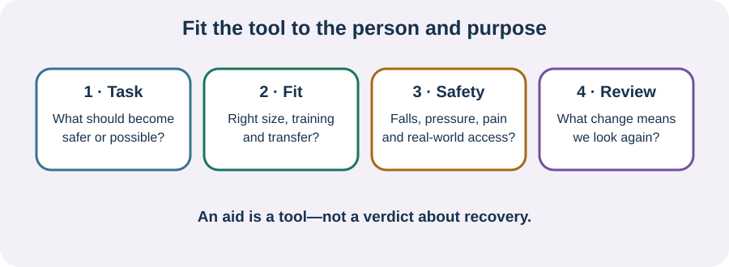

<!-- NAV-BREADCRUMB:START -->
[Home](../../../README.md) › [Course](../../README.md) › Part Five: Living With FND › [Module 17](README.md) › **Mobility Aids, Wheelchairs, Seating, and Fall Safety**
<!-- NAV-BREADCRUMB:END -->

# Mobility Aids, Wheelchairs, Seating, and Fall Safety

> **Working draft:** This page was automatically generated and is looking for [contributors and reviewers](https://fnd-education-project.github.io/FND-Education/).

There is no honest rule that says every person with FND should use an aid—or that no person with FND should.

## For the Person With FND

### Definition

A **mobility aid** is equipment used to make moving or positioning safer or more possible. Examples include a cane, walker, wheelchair, seating system or transfer equipment.

*Illustration: an aid is a tool for a particular person and purpose, not a verdict about recovery.*

### If you read only one thing

The right question is not, “Are aids good or bad for FND?” It is, “What problem should this aid solve, and what happens when this person uses it?”

### Possible benefits and burdens

An aid may reduce falls, pain or exhaustion; make school, work or family life reachable; and give independence. It may also be poorly fitted, hard to lift, unusable in the home, tiring for the arms, or create pressure and transfer risks. These possibilities call for assessment and review, not shame.

In a 2026 specialist-clinic study of 100 people with motor FND, falls and injuries were common enough to support broad falls assessment. That study does not predict one person's risk or prove which aid will help. (*citation* [2](#citation-2))

### Safety is wider than falling

Think about the route, slopes, thresholds, brakes, footwear, episodes, vision, dizziness, pain, medication, getting on and off, pressure care and whether another person can help safely. New fainting, injury, sudden new weakness or a major change still needs medical assessment; do not assume it is “just FND.”

### Community experiences for review

**Option 1 — access to fuller life**

> “My mobility aids have been incredibly helpful and enable me to live life more fully.”

**Option 2 — independence**

> “The wheelchair has helped with independence a lot.”

— Two experiences from one public discussion about mobility aids. [Read the public source](https://www.reddit.com/r/FND/comments/106utzh/advice_needed_considering_using_mobility_aid_for/).

### Questions

#### Where would a mobility aid give you access that you do not have now?

#### What fear or judgement has made this decision harder for you?

### One small thing you can do

Name one journey or task and the barrier within it. If falls, transfers, pressure, pain or fitting are involved, take that goal to an occupational therapist, physiotherapist or suitable equipment service rather than borrowing or buying blindly.

***
[For the Person With FND](#for-the-person-with-fnd) 
[For Family, Friends, and Other Supporters](#for-family-friends-and-other-supporters) 
[For Clinicians and the Care Team](#for-clinicians-and-the-care-team) 
[Research and Sources](#research-and-sources)
***

## For Family, Friends, and Other Supporters

Do not hide an aid to make someone “try harder,” or insist on it when they have said no. Ask what makes the activity safer and what kind of help is wanted. Learn safe transfer and wheelchair handling from a qualified professional; supporter injury matters too.

***
[For the Person With FND](#for-the-person-with-fnd) 
[For Family, Friends, and Other Supporters](#for-family-friends-and-other-supporters) 
[For Clinicians and the Care Team](#for-clinicians-and-the-care-team) 
[Research and Sources](#research-and-sources)
***

## For Clinicians and the Care Team

### Research quotations for review

**Option 1 — Nicholson et al., 2020**

> “independence in activities of daily living”

**Option 2 — Mohammadi et al., 2026**

> “a multidimensional approach to falls assessment”

*Figure 1 — Research quotations offered for editorial selection. (*citations* [1](#citation-1), [2](#citation-2))*

### Prescribe for function, not ideology

Assess the person's chosen task, gait or transfer pattern, variability, falls, injuries, strength, pain, fatigue, cognition, sensory or vestibular factors, home and community setting, transport and coexisting conditions. Consider immediate access and safety alongside conditioning and rehabilitation goals.

FND occupational-therapy guidance includes cautious, goal-led equipment use, but comparative trials of aid strategies are lacking. Document the indication, fitting and training, benefit, burden, maintenance and review point. Avoid both blanket prohibition and automatic prescription. (*citation* [1](#citation-1))

Persistent disability deserves continued equipment, pressure, pain, bone-health, falls and participation review even when symptom improvement is limited.

***
[For the Person With FND](#for-the-person-with-fnd) 
[For Family, Friends, and Other Supporters](#for-family-friends-and-other-supporters) 
[For Clinicians and the Care Team](#for-clinicians-and-the-care-team) 
[Research and Sources](#research-and-sources)
***

<!-- NAV-CONTEXT:START -->
**Continue:** [Next page: Sensory, Home, and Communication Access](03-sensory-home-and-communication-access.md)

**Navigate:** [← Previous page](01-adapting-personal-care-and-household-tasks.md) · [Module overview](README.md) · [Course](../../README.md)
<!-- NAV-CONTEXT:END -->

***

## Research and Sources

| Citation | Figure | Full citation |
|---|---|---|
| **[1]** | Figure 1 | Nicholson C, Edwards MJ, Carson AJ, et al. Occupational therapy consensus recommendations for functional neurological disorder. *Journal of Neurology, Neurosurgery & Psychiatry*. 2020;91(10):1037–1045. [FND-CIT-0011](../../../research/citation-index.md#fnd-cit-0011). [https://doi.org/10.1136/jnnp-2019-322281](https://doi.org/10.1136/jnnp-2019-322281) |
| **[2]** | Figure 1 | Mohammadi Z, Nielsen G, Stone J, et al. Falls in functional neurological disorders: prevalence, risk factors, and relationship to disease characteristics. *European Journal of Neurology*. 2026;33(6):e70665. [FND-CIT-0085](../../../research/citation-index.md#fnd-cit-0085). [https://doi.org/10.1111/ene.70665](https://doi.org/10.1111/ene.70665) |

This page still needs review by mobility-aid users, wheelchair users, occupational therapists, physiotherapists and seating or falls specialists.

*Plain-language draft and research package prepared: September 8, 2026 · Clinical review pending*
