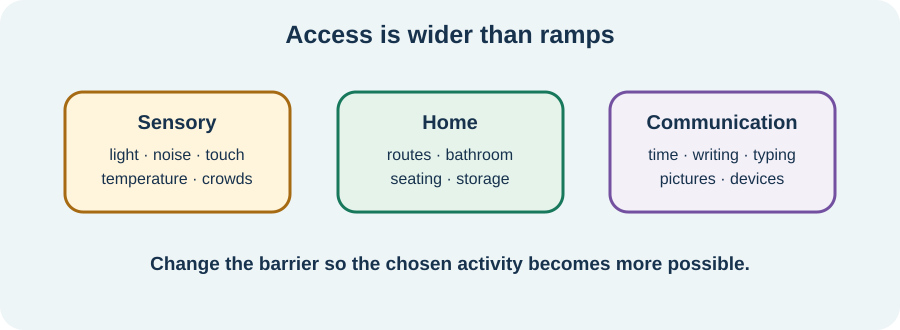

<!-- NAV-BREADCRUMB:START -->
[Home](../../../README.md) › [Course](../../README.md) › Part Five: Living With FND › [Module 17](README.md) › **Sensory, Home, and Communication Access**
<!-- NAV-BREADCRUMB:END -->

# Sensory, Home, and Communication Access

> **Working draft:** This page was automatically generated and is looking for [contributors and reviewers](https://fnd-education-project.github.io/FND-Education/).

Access can begin before symptoms improve. A quieter place, a safer layout or another way to communicate may make participation possible today.

## For the Person With FND

### Definition

**Accessibility** means removing or reducing barriers so a person can take part. The barrier may be in the surroundings, the task or the way information is given—not in the person's worth.

*Illustration: more than one layer may need changing. Access is not limited to ramps.*

### If you read only one thing

You do not have to wait until you are “better enough” to ask for dimmer light, less noise, a chair, clear written steps, extra time or another way to speak.

### Three places to look

- **Sensory:** light, noise, movement, touch, temperature, crowds or smells.
- **Home:** steps, narrow routes, bathroom safety, seating, where items are stored and space to recover after an activity.
- **Communication:** speech, voice, hearing, word-finding, memory, processing time and access to writing, typing, pictures or a communication device.

An adaptation should fit the actual barrier. Sunglasses may help one setting but make another harder. A phone note may support a brief episode; a speech and language therapist may be needed for a fuller communication plan. FND guidance supports environmental and task changes, but individual trials still matter. (*citations* [1](#citation-1), [2](#citation-2))

### Community experiences for review

**Option 1 — light**

> “I’ve got FL-41 lens coating sunglasses to help with light sensitivity.”

— One person's accessibility idea. [Read the public source](https://www.reddit.com/r/FND/comments/1h7poki/accessibility_aids/).

**Option 2 — loss of speech can last**

> “I have been mute for 2 weeks now and it doesn’t look like it’s going to resolve anytime soon.”

— One person's account of a prolonged communication barrier. [Read the public source](https://www.reddit.com/r/FND/comments/1mer8ej/tw_symptom_discussion_anyone_else_mute/).

These are experiences, not proof that the same aid or course applies to someone else.

### Questions

#### Which place asks your brain or body to filter too much at once?

#### What would help you stay part of a conversation when speech, memory or processing becomes difficult?

### One small thing you can do

Choose one setting. Complete: “I can take part more safely if _____.” Try one reversible change. Seek assessment for new loss of speech, hearing or vision, swallowing difficulty, injury risk or a major unexplained change.

***
[For the Person With FND](#for-the-person-with-fnd) 
[For Family, Friends, and Other Supporters](#for-family-friends-and-other-supporters) 
[For Clinicians and the Care Team](#for-clinicians-and-the-care-team) 
[Research and Sources](#research-and-sources)
***

## For Family, Friends, and Other Supporters

Ask before turning off lights, speaking for the person or moving their equipment. Give time for a reply. Agree a simple yes/no method and a way to pause if communication is unreliable. Keep addressing the person even when someone else is helping.

***
[For the Person With FND](#for-the-person-with-fnd) 
[For Family, Friends, and Other Supporters](#for-family-friends-and-other-supporters) 
[For Clinicians and the Care Team](#for-clinicians-and-the-care-team) 
[Research and Sources](#research-and-sources)
***

## For Clinicians and the Care Team

### Research quotations for review

**Option 1 — Nicholson et al., 2020**

> “environmental adaptations”

**Option 2 — Bailey et al., 2024**

> “practical disability advice”

*Figure 1 — Research quotations offered for editorial selection. (*citations* [1](#citation-1), [2](#citation-2))*

### Make access part of care

Ask which settings and communication demands restrict participation. Assess cognition, vision, hearing, vestibular symptoms, pain, fatigue, migraine, neurodevelopmental needs and other contributors rather than assuming every barrier is FND.

Offer information in more than one format. Record the person's preferred communication method, response time, sensory needs and who may assist with consent. Coordinate occupational therapy, speech and language therapy, physiotherapy, audiology, optometry or other services according to the barrier. Evidence for specific sensory adaptations in FND is limited, so identify the goal, trial proportionately and review benefit and burden. (*citations* [1](#citation-1), [2](#citation-2))

***
[For the Person With FND](#for-the-person-with-fnd) 
[For Family, Friends, and Other Supporters](#for-family-friends-and-other-supporters) 
[For Clinicians and the Care Team](#for-clinicians-and-the-care-team) 
[Research and Sources](#research-and-sources)
***

<!-- NAV-CONTEXT:START -->
**Continue:** [Next page: Try and Review Equipment as Needs Change](04-trying-and-reviewing-equipment-as-needs-change.md)

**Navigate:** [← Previous page](02-mobility-aids-wheelchairs-seating-and-fall-safety.md) · [Module overview](README.md) · [Course](../../README.md)
<!-- NAV-CONTEXT:END -->

***

## Research and Sources

| Citation | Figure | Full citation |
|---|---|---|
| **[1]** | Figure 1 | Nicholson C, Edwards MJ, Carson AJ, et al. Occupational therapy consensus recommendations for functional neurological disorder. *Journal of Neurology, Neurosurgery & Psychiatry*. 2020;91(10):1037–1045. [FND-CIT-0011](../../../research/citation-index.md#fnd-cit-0011). [https://doi.org/10.1136/jnnp-2019-322281](https://doi.org/10.1136/jnnp-2019-322281) |
| **[2]** | Figure 1 | Bailey C, Ellis M, Bate E, et al. Illness perceptions, experiences of stigma and engagement in functional neurological disorder before and after group education. *BMJ Neurology Open*. 2024;6(1):e000633. [FND-CIT-0091](../../../research/citation-index.md#fnd-cit-0091). [https://doi.org/10.1136/bmjno-2024-000633](https://doi.org/10.1136/bmjno-2024-000633) |

This page still needs review by people with sensory or communication barriers and relevant accessibility and clinical specialists.

*Plain-language draft and research package prepared: September 8, 2026 · Clinical review pending*
