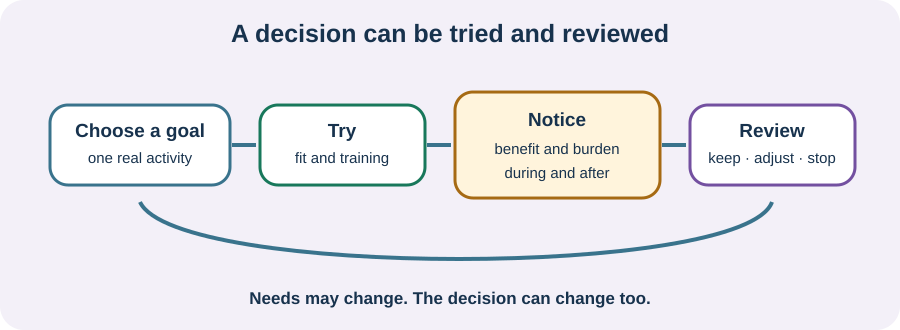

<!-- NAV-BREADCRUMB:START -->
[Home](../../../README.md) › [Course](../../README.md) › Part Five: Living With FND › [Module 17](README.md) › **Try and Review Equipment as Needs Change**
<!-- NAV-BREADCRUMB:END -->

# Try and Review Equipment as Needs Change

> **Working draft:** This page was automatically generated and is looking for [contributors and reviewers](https://fnd-education-project.github.io/FND-Education/).

Equipment decisions are easier to understand when they are treated as a trial with a purpose, not as a permanent judgement about you.

## For the Person With FND

### Definition

An **equipment trial** is a planned chance to see whether an aid helps a named activity. A **review** checks whether it still helps and whether its fit, risks or purpose have changed.

*Illustration: the result may be keep, adjust, use only in some settings, replace or stop. None is a moral score.*

### If you read only one thing

Ask what the equipment lets you do, what it costs you to use, and when the decision will be looked at again.

### Make the trial concrete

A goal such as “walk better” can be hard to judge. A goal such as “reach the bathroom at night with fewer near-falls” or “join a family outing without spending the next day unable to eat” gives useful information.

Notice both benefit and burden: safety, distance, help needed, pain, fatigue, pressure, transport, confidence, recovery time and access. A good result may be use in one setting and not another.

Funding rules and waiting lists can narrow the available choices. That is a service barrier, not evidence that your need is unimportant. FND guidance supports collaborative, goal-led decisions, but research does not provide a universal timetable or best aid. (*citations* [1](#citation-1), [2](#citation-2))

### Community experiences for review

**Option 1 — different aids in different settings**

> “I still do PT and walk without them in safe environments/when I feel good.”

— One person's account of flexible aid use. [Read the public source](https://www.reddit.com/r/FND/comments/1hypc8n/how_i_explain_fnd_to_others_and_how_i_wish_it_was/).

**Option 2 — an aid as a way through an episode**

> “The only thing that gets my walking happening again is using a walker.”

— One person's account of paralysis episodes. [Read the public source](https://www.reddit.com/r/FND/comments/1kchl1l/how_to_get_out_of_paralysis_epsiode/).

### Questions

#### What would this aid make possible on an ordinary or difficult day?

#### What change would tell you that it needs adjusting or reviewing?

### One small thing you can do

For one aid, write: **goal — benefit — burden — review date**. If the aid causes pain, skin damage, repeated near-falls, unsafe transfers or no longer fits, stop and seek suitable professional review.

***
[For the Person With FND](#for-the-person-with-fnd) 
[For Family, Friends, and Other Supporters](#for-family-friends-and-other-supporters) 
[For Clinicians and the Care Team](#for-clinicians-and-the-care-team) 
[Research and Sources](#research-and-sources)
***

## For Family, Friends, and Other Supporters

Help observe practical outcomes without turning the trial into surveillance. Ask the person what counts as benefit. A less visible outcome—being able to stay at an event, wash privately or recover sooner—may matter most.

***
[For the Person With FND](#for-the-person-with-fnd) 
[For Family, Friends, and Other Supporters](#for-family-friends-and-other-supporters) 
[For Clinicians and the Care Team](#for-clinicians-and-the-care-team) 
[Research and Sources](#research-and-sources)
***

## For Clinicians and the Care Team

### Research quotations for review

**Option 1 — Nicholson et al., 2020**

> “individualised assessment and treatment”

**Option 2 — Lehn et al., 2025**

> “person-centred treatment”

*Figure 1 — Research quotations offered for editorial selection. (*citations* [1](#citation-1), [2](#citation-2))*

### Document a reviewable decision

Record the functional goal, alternatives considered, setting, fit, training, risks, maintenance, funding constraints and agreed review trigger. Measure outcomes the person values as well as observable performance. One clinic observation is not a reliable summary of variable function.

Reassessment should allow continuation, different use, modification, replacement or withdrawal after discussion. Do not make equipment removal a test of motivation. If rehabilitation and present access appear to conflict, make the trade-off explicit and decide with the person. Consensus is stronger than direct trial evidence in this area. (*citations* [1](#citation-1), [2](#citation-2))

***
[For the Person With FND](#for-the-person-with-fnd) 
[For Family, Friends, and Other Supporters](#for-family-friends-and-other-supporters) 
[For Clinicians and the Care Team](#for-clinicians-and-the-care-team) 
[Research and Sources](#research-and-sources)
***

<!-- NAV-CONTEXT:START -->
**Continue:** [Next module: Relationships, Identity, and Grief](../module-18-relationships-identity-and-grief/README.md)

**Navigate:** [← Previous page](03-sensory-home-and-communication-access.md) · [Module overview](README.md) · [Course](../../README.md)
<!-- NAV-CONTEXT:END -->

***

## Research and Sources

| Citation | Figure | Full citation |
|---|---|---|
| **[1]** | Figure 1 | Nicholson C, Edwards MJ, Carson AJ, et al. Occupational therapy consensus recommendations for functional neurological disorder. *Journal of Neurology, Neurosurgery & Psychiatry*. 2020;91(10):1037–1045. [FND-CIT-0011](../../../research/citation-index.md#fnd-cit-0011). [https://doi.org/10.1136/jnnp-2019-322281](https://doi.org/10.1136/jnnp-2019-322281) |
| **[2]** | Figure 1 | Lehn A, Petrie D, Palmer D, et al. Managing functional neurological disorder: treatment recommendations for health professionals in Australia. *BMJ Neurology Open*. 2025;7(1):e000970. [FND-CIT-0076](../../../research/citation-index.md#fnd-cit-0076). [https://doi.org/10.1136/bmjno-2024-000970](https://doi.org/10.1136/bmjno-2024-000970) |

This page still needs review by equipment users, prescribers, repair services and people navigating funding systems.

*Plain-language draft and research package prepared: September 8, 2026 · Clinical review pending*
